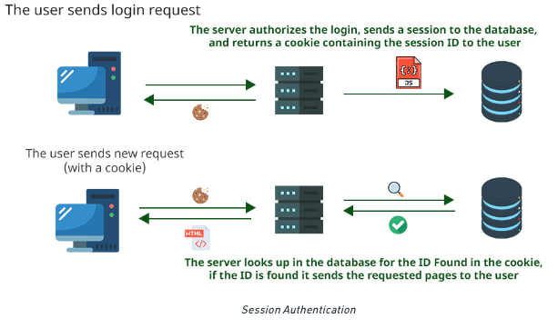
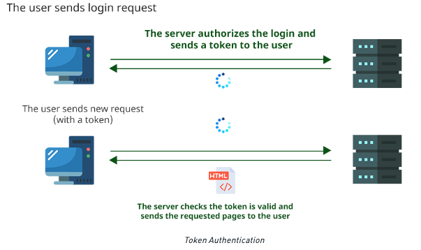

HTTP의 무 상태성과 비 연결성이라는 특징으로 인해 사용자의 인증 정보가 필요할 때마다 인증해야 하는 문제점이 발생한다.
이런 문제를 해결하기 위해 쿠키, 세션, 토큰 등과 같은 곳에 인증 정보를 담아 사용하여 문제를 해결하게 된다.

다중 서버에서는 세션을 이용해 인증 할 수 있지만 세션을 따로 관리해야 하고 복잡하기 때문에 토큰 인증 방식을 주로 사용한다.

### Session

1. 사용자가 서버에 로그인 요청을 보냅니다.
2. 서버는 로그인 요청을 인증하고, 데이터베이스에 세션을 전송하고, 사용자에게 세션 ID를 포함하는 쿠키를 반환한다.
3. 이제 사용자는 새로운 요청을 (쿠키와 함께) 보냅니다.
4. 서버는 데이터베이스에서 쿠키에서 발견된 ID를 확인하고, ID가 발견되면 요청된 페이지를 사용자에게 보냅니다.

세션의 경우 세션 저장소에 세션 아이디를 저장해 관리한다.

서버가 하나라면 세션 저장소 관리가 쉽겠지만, 다중 서버라면 세션 저장소는 관리하기 어려워 진다.

### Token-Based Authentication

1. 사용자가 서버에 로그인 요청을 보냅니다.
2. 서버가 로그인을 승인하고 사용자에게 토큰을 보냅니다.
3. 이제 사용자가 토큰과 함께 새 요청을 보냅니다.
4. 서버는 토큰이 유효한지 여부를 확인하고, 토큰이 유효한 경우 요청된 페이지를 사용자에게 보냅니다.

토큰의 경우 로그인이 성공적이면 토큰을 응답하고, Client 에서 요청할때 헤더에 Token 을 담아서 보내면 서버에서 인증 및 인가 처리후 응답하게된다.

출처

https://www.geeksforgeeks.org/session-vs-token-based-authentication/