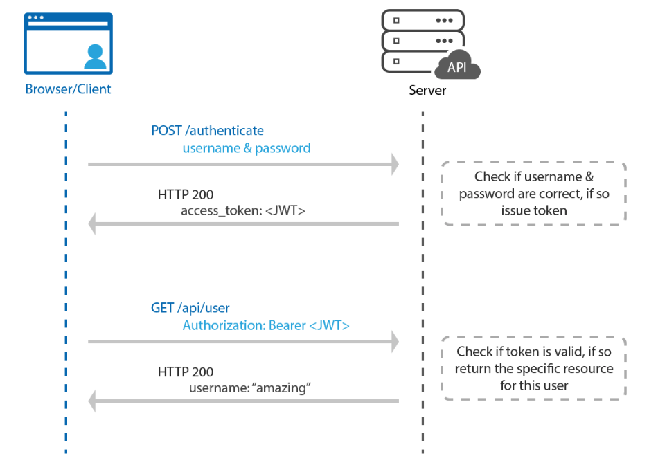

토큰 기반 인증을 사용할 때 토큰은 대체로 요청 헤더의 Authorization 필드에 담아져 보내진다.
`Authorization: <type> <credentials>`

 **type** 에 들어가는 값이 **Bearer** 값이다.

토큰에는 많은 종류가 있고 서버에도 다양한 종류의 토큰을 처리하기 위해 type 값이 다양하다.

### type 종류

### Basic

사용자 아이디와 암호를 `Base64`로 인코딩한 값을 토큰으로 사용합니다. (RFC 7617)

### Bearer

JWT 혹은 OAuth에 대한 토큰을 사용합니다. (RFC 6750)

### Digest

서버에서 난수 데이터 문자열을 클라이언트에 보냅니다. 클라이언트는 사용자 정보와 nonce를 포함하는 해시값을 사용하여 응답합니다. (RFC 7616)

#### HOBA

전자 서명 기반 인증방식입니다. (RFC 7486)

### Mutual

암호를 이용한 클라이언트-서버 상호 인증입니다.  (draft-ietf-httpauth-mutual)

### AWS4-HMAC-SHA256
AWS 전자 서명 기반 인증 (링크)

[참고1](https://velog.io/@cada/토근-기반-인증에서-bearer는-무엇일까)

[참고2](https://developer.okta.com/blog/2019/02/14/modern-token-authentication-in-node-with-express)