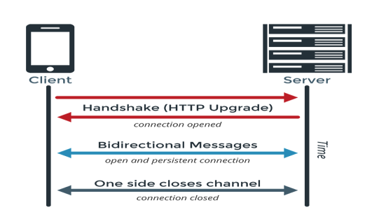

## 웹소켓(Web Sockets)

HTML5 표준 기술로, 사용자의 브라우저와 서버 사이의 동적인 양방향 연결 채널을 구성하고 사용자의 브라우저와 서버 사이의 인터액티브 통신 세션을 설정할 수 있게 하는 고급 기술이다. 개발자는 웹 소켓 API를 통해 서버로 메시지를 보내고 서버의 응답을 위해 서버를 폴링하지 않고도 이벤트 중심 응답을 받는 것이 가능하다.

### 동작 방식

순서 : 핸드쉐이크 > 데이터를 양방향으로 주고받음 > 웹소켓을 Close

### 장점

- 서버와 클라이언트 사이에서 데이터를 주고받을 수 있다.
- HTTP REST 메서드인 POST보다 빠르다.
- 여러 API 또는 여러 게임 멀티플레이에도 사용된다.

### 단점

- 프로그램 구현에보다 많은 복잡성을 초래한다.

- 웹 소켓은 HTTP와 달리 Stateful protocol이기 때문에 서버와 클라이언트 간의 연결을 항상 유지해야 하며 만약 비정상적으로 연결이 끊어졌을 때 적절하게 대응해야 한다. 이는 기존의 HTTP 사용 시와 비교했을 때 코딩의 복잡성을 가중시키는 요인이 될 수 있습니다.
- 서버와 클라이언트 간의 Socket 연결을 유지하는 것 자체가 비용이 든다.
- 특히나 트래픽 양이 많은 서버 같은 경우에는 CPU에 큰 부담이 될 수 있다.
- 오래된 버전의 웹 브라우저에서는 지원하지 않는다. (물론 SockJS 라이브러리 같은 경우에는 Fallback option을 제공하고 있습니다.)
- 서버와 클라이언트 간의 연결이 끊어졌을 때 생성되는 에러 메세지가 구체적이지 않아서 (예를 들어 여러가지 다른 이유로 연결이 끊어졌는데 에러 메세지가 같은 경우) 디버깅을 하는데 어려움이 많기도 합니다.

### WebSocket 서버의 종류

- pywebsocket(apache)
- phpwebsocket(php)
- jWebSocket(java,javascript)
- web-socket-ruby(ruby)
- Socket.IO(node.js)

### 어떤 상황에서 필요한가?

- 실시간 양방향 데이터 통신이 필요한 경우.
- 많은 수의 동시 접속자를 수용해야 하는 경우.
- 브라우저에서 TCP 기반의 통신으로 확장해야 하는 경우.
- 개발자에게 사용하기 쉬운 API가 필요할 경우.
- 클라우드 환경이나 웹을 넘어 SOA(Service Oriented Architecture)로 확장해야 하는 경우

### 사용 예시

- 카카오톡 챗
- 페이스북과 같은 SNS APP
- LOL 같은 멀티플레이어 Game
- 위치 기반 APP
- 증권 거래 정보 사이트 및 APP
- 화상 채팅 APP
- 구글 Doc같이 여러 명이 동시 접속해서 수정할 수 있는 Tool

### Reference

[https://velog.io/@93jm/웹소켓-Web-Socket](https://velog.io/@93jm/웹소켓-Web-Socket)

[https://namu.wiki/w/웹소켓](https://namu.wiki/w/웹소켓)

[https://inpa.tistory.com/entry/WEB-🌐-웹-소켓-Socket-역사부터-정리#웹_소켓_이란](https://inpa.tistory.com/entry/WEB-🌐-웹-소켓-Socket-역사부터-정리#웹_소켓_이란)

https://choseongho93.tistory.com/266