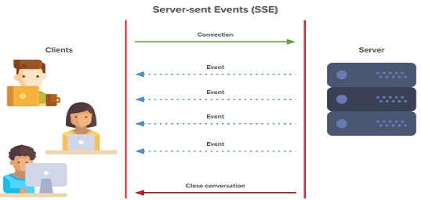

## SSE(Server-Sent Event)

서버의 데이터를 실시간으로, 지속적으로 Streaming 하는 기술. 웹 표준으로써 IE를 제외한 모든 브라우저에서 지원되며, IE역시 polyfill을 통해 지원이 가능

### 동작 방식

### 장점

- 전통적인 HTTP를 통해 통신하므로 다른 프로토콜이 필요가 없다.
- 재접속 처리 같은 대부분의 저수준 처리가 자동으로 된다.
- 표준 기술답게 IE를 제외한 브라우저 대부분을 지원한다.
- HTML과 JavaScript만으로 구현할 수 있으므로 현재 지원되지 않는 브라우저(IE 포함)도 polyfill을 이용해 크로스 브라우징이 가능하다. (여기서 polyfill이란 브라우저가 지원하지 않는 API를 플러그인이나 JavaScript 등으로 흉내 내 구현한 것을 뜻한다)

### 단점

- IE에선 SSE를 지원하지 않는다.
- Client에서 연결을 끊어도(=페이지를 떠나도) 서버단에서 감지가 어렵다.
- 웹소켓과 달리, 클라이언트는 서버로부터 데이터만 받을 수 있게 된다.

### Reference

https://hamait.tistory.com/792

[https://inpa.tistory.com/entry/NODE-📚-Server-Sent-Events-💯-정리-사용법](https://inpa.tistory.com/entry/NODE-📚-Server-Sent-Events-💯-정리-사용법)

https://www.neerajsidhaye.com/posts/sse/sse/

https://sjh836.tistory.com/181

