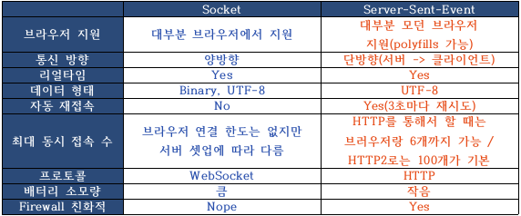

## 웹소켓 vs SSE(Server-Sent-Event) 차이점

SSE는 전통적인 HTTP를 통해 전송된다. 즉, 작동하려면 특별한 프로토콜이나 서버 구현이 필요하지 않는다. 반면 WebSocket은 프로토콜을 처리하기 위해 전이중 연결과 새로운 웹 소켓 서버가 필요하다. 또한 서버 보낸 이벤트에는 자동 재연결, 이벤트 ID 및 임의 이벤트를 보내는 기능과 같이 WebSocket은 디자인 측면에서 부족한 다양한 기능이 있다.

