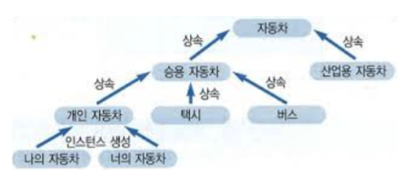

## 2개 이상의 인스턴스 변수를 가진 클래스를 쓰지 않는다.

이번 규칙은 3번 규칙과 비슷한 의미를 가진다.

```java
Class Name {
  String first;
  String middle;
  String last;
}
```

```java
Class Name {
  Surname family;
  GivenNames given;
}
Class Surname{
  String first;
}
Class GivenNames{
  List<String> names;
}
```

GivenNames 클래스에 이름 목록을 만들면, middle, last 또 추가되는 이름값을 받을 수 있게된다.

기존에 3개의 인스턴스를 관리했지만 GivenNames을 만듬으로써 2개의 인스턴스를 관리할 수 있게 되었다.

사실 예제가 이름이라 크게 변화된게 없는데 차로 예를 들면 계층 구조를 가지며 인스턴스를 관리하게 된다. 



출처 : https://www.fun-coding.org/PL&OOP1-2.html

이는 객체지향 특징중 상속과 다형성에 해당하게 된다. 

이러한 리팩토링 과정을 통해 좋은 객체지향 설계로 이어지게 된다.