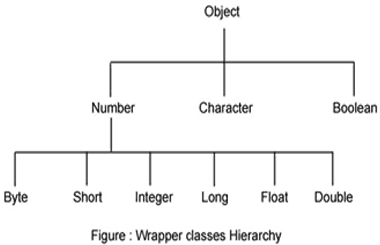
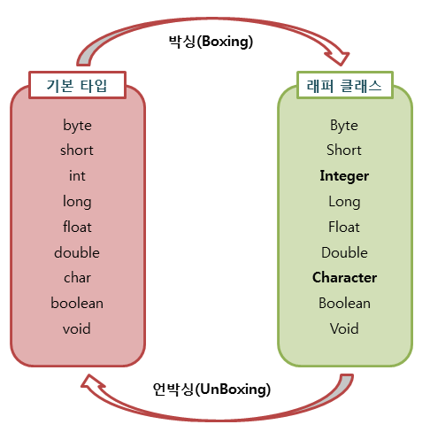

### Wrapper Class

Wrapper Class는 기본타입을 객체로 포장하는 역할을 한다.

*Java의 자료형은 크게 기본 타입(primitive type)과 참조 타입(reference type)으로 나누어진다. 기본타입은 정수, 실수, 논리 타입이 있고, 참조 타입은 클래스, 인터페이스, 배열, 열거 타입이 있다.*


실제로 Wrapper Class가 존재하는 것이 아닌, 기본타입의 데이터를 객체로 만들어주는 기능을 하는 클래스를 총칭해서 Wrapper Class라고 부른다.

자바는 모든 기본타입의 값을 갖는 객체를 생성할 수 있다. 이런 객체를 포장 ( Wrapper ) 객체라고 하는데, 기본타입의 값을 내부에 두고 포장하기 때문에 포장 객체이다. 기본타입 값은 외부에서 변경할 수 없다.

| **기본타입(primitive type)** | **래퍼클래스(wrapper class)** |
| ---------------------------- | ----------------------------- |
| boolean                      | Boolean                       |
| byte                         | Byte                          |
| char                         | Character                     |
| float                        | Float                         |
| int                          | Integer                       |
| long                         | Long                          |
| short                        | Short                         |
| double                       | Double                        |

int, char 을 제외한 나머지는 기본 타입의 첫 글자를 대문자로 바꾼 이름을 가지고 있다.


### Wrapper Class 구조도




### 그럼 왜 사용할까?

1. 기본 데이터 타입을 Object 로 변환할 수 있다.
	-  메소드에 전달된 인수를 수정하려는 경우 오브젝트가 필요하다.
2. java.util 패키지의 클래스는 객체만 처리하므로 Wrapper class는 이 경우에도 도움이 된다.

3. ArrayList 등과 같은 Collection Framework의 데이터 구조는 기본 타입이 아닌 객체만 저장하게 되고, Wrapper class를 사용하여 자동박싱/언박싱이 일어난다.

4. 멀티스레딩에서 동기화를 지원하려면 객체가 필요하다.
4. 기본 자료형의 값을 문자열로 변환 혹은 반대 경우
4. 기본 자료형의 값을 단순히 값으로만 사용하지 않고 그 값에 대한 Wrapper Class의 메서드를 사용 혹은 null값을 이용하기 위해 사용된다.


### 박싱(boxing)과 언박싱(UnBoxing)

기본 타입의 값을 포장 객체로 만드는 과정을 **박싱(Boxing)**이라고 하고 반대로 포장객체에서 기본타입의 값을 얻어내는 과정을 **언박싱(UnBoxing)**이라고 한다.



``` java
// 기본자료형 -> wrapper 클래스 := boxing
// wrapper 클래스 -> 기본자료형 := unboxing
public static void main(String[] args)  {
	Integer wrapperInt = new Integer(20); // 박싱
  Integer wrapperInt = Integer.valueOf(20); // 박싱
  // 박싱시 첫 번째 방식보다 두 번째 방식이 성능상 좋다.
  int primitiveInt = wrapperInt.intValue(); //언박싱
  // autoBoxing, autoUnBoxing
  wrapperInt = (Integer)primitiveInt; // 박싱 (Primitive to Wrapper)
  primitiveInt = (int)wrapperInt; // 언박싱 (Wrapper to Primitive)
}
```


### 값 비교

```java
public static void main(String[] args)  {
  Integer wrapperInt1 = Integer.valueOf(20);
  Integer wrapperInt2 = Integer.valueOf(20);
  int primitiveInt = 10; //기본타입

  wrapperInt1 == primitiveInt //true
  wrapperInt1.equals(primitiveInt) //true
  wrapperInt1 == wrapperInt2 //false
  wrapperInt1.equals(wrapperInt2) //true
    
	// 3번 == 에서 false가 나온 이유는 wrapper 객체의 참조 주소를 비교하기 때문에 false 값이 나온다. 필드 값을 비교하려면 Object의 equals 메서드를 사용해야 한다.
}
```

