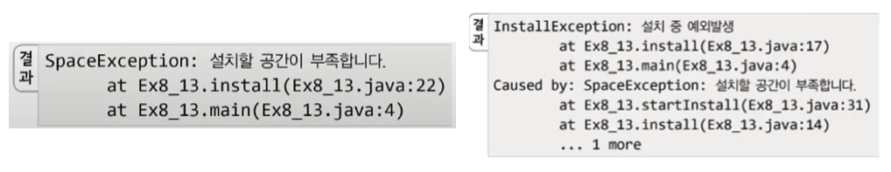

## 프로그램 오류

- 컴파일 에러(compile-time error) : 컴파일 할 때 발생하는 에러
	- 주로 IDE가 기본적인 오류를 잡아줌
- 런타임 에러(runtime error) : 실행 할 때 발생하는 에러
	- 에러 (error) : 심각한 오류 ex) out of memmory error
	- 예외 (exception) : 다소 미약한 오류
		- Exception ...
		- RuntimeException ...
- 논리적 에러(logical error) : 작성 의도와 다르게 동작


### 예외처리 

프로그램 실행 시 발생할 수 있는 예외의 발생에 대비한 코드를 작성하는 것으로 프로그램의 비정상 종료를 막고 정상적인 실행 상태를 유지하는 위한 것이다.


### 예외 클래스의 구조


Reference : https://www.benchresources.net/exception-hierarchy-in-java/


### [Exception](https://docs.oracle.com/javase/8/docs/api/java/lang/Exception.html) : checked

컴파일러가 예외 처리 여부를 체크한다. 예외 처리 필수

- IO Exception : 입출력 예외
- Class Not Found Exception : 클래스가 존재 X

### [Runtime Exception](https://docs.oracle.com/javase/8/docs/api/java/lang/RuntimeException.html) : unchecked

컴파일러가 예외 처리 여부를 체크 안한다. 예외 처리 선택

프로그래머의 실수로 발생하는 예외

- Arithmetic Exception : 산술 계산 예외. ex) 0으로 나누기

- Null Pointer Exception : 널 포인터 예외

- Class Cast Exception : 형변환 예외

- Index Out Of Bounds Exception : 배열 번위 벗어난 예외

	- Array Index Out Of Bounds Exception
	- String Index Out Of Bounds Exception 

- IllegalArgument

	[`java.lang.IllegalArgumentException`](https://docs.oracle.com/javase/8/docs/api/java/lang/IllegalArgumentException.html)은 적합하지 않거나(illegal) 적절하지 못한(inappropriate) 인자를 메소드에 넘겨주었을 때 발생

### try-catch

```java
public static void main(String[] args) {
  Sample sample = new Sample();
  int c;
  try {
    c = 20 / 0;
    System.out.print(c);  // 이 코드는 실행되지 않는다.
  } catch (ArithmeticException e) {
    c = -1;
  }
  System.out.print(c); // -1 출력
  // c == -1 이된다.
}
```


### 사용자 정의 예외 만들기

프로그램을 개발하다 보면 자바에서 표준으로 제공하는 예외 클래스만으로 다양한 종류의 예외를 표현할 수 없다. 

Exception과 Runtime Exception 중 선택해서 상속하면 된다.

```java
public class CustomException extend Exception {
  CustomException() { } // 매개 변수 없는 기본 생성자
  CustomException(String msg) {
    super(msg); // 예외 원인 전달하기 위한 String 매개 변수를 갖는 생성자
    						// 상속 받은 Exception Class의 생성자 호출
  }
}
```

사용자 정의 예외 클래스 이름은 Exception으로 끝나는 것이 좋다. 생성자는 위 코드와 같이 두 개를 선언하는 것이 일반적이다.

```java
public void test_CustomException() throws CustomException {
  throw new CustomException("CustomException 예외를 던집니다.")
}

public static void main(String[] args) {
  try {
    test_CustomException();
  } catch (ArithmeticException e) {
    String message = e.getMessage();
    System.out.print(message);  // "CustomException 예외를 던집니다." 출력
    e.printStackTrace(); //예외의 발생 경로 추적
  }
}
```

*rintStackTrace() : 예외 발생 당시의 호출스택에 있었던 메서드 정보와 예외 메시지를 화면에 출력한다.*
*getMessage() : 발생한 예외클래스의 인스턴스에 저장된 메시지를 얻을 수 있다.*


### 연결된 예외

그래서 2가 방법으로 사용

1. 세부적인 사항을 포괄적인 사항으로 포함시킬 때 사용
	- 한 예외가 다른 예외를 발생시킬 수 있다.
2. cheked 예외를 unchecked 예외로 변경시 사용
	- 예외 A가 예외 B를 발생시키면, A는 B의 원인 예외 (cause exception)

#### 세부적인 사항을 포괄적인 사항으로 포함시킬 때 사용

```java
try {
   install();
} catch(InstallException e { // SpaceException과 MemoryException을 하나로 묶음
	e.printStackTrace();
} catch(Exception e) {
	e.printStackTrace();
}
```

```java
void install() throws InstallException {
    try {
    	startInstall();		// SpaceException 발생
        copyFiles();
    } catch (SpaceException e) {
    	InstallException ie = new InstallException("설치 중 예외 발생");	// 예외 생성
        ie.initCause(e);	// InstallException의 원인 예외를 SpaceException으로 지정
        throw ie;		// InstallException을 발생시킨다.
    } catch (MemoryException me) {
    	...
    }
}
```



위 사진과 같이 연결됨으로써 설치중, 공간이 공간이 부족하다는 정보 표시가 된다.


#### 예외 A가 예외 B를 발생시키면, A는 B의 원인 예외 (cause exception)

```java
static void startInstall() throws SpaceException, MemoryException {
    if(!enoughSpace())		// 충분한 설치 공간이 없는 경우
    	throw new SpaceException("설치할 공간이 부족합니다.");
    
    if(!enoughMemory())		// 충분한 메모리가 없는 경우
    	throw new MemoryException("메모리가 부족합니다.");
}
```

위 코드를 아래와 같이 변경

```java
static void startInstall() throws SpaceException {
    if(!enoughSpace())		// 충분한 설치 공간이 없는 경우
    	throw new SpaceException("설치할 공간이 부족합니다.");
    
    if(!enoughMemory())		// 충분한 메모리가 없는 경우
    	throw new RuntimeException(new MemoryException("메모리가 부족합니다.")); // 원인 예외
}
```


코드 출처 : 자바의 정석_남궁서 저