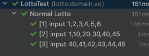
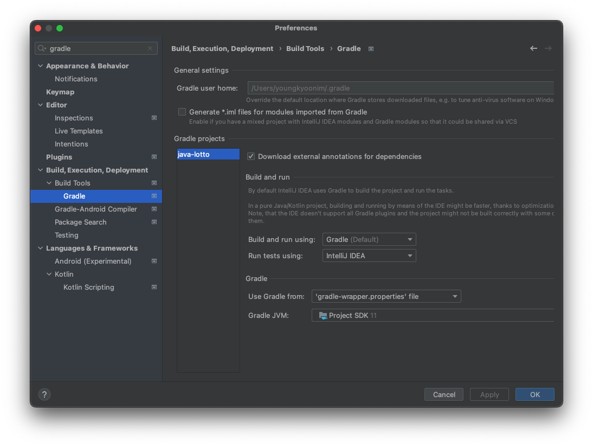
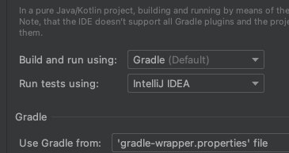

```java
@DisplayName("로또 정상 값 테스트")
@ParameterizedTest(name = "[{index}] input {0} ")
@ValueSource(strings = {"1,2,3,4,5,6", "1,10,20,30,40,45", "40,41,42,43,44,45"})
void lottoNumberTest(String inputString) {
  Lotto lotto = new Lotto(inputHandler.stringToList(inputString));
  assertThat(lotto.getLottoNumbers()).isEqualTo(inputHandler.stringToList(inputString));
}
```




>you can customize invocation display names via the `name` attribute of the`@ParameterizedTest` annotation like in the following example.
>
>```
>@DisplayName("Display name of container")
>@ParameterizedTest(name = "{index} ==> the rank of ''{0}'' is {1}")
>@CsvSource({ "apple, 1", "banana, 2", "'lemon, lime', 3" })
>void testWithCustomDisplayNames(String fruit, int rank) {
>}
>```
>
>When executing the above method using the `ConsoleLauncher` you will see output similar to the following.
>
>```
>Display name of container ✔
>├─ 1 ==> the rank of 'apple' is 1 ✔
>├─ 2 ==> the rank of 'banana' is 2 ✔
>└─ 3 ==> the rank of 'lemon, lime' is 3 ✔
>```
>
>https://junit.org/junit5/docs/current/user-guide/#writing-tests-parameterized-tests-display-names


IntelliJ 에서 표시가 않되는 문제가 발생한다.

- Preferences  > Gradle 검색
- Build, Execution, Deployment 아래 있는 Gradle 선택
- Run tests using을 IntelliJ IDEA로 변경하면 해결된다.



