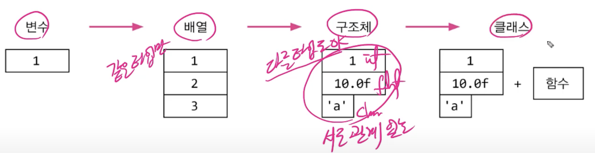

# 객체 지향 개념

## 클래스와 객체

### 클래스

#### 정의

클래스란 객체를 정의해 놓은 것

#### 용도

클래스는 객체를 생성하는데 사용

### 객체

#### 정의

실제로 존재하는 것, 사물 또는 개념

#### 용도

객체가 가지고 있는 기능과 속성에 따라 다름

| 클래스      | 객체 |
| ----------- | ---- |
| 제품 설계도 | 제품 |
| TV 설계도   | TV   |


## 객체의 구성요소 - 속성과 기능

객체 = 속성(변수) + 기능(메서드)

### TV

| 속성(변수)       | 크기, 길이, 높이, 색상, 볼륨, 채널 등                  |
| ---------------- | ------------------------------------------------------ |
| **기능(메서드)** | 켜기, 끄기, 볼륨 높이기, 볼륨 낮추기, 채널 변경하기 등 |

```java
//TV 설계도
Class tv {
  String color: //색깔
  boolean power; // 전원상태
  int channel; // 채널
  
  void power() { power = !power; }
  void channelUp() { channel++; }
  void channelUp() { channel--; }
}
```


## 객체와 인스턴스

객체 : 모든 인스턴스를 대표하는 일반적 용어

인스턴스 : 특정 클래스로부터 생성된 객체(예:TV인스턴스)


클래스 -----인스턴스화-----> 인스턴스(객체)

설계도 ----- 제품 생성 -----> 제품


### Q&A

클래스가 왜 필요한가? 객체를 생성하기 위해

객체가 왜 필요한가? 객체를 사용하기 위해

객체를 사용한다는 것은? 객체가 가진 속성(변수)과 기능(메서드)을 사용하려고


## 객체의 생성과 사용

### 객체의 생성

클래스명 변수명;				// 클래스의 객체를 참조하기 위한 참조변수를 선언

변수명 = new 클래스명();  // 클래스의 객체를 생성 후, 객체의 주소를 참조변수에 저장

```java
Tv = t;				// Tv클래스 타입의 참조변수 t선언
t = new Tv(); // Tv인스턴스를 생성한 후, 생성된 Tv인스턴스의 주소를 t에 저장
```

### 객체의 사용

```java
t.channel = 7;		// Tv인스턴스의 멤버변수 channel의 값을 7로 한다.
t.channelDown();	// Tv인스턴스의 메서드 channelDown()을 호출한다.
System.out.println("현재 채널은 " + t.channel + "입니다.");
```


## 객체 배열

객체 배열 == 참조변수 배열

```java
Tv tv1, tv2, tv3;
Tv[] tvArr = new Tv[3];
tvArr[0] = new Tv;
tvArr[1] = new Tv;
tvArr[2] = new Tv;
```


## 클래스의 정의

### 1. 설계도

### 2. 클래스 == 데이터 + 함수

변수 -> 배열 -> 구조체 -> 클래스



### 3. 사용자 정의 타입

```java
int hour = 12;
int minute = 34;
int second = 54;
```

```java
// 객체지향적
class Time {
  int hour;
	int minute;
	int second;
}
Time t = new time();
t.hour = 12;
t.minute = 34;
t.second = 54;
```


# 선언 위치에 따른 변수의 종류

```java
public class Class {

	int iv; // 인스턴스 변수 (Instance Valiable)
	static int cv; // 클래스 변수(Class Valiable)
	
	void method() {
		int lv; // 지역 변수(Local Valiable)
	}
}
```

### 인스턴스 변수

- 클래스 내에 선언된 변수
- 인스턴스 변수는 인스턴스가 생성될 때 생성된다. 객체 생성 시마다 새로운 변수가 생성된다.
- 인스턴스 별로 다른 값을 가질 수 있다. 즉, 각각의 인스턴스 변수마다 고유의 값을 가진다.

### 클래스 변수

- 인스턴스 변수에 `Static` 키워드만 붙여주면 된다.
- 인스턴수 변수와 다르게 공통된 값을 공유하게 된다.
- 클래스가 메모리에 올라갈 때 부터 프로그램이 종료될 때까지 유지된다.
- 클래스가 여러 번 생성되어도 `Static` 변수는 **딱 한 번**만 생성된다. 메모리에 딱 한 번만 올라간다.
- 동일한 클래스의 모든 객체들에 의해서 공유된다. 즉, 전역 변수가 된다.

### 지역 변수

- 메서드 내에서 선언되며 메서드 내에서만 사용할 수 있는 변수
- 메서드가 실행될 때 메모리를 할당 받으며 메서드가 끝나면 소멸된다.


## 클래스 변수와 인스턴스 변수 차이


카드의 공통 속성 ( 클래스 변수 )

- 카드의 폭
- 카드의 높이

카드의 개별 속성 ( 인스턴스 변수 )

- 무늬
- 숫자

```java
class Card {
  String kind;
  int number;
  static int width = 100;
  static int width = 250;
}
```

```java
Card c = new Card();
c.kinf = "Heart";
c.number = 5;
Card.width = 200; //c.width는 사용 가능하지만 권장 하지 않음
Card.height = 300;//이유는 오해하기 쉽다.
```


## 메서드란

1. 문장들을 {}로 묶어놓은 것
2. 갑(입력)을 받아서 처리하고, 결과를 반환(출력)

#### 메서드의 장점

- 코드의 중복을 줄일 수 있따
- 코드의 관리가 쉽다.
- 코드를 재사용할 수 있다.
- 코드가 간결해서이해하기 쉬워진다.

#### 메서드의 작성

- 반복적으로 수행되는 여러 문장을 메서드로 작성
- 하나의 메서드는 한 가지 기능만 수행하도록 작성

#### 메서드 = 선언부 + 구현부

반환타입 메서드이름 (타입 변수명, 타입 변수명, ... ) // 선언부
{ 																			 // 구현부
	// 메서드 호출시 수행될 코드
}

#### 매개변수도 지역변수이다.


## 
