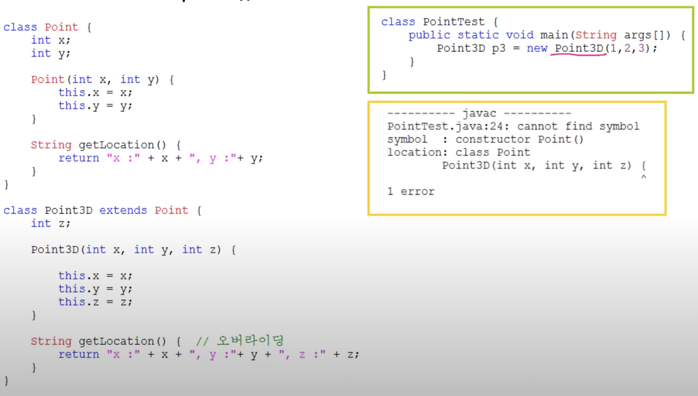

### super

- 객체 자신을 가리키는 참조변수. 인스턴스 메서드(생성자) 내에만 존재 -> static 메서드내에 사용 불가

- 조상의 맴버와 자신의 멈버를 구별할 때 사용

```java
Class ex{
  public static void main(String args[]) {
    Child c = new Child();
    c.method(30);
  }
}

class Parent { int x = 10; } // super.x

class Child extend Parent {
  int x = 20; // this.x
  
  void method(int x) {
    System.out.println("x = " + x);
    System.out.println("this.x = " + this.x);
    System.out.println("super.x = " + super.x);
  }
}

//결과
x = 30
this.x = 20
super
```

### 

### super() - 조상의 생성자 != super

- 조상의 생성자를 호출할 때 사용
- 조상의 멤버는 조상의 생서자를 호출해서 초기화
- 생성자의 첫 줄에 반드시 생성자를 호출해야한다. 그렇지 않으면 컴파일러가 생성자의 첫 줄에 super();를 삽입한다.

```java
class Point extends Object {
  int x;
  int y;
  
  Point() {
    this(0,0);
  }
  
  Point(int x, int y) {
    super(); // Object(); 
    this.x = x;
    this.y = y;
  }
}
```


### 예시



에러 나는 이유는 Point3D에서 super(); -&gt; Point()를 호출하게 된다. 

Point 클래스에는 기본 생성자가 없으므로 에러가 나게 된다.

클래스를 작성할 때는 기본 생성자 작성은 필수다 

#### 맞는 코드

```java
Point3D(int x, int y, int z) {
  super(x,y);
  this.z = z;
}
```

