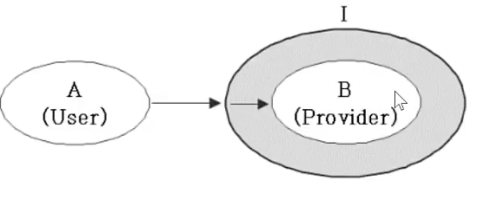

## 인터페이스(interface)

- 인터페이스의 본질 : 프로그래밍 관점 추상 메서드의 집합 
- 구현된 것이 전혀 없는 설계도. 껍데기(모든 멤버가 public)
- 상수만 가질 수 있다. 변수 X, iv X, cv X, 생성자 x, 인스턴스 메서드 x

```java
interface 인터페이스이름 {
  public static final 타입 상수이름 = 값;	//상수만
  public abstract 메서드이름(매개변수목록);	//추상메서드
}
```

- 상수는 항상 public static final, 메서드는 항상 public abstract 그래서 생략가능


## 추상 클래스와 인터페이스 차이

| 인터페이스                                 | 추상 클래스                                                  |
| ------------------------------------------ | ------------------------------------------------------------ |
| 추상 메서드만 가진 것 (모든 부분이 미완성) | 일반 클래스가 생성자 + iv + 추상 메서드를 가진 것 (일부가 미완성) |


## 인터페이스의 상속

- 인터페이스의 조상은 인터페이스만 가능(Object가 최고 조상 아님)
- 다중 상속이 가능.(추상메서드는 충돌해도 문제 없음)
	- 다중 상속 시 충돌 문제는, 선언 부는 일치하고, 내용{}이 다르면 어느 쪽을 상속받을지 결정할 수 없어서 생기는 문제다.
	- 하지만, 인터페이스는 상속받은 후에 내용을 구현하기 때문에 문제가 생기지 않는다.

```java
interface Fightavle extend Movable, Attachable {}

interface Movable {
  void move(int x, int y);
}

interface Attachable {
  void attack(Unit u);
}
```


## 인터페이스의 구현

- 인터페이스에 정의된 추상 메서드를 완성하는 것

```java
class 클래스이름 implements 인터페이스이름 {
  // 인터페이스에 정의된 추상메서드를 모두 구현해야 한다.
}
```

- 일부만 구현하는 경우, 클래스 앞에 abstract를 붙여야 한다. -> 추상 클래스


## 인터페이스를 이용한 다형성

- 인터페이스도 구현 클래스의 부모이다
- **인터페이스 타입 매개변수는 인터페이스 구현한 클래스의 객체만 가능**

```java
interface Fightable {
  void move(int x, int y);
  void attack(Fightable f); // 상속받아 구현한 클래스의 인스턴스만 가능
}

class Fighter extends Unit implements Figtable {
  public void move(int x, int y) { ... }
  public void attack(Fightable f) { ... }
}

조상클래스 -> 자손객체
Unit u = new Fighter();			 // 가능
Fightable f = new Fighter(); // 가능
```

- 인터페이스를 메서드의 리턴타입으로 지정할 수 있다.

```java
Fightable method() { //Fightable인터페이스를 구현한 클래스의 인스턴스를 반환
  Fighter f = new Fighter();
  return f; //f == 인터페이스를 구현한 객체
}

Fightable f = method();

class Fighter extends Unit implements Fightable {
  public void move(int x, int y) { ... }
  public void attack(Fightable f) { ... }
}
```


## 인터페이스의 장점

- 두 대상(객체) 간의 '연결, 대화, 소통'을 돕는 '중간 역할'을 한다.
- 리모컨, 기계의 껍데기, 키보드, 등... 중간 역할
- 껍데기를 냅두고 내부를 변경하는데 유리하다.
- 선언(설계)와 구현을 분리시킬 수 있게 한다.

```java
class B {
  public void method() {
    System.out.println("methodInB");
  }
}
```

분리

```java
interface I {
	public void method()
}

class B implements I{
  public void method() {
    System.out.println("methodInB");
  }
}
```

- 인터페이스 덕분에 B가 변경되어도 A는 안바꿀 수 있게 된다.(느슨한 결합)



A는 I사용, B는 구현

위 그림과 같이 interface로 중간 역할을 해주면 B가 C로 변경되어도 A는 변경할 필요가 없다. (느슨한 결합)

```java
//직접적인 관계의 두 클래스 A-B
class A {
  public void methodA(B b) { //B를 사용
    b.methodB();
  }
}

class B {
  public void methodB() {
    System.out.println("methodInB()");
  }
}

class C implements I {
  public void methodB() {
    System.out.println("methodInB() in C class");
  }
}

//클래스 B -> C 로 변경시 A 코드 변경 필요

class InterfaceTst {
  public static void main(String args[]) {
    A a = new A();
    a.methodA(new B()); //"methodInB()"출력
  }
}
```

```java
//간접적인 관계의 두 클래스 A-I-B
class A {
  public void methodA(I i) { //I를 사용
    i.methodB();
  }
}

Interface I { void methodB(); }

class B implements I {
  public void methodB() {
    System.out.println("methodInB()");
  }
}

class C implements I {
  public void methodB() {
    System.out.println("methodInB() in C class");
  }
}

//클래스 B -> C 로 변경시 A는 변경 없음

class InterfaceTst {
  public static void main(String args[]) {
    A a = new A();
    a.methodA(new B()); //"methodInB()"출력
    a.methodA(new C()); //"methodInB() in C class"출력
  }
}
```

- 개발 시간을 단축할 수 있다.
	- 인터페이스가 없으면 A가 B를 사용하려면 먼저 B가 완성되어야 한다.
	- 인터페이스를 사용하면 추상메서드 호출 가능하기 때문에 코드 작성 가능.(메서드가 완성되어있다고 가정하고 구현)
	- IV사용은 메서드를 통해서 접근하기 떄문에 상관없다.

- 변경에  유리한 유연한 설계가 가능
- 표준화가 가능하다. ex. JDBC -> 여러 종류의 DB와 연결하기 위한 표준, DB회사는 JDBC 표준에 맞춰서 제공
- 서로 관계없는 클래스들을 관계를 맺어줄 수 있다.


SCV, Tank, Dropship 를 수리하는 기능을 만든다고 가정하면

```java
interface Repairable {}

class SCV extends GroundUnit implements Repairable {
  // ...
}
class Tank extends GroundUnit implements Repairable {
  // ...
}
class Dropship extends AirUnit implements Repairable {
  // ...
}

void repair(Repairable r) { // -> Repairable을 구현한 객체만 가는
  if (r instanceof Unit) {
    Unit u = (Unit)r;
    While(u.hitPoint != u.MAX_HP) {
      u.hitPoint++; //Unit의 HP를 증가시킨다.
    }
  }
}
```


## 디폴트 메서드와 static메서드(JDK 1.8부터)

- 인터페이스에 디폴트 메서드와 static메서드 추가 가능(JDK 1.8부터)
- 인터페이스에 새로운 메서드(추상 메서드)를 추가하기 어려움
	- 새로운 메서드를 추가하면 상속받은 클래스에 모두 추가해야함
	- 해결책 -> 디폴트 메서드
- 디폴트 메서드는 인터페이스 메서드(인터페이스 원칙 위반)

```java
interface Interface {
  void method();
  default void newMethod() [] // 몸통(내용)이 있는 메서드를 추가 가능 == 디폴트 메서드
}
```

- 디폰트 메서드가 기존의 메서드와 충돌할 때의 해결책 -> 충돌시, 그냥 직접 오버라이딩 하면 해결.
	- 여러 인터페이스의 디폴트 메서드 간의 충돌
		- 인터페이스를 구현한 클래스에서 디폴트 메서드를 오버라이딩해야 한다.
	- 디폴트 메서드와 조상 클래스의 메서드 간의 충돌
		- 조상 클래스의 메서드가 상속되고, 디폴트 메서드는 무시된다.
