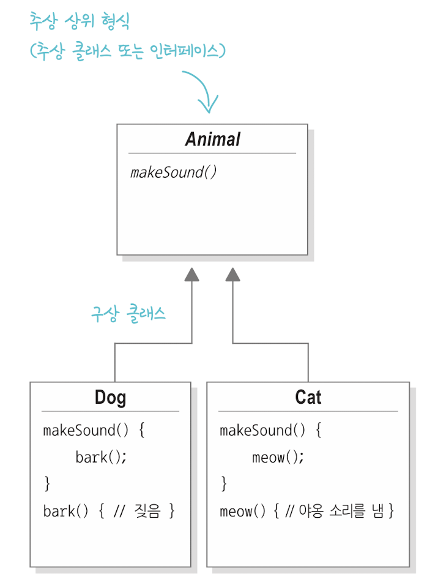
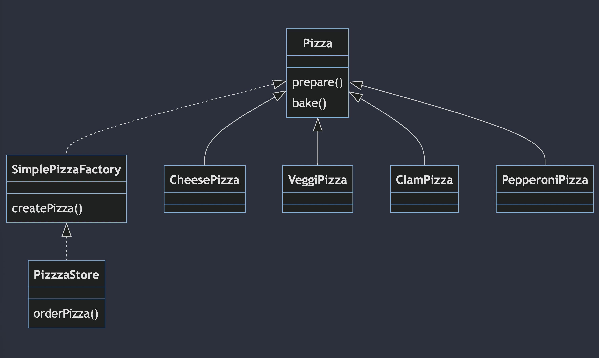
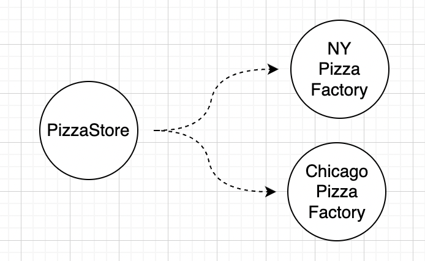
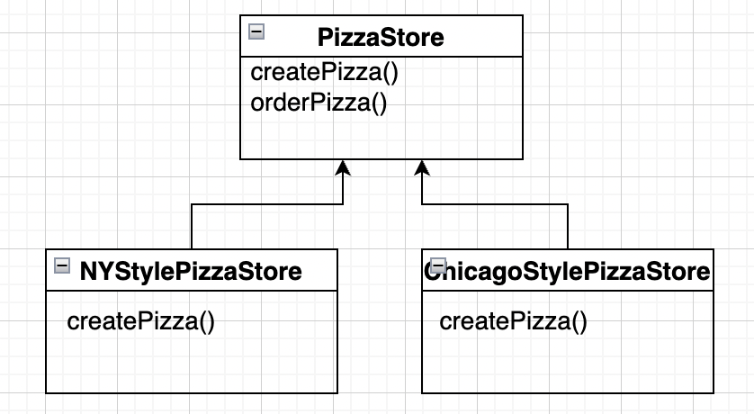
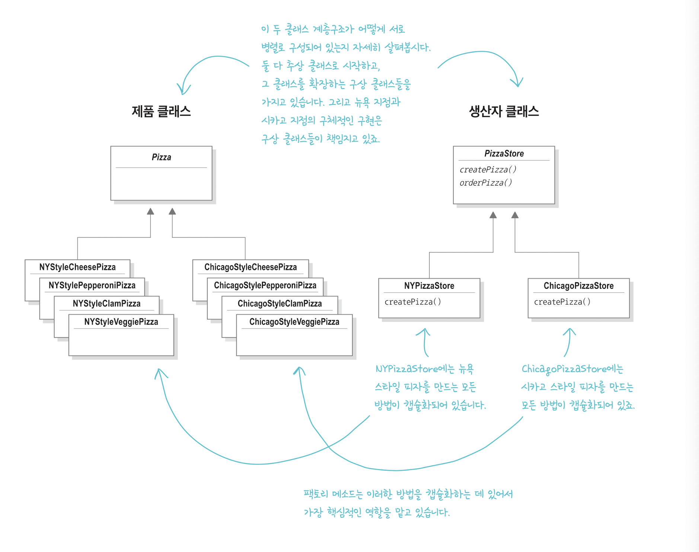
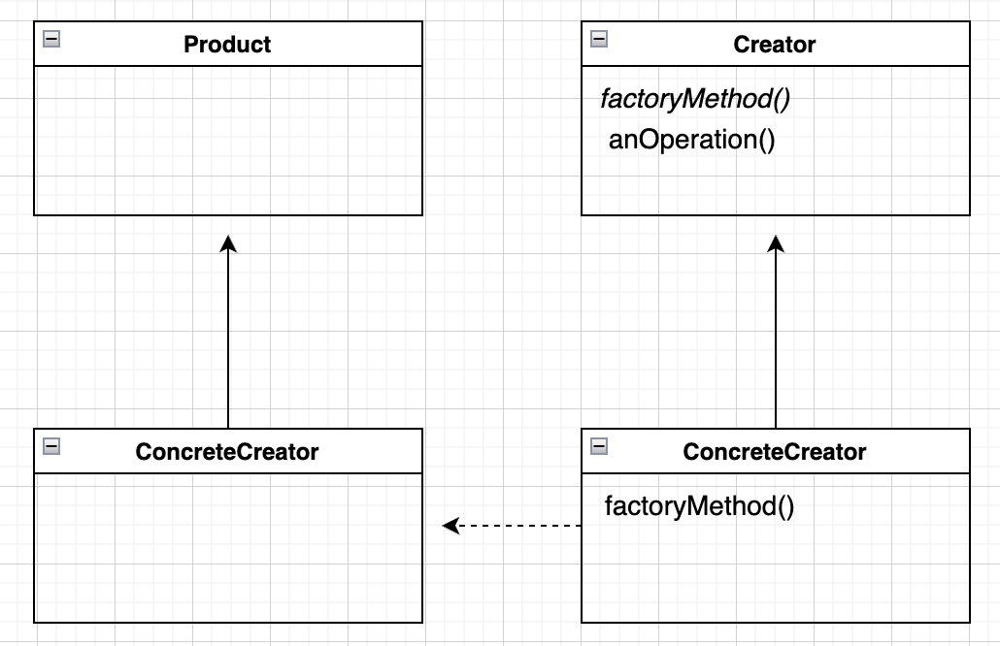

# 팩토리 패턴(factory pattern)


### 팩토리 패턴을 사용하는 이유

다형성은 높이고 의존성 낮추기 위해서이다.


### 구상 클래스, 추상 클래스, 인터페이스 사용 이유

new 연산자를 사용해 인스턴스를 구현하면 나중에 코드를 수정해야 할 가능성이 커지고, 유연성이 떨어집니다. 그래서 상위 형식에 맞춰서 프로그래밍합니다. (인터페이스에 맞춰서 프로그래밍한다.)



>실제 실행 시에 쓰이는 객체가 코드에 공정되지 않도록 상위 형식(supertype)에 맞춰 프로그래밍해서 다형성을 활용해야 한다는 점
>
>변수를 선언할 때 보통 추상 클래스나 인터페이스 같은 상위 형식으로 선언해야 한다. 객체를 변수에 대입할 때 상위 형식을 구체적으로 구현한 형식이라면 어떤 객체든 넣을 수 있기 때문이다. 그러면 "변수를 선언하는 클래스에서 실제 객체의 형식을 몰라도 된다"라는 뜻으로 생각하면 된다.
>
>출처 : 헤드 퍼스트 디자인 패턴

구상 클래스 형식에 맞춰서 프로그래밍

```java
Dog d = new Dog(); // 변수 d를 Dog 형식(Animal을 확장한 구상 클래스)으로 선언하면
d.dark();					 // 구체적인 구현에 맞춰서 코딩해야 한다.
```

인터페이스와 상위 형식에 맞춰서 프로그래밍

```java
Animal animal = new Dog(); //Dog라는 걸 알고 있긴 하지만 다형성을
animal.makeSound(); 			 //활용해서 Animal의 래퍼런스를 써도 된다.
```

더 바람직한 방법으로 상위 형식의 인스턴스를 만드는 과정을 new Dog()같은 식으로 직접 코드로 만드는 대신 구체적으로 구현된 객체를 실행시에 대입하는 것이다.

```java
anumal = getAnimal();
a.makeSound();
```

> 출처 : 헤드 퍼스트 디자인 패턴


## Simple Factory 

디자인 패턴이라기 보다는 프로그래밍에서 자주 쓰이는 광용구에 가깝다. 팩토리 패턴이라고 부르는 사람들도 있다.


피자 가게를 운영한다고 가정

```java
Pizza orderPizza() {
  Pizza pizza = new Pizza();
  
  pizza.prepare();
  pizza.bake();
  return pizza;
}
```


피자 종류가 여러개라면?

```java
Pizza orderPizza(String type) {
  Pizza pizza;
  
  if (type.equlas("cheese")) {
    pizza = new ChesePizze();
  } else if (type.equlas("pepperoni")) {
    pizza = new PepperoniPizze();
  } else if (type.equlas("veggie")) {
    pizza = new VeggiePizze();
  }
  
  pizza.prepare();
  pizza.bake();
  return pizza;
}
```


피자 메뉴를 수정한다면? 기존 메뉴 하나를 제외하고 신메뉴 2개 추가

```java
Pizza orderPizza(String type) {
  Pizza pizza;
  
  if (type.equlas("cheese")) {
    pizza = new ChesePizze();
  } else if (type.equlas("pepperoni")) {
    pizza = new PepperoniPizze();
//  } else if (type.equlas("veggie")) {
//    pizza = new VeggiePizze();
  } else if (type.equlas("clam")) {
    pizza = new ClamPizze();
  } else if (type.equlas("greek")) {
    pizza = new GreekPizze();
  }
  
  pizza.prepare();
  pizza.bake();
  return pizza;
}
```

orderPizza클래스에서 문제되는 부분은 객체 생성 부분이다. 의존성도 높다.


객체 생성 부분 캡슐화 -> SimpleFactory

```java
//팩토리를 사용하는 클라이언트 -> SimplePazzaFactory로부터 피자 인스턴스를 받게 된다.
public class PazzaStore {
  SimplePazzaFactory factory;

  public PizzaStore(SimplePizzaFacory factory) {
    this.factory = factory;
  }

  Pizza orderPizza(String type) {
    Pizza pizza;

    pizza = factory.createPizza(type);

    pizza.prepare();
    pizza.bake();
    return pizza;
  }
  ...
}
```

```java
// 피자 객체를 생성하는 팩토리. 이 애플리케이션에서 유일하게 객체 생성 Pizza 클래스를 직접 참조하는 부분
public class SimplePizzaFactory {
  
  public Pizza createPizza(String type){ // 팩토리에서 만드는 피자
    Pizza pizza = null;
    
    if (type.equlas("cheese")) {
      pizza = new ChesePizze();
    } else if (type.equlas("pepperoni")) {
      pizza = new PepperoniPizze();
    } else if (type.equlas("clam")) {
      pizza = new ClamPizze();
    } else if (type.equlas("greek")) {
      pizza = new GreekPizze();
    }
    return pizza;
  }
}
```


클래스 다이어그램



~pizza 팩토리에서 생산하는 제품에 해당하는 구상 클래스

각 피자는 Pizza 추상 클래스를 확장해야 한다.


## 기존 PizzaStore 코드를 모든 지점에서 활용하려고 한다면?



피자를 만드는 createPizza() 메소드를 다시 PizzaStore에 넣습니다. 하지만 메소드를 추상 메소드로 선언해 지역별 스타일에 맞게 PizzaStore의 서브 클래스를 만든다. NYPizzaStore, ChicagoPizzaStore ...

*createPizza() 메소드를 PizzaStore에 넣는 이유는 분점마다 고유 스타일의 피자를 생성할 수 있게 하기 위함니다.*



createPizza()는 추상 메소드로, 서브 클래스를 만들 때 이 메소드를 반드시 구현해야한다.

orderPizza() 메소드를 고쳐 쓸 수 없게 하고 싶다면 final로 선언하면 된다.(Override 방지)

```java
public abstract class PizzaStore {
  
  Pizza orderPizza(String type) {
    Pizza pizza;

    pizza = createPizza(type); //팩토리 객체가 아닌 PizzaStore에 있는 추상 메서드 호출

    pizza.prepare();
    pizza.bake();
    return pizza;
  }
  
  abstract Pizza createPizza(String type); //팩토리 메소드가 추상 메소드로
}
```

```java
public class NYPizzaStore extends PizzaStore {

  	//orderPizza() 메소드는 자동 상속
  
	  //createPizza()는 Pizza 객체를 리턴하며, Pizza의 서브 클래스 가운데
  	//어느 구상 클래스 객체의 인스턴스를 만들어서 리턴할지는 전적으로 PizzaStore의 서브 클래스에 의해 결정된다.
  	//구상 클래스의 객체를 생성해, 피자 종류에 해당하는 뉴욕 스타일 피자를 생성해서 리턴한다.
    public Pizza createPizza(String type){
        if (type.equlas("cheese")) {
            return new NYStyleChesePizze();
        } else if (type.equlas("pepperoni")) {
            return new NYStylePepperoniPizze();
        } else if (type.equlas("clam")) {
            return new NYStyleClamPizze();
        } else if (type.equlas("greek")) {
            return new NYStyleGreekPizze();
        } else {
            return null
        }
    }
}
```


현재 코드를 보면 PizzaStore와 Pizza는 서로 완전히 분리되어 있음을 알 수 있다.

orderPizza() 메소드에서 Pizza 객체를 가지고 여러 가지 작업을 하지만, Pizza는 추상 클래스라서 orderPizza()는 실제로 어떤 구상 클래스에서 작업이 처리되고 있는지 전혀 알 수 없다.

orderPizza()에서 createPizza()를 호출하면 Pizza의 서브 클래스가 호출을 받아 피자를 만들게 된다. 피자의 종류는 피자를 주문하는 가게(PizzaStore 서브 클래스)에 따라 달라지게 된다.

orderPizza()가 보기에는 피자 종류를 서브클래스에서 경정해서 전달해 주는 것 같이 느낀다.

팩토리 패턴은 서브 클래스에서 어떤 클래스를 만들지 결정함으로써 객체 생성을 캡슐화했다.


그리고 추가로 가게가 생긴다면, PizzaStore 서브 클래스를 추가하면 된다.



> 출처 : 헤드 퍼스트 디자인 패턴


## 팩토리 메소드 패턴(Factory Method Pattern) 정의

객체를 생성할 떄 사용하는 서브클래스에 따라 생산되는 객체 인스턴스가 결정된다. 실행 중에 생산자 클래스가 실제 생상될 제품을 전혀 모르는 상태로 만들어지기 때문이다.



Creator에는 제품으로 원하는 일을 할 때 필요한 모든 메소드가 구현되어 있다. 하지만 제품을 만들어 주는 팩토리 메소드는 추상 메소드로 정의되어 있다.

Creator에서 정의된 추상메서드는 ConcreteCreator 에서 factoryMethod()를 구현한다.

Product와 ConcreteCreatr (제품 클래스)는 모두 똑같은 인터페이스를 구현해야 한다. 그래야 그 제품을 사용할 클래스에서 구상 클래스가 아닌 인터페이스의 레퍼런스로 객체를 참조할 수 있기때문이다.


Reference : 헤드 퍼스트 디자인 패턴
