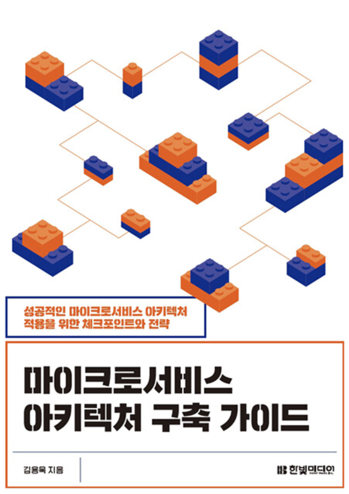

이 책은 크게 1부, 2부로 나누어져 있습니다.

#### 1부. 마이크로서비스 아키텍처 이해하기

1부는 마이크로서비스 아키텍처에 대한 근본적인 정의와 마이크로서비스를 효과적으로 운영하는 방법에 대해서 상세하게 설명해주고 있습니다. 책에서 독자에게 질문을 던져 생각을 한 번 더 하게끔 해 독자의 상황과 예제의 상황을 비교하거나, 참고할 수 있습니다.

#### 2부. 마이크로서비스 아키텍처 적용하기

2부는 마이크로서비스 아키텍처를 구축하는 방법과 실제 예제 및 문제점과 해결방안과 함께 설명되어 쉽게 따라 할 수 있게 구성되어 있습니다. 하지만 다양한 도구를 다루기 때문에, 도구에 익숙하지 않을 때 따라 하기 어려울 수 있습니다.

마이크로서비스 아키텍처를 구축한다면 참고하기 좋은 도서라 생각됩니다.

**"한빛미디어 <나는 리뷰어다> 활동을 위해서 책을 제공받아 작성된 서평입니다."**

