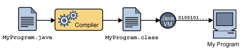
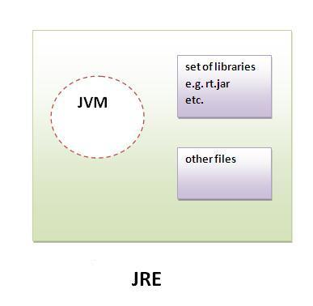

## 목표

자바 소스 파일(.java)을 JVM으로 실행하는 과정 이해하기.

### JVM이란 무엇인가

자바 가상머신( **J**ava **V**irtual **M**achine)의 약자이다.

JVM은 자바 소스코드로부터 만들어지는 자바 바이너리 파일(.class)을 실행할 수 있다. 또한 JVM은 플랫폼에 의존적이다. 즉 리눅스의 JVM과 윈도우즈의 JVM은 다르다. 단, 컴파일된 바이너리 코드는 어떤 JVM에서도 동작시킬 수 있다.

*하드웨어에 맞게 완전히 컴파일된 상태가 아니고 실행 시에 해석(interpret)되기 때문에 속도가 느리다는 단점을 가지고 있다. 하지만 요즘엔 바이트코드(컴파일된 자바코드)를 하드웨어의 기계어로 바로 변환해주는 JIT컴파일러와 향상된 기술이 적용되어 속도의 격차를 많이 줄였다.*

**즉, JVM은 CPU가 원시 코드를 실행할 수 있게 하는 가상 컴퓨터**

*[출처](https://doozi0316.tistory.com/entry/1%EC%A3%BC%EC%B0%A8-JVM%EC%9D%80-%EB%AC%B4%EC%97%87%EC%9D%B4%EB%A9%B0-%EC%9E%90%EB%B0%94-%EC%BD%94%EB%93%9C%EB%8A%94-%EC%96%B4%EB%96%BB%EA%B2%8C-%EC%8B%A4%ED%96%89%ED%95%98%EB%8A%94-%EA%B2%83%EC%9D%B8%EA%B0%80)*

### 컴파일 하는 이유 

원시코드는 CPU가 인식하지 못해서 기계어로 컴파일을 해줘야한다.
하지만, Java는 JVM을 거쳐서 OS에 도달하기 때문에 OS가 인식할 수 있는 기계어가 아닌 JVM이 인식할 수 있는 Java bytecode(`*.class`)로 변환된다.

Java compiler를 사용해서 .java(원시코드)로 부터 .class(Java bytecode)을 생성한다. 

*Java compiler는 JDK를 설치하면 bin 에 존재하는 javac.exe 이다.*

이렇게 변환된 bytecode는 기계어가 아니기 때문에 OS에서 바로 실행되지 않는다. 
즉, OS에 종속적이지 않고, Java 파일 하나만 만들면 어느 디바이스든 JVM 위에서 실행할 수 있게된다.

### 실행하는 방법

.class(java bytecode)는 자바 인터프리터(java.exe)로 실행한다.

*자바 인터프리터는 JDK를 설치하면 bin 에 존재하는 java.exe 이다.*

*java.exe 는 JVM을 구동시키기 위한 명령 프로그램이다.*

### 바이트코드란

자바 컴파일러에 의해 변환된 코드의 명령어 크기가 1바이트라서 자바 바이트 코드라고 불린다.

*bytecode는 가상 컴퓨터(VM)에서 돌아가는 실행 프로그램을 위한 이진 표현법*

bytecode는 다시 JIT 컴파일러 또는 실시간 번역기에 의해 비이너리 코드로 변환된다.

*바이너리 코드는 0과 1로 구성된 이진코드 *

*기계어는 바이너리 코드이다. 하지만, CPU 제조사에 따라 기계어가 다를 수 잇다.*

### JVM의 역할

- 바이너리 코드를 읽는다.
- 바이너리 코드를 검증한다.
- 바이너리 코드를 실행한다.
- 실행환경(Runtime Environment)의 규격을 제공한다. (필요한 라이브러리 및 기타파일)

### JVM 구성 요소

### JDK와 JRE의 차이

#### JDK = JRE + 개발에 필요한 실행파일

자바 개발도구 (Java Development Kit)는 JRE + 개발을 위해 필요한 도구(javac, java등) 컴파일러, 디버거 등을 포함한다.

*[출처](https://wikidocs.net/257)*

#### JRE = JVM + 클래스 라이브러리 (Java API)

자바 실행환경 (Java Runtime Environment)이 자바 프로그램을 동작시킬 때 필요한 라이브러리 파일들과 기타 파일들을 가지고 있다. JRE는 JVM의 실행환경을 구현했다고 할 수 있다.

*[출처](https://wikidocs.net/257)*

*[출처](https://www.boardinfinity.com/blog/understanding-the-difference-between-jdk-jre-and-jvm/)*

#### SDK - Software Development Kit (소프트웨어 개발 키트)

하드웨어 플랫폼, 운영체제 또는 프로그래밍 언어 제작사가 제공하는 툴이다.
대표적인 예로, JDK 등이 있다.

