# JVM

JVM은 컴파일의 결과물인 바이트 코드를 실행하기 위한 가상 머신이다.  
컴파일된 _.class 파일들을 클래스 로더가 읽고 **Runtime Data Area** 에 올라가면  **Execution Engine** 이 바이트 코드를 읽게 된다.

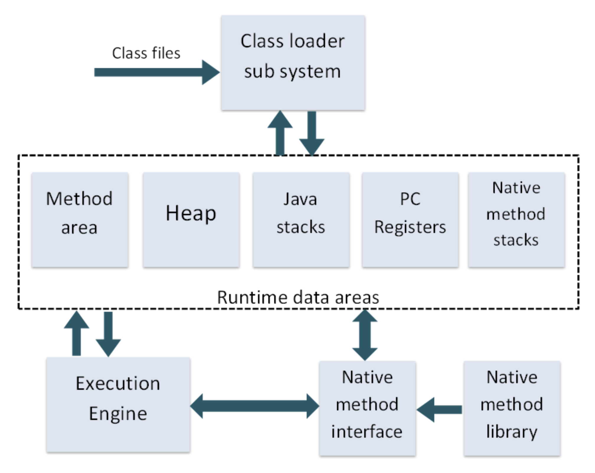

#### JVM은 크게 4가지로 구분된다.

-   Class Loader
-   Runtime Data Area
-   Execution Engine


## Class Loader

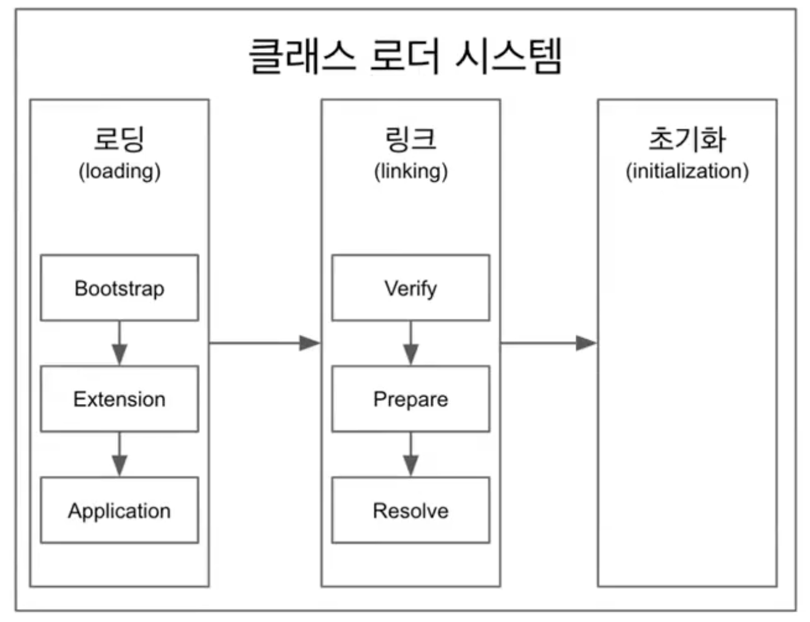

자바는 동적 로드, 즉 컴파일타임이 아니라 런타임에 클래스를 처음으로 참조할 때 해당 클래스를 로드하고 링크하는 특징이 있다. 이 동적 로드를 담당하는 부분이 JVM의 클래스 로더이다.

#### 자바 클래스 로더의 특징

-   계층 구조: 클래스 로더끼리 부모-자식 관계를 이루어 계층 구조로 생성된다. 최상위 클래스 로더는 부트스트랩 클래스 로더(Bootstrap Class Loader)이다.
-   위임 모델: 계층 구조를 바탕으로 클래스 로더끼리 로드를 위임하는 구조로 동작한다. 클래스를 로드할 때 먼저 상위 클래스 로더를 확인하여 상위 클래스 로더에 있다면 해당 클래스를 사용하고, 없다면 로드를 요청받은 클래스 로더가 클래스를 로드한다.
-   가시성(visibility) 제한: 하위 클래스 로더는 상위 클래스 로더의 클래스를 찾을 수 있지만, 상위 클래스 로더는 하위 클래스 로더의 클래스를 찾을 수 없다.
-   언로드 불가: 클래스 로더는 클래스를 로드할 수는 있지만 언로드(삭제) 할 수는 없다. 언로드 대신, 현재 클래스 로더를 삭제하고 아예 새로운 클래스 로더를 생성하는 방법을 사용할 수 있다.

각 클래스 로더는 로드된 클래스들을 보관하는 네임스페이스(namespace)를 갖는다. 클래스를 로드할 때 이미 로드된 클래스인지 확인하기 위해서 네임스페이스에 보관된 FQCN(Fully Qualified Class Name)을 기준으로 클래스를 찾는다. 비록 FQCN이 같더라도 네임스페이스가 다르면, 즉 다른 클래스 로더가 로드한 클래스이면 다른 클래스로 간주된다.

#### 클러스 로더의 위임 모델

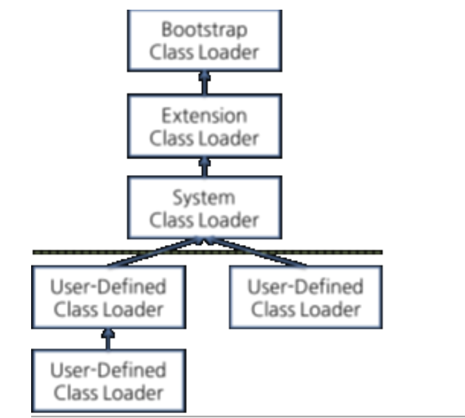

클래스 로더가 클래스 로드를 요청받으면, 클래스 로더 캐시, 상위 클래스 로더, 자기 자신의 순서로 해당 클래스가 있는지 확인한다. 즉, 이전에 로드된 클래스인지 클래스 로더 캐시를 확인하고, 없으면 상위 클래스 로더를 거슬러 올라가며 확인한다. 부트스트랩 클래스 로더까지 확인해도 없으면 요청받은 클래스 로더가 파일 시스템에서 해당 클래스를 찾는다.

-   부트스트랩 클래스 로더
    -   최상위 우선순위를 가진 클래스 로더
    -   JVM을 기동 할 때 생성되며, Object 클래스들을 비롯하여 자바 API들을 로드한다. 다른 클래스 로더와 달리 자바가 아니라 네이티브 코드로 구현되어 있다.
    -   JAVA\_HOME\\lib에 있는 코어 자바 API를 제공한다.
-   익스텐션 클래스 로더(Extension Class Loader) / Platfrom ClassLoader
    -   기본 자바 API를 제외한 확장 클래스들을 로드한다. 다양한 보안 확장 기능 등을 여기에서 로드하게 된다.
    -   JAVA\_HOME\\lib\\ext 폴더 또는 java.ext.dirs 시스템 변수에 해당하는 위치에 있는 클래스를 읽는다.
-   시스템 클래스 로더(System Class Loader) / Application ClassLoader
    -   부트스트랩 클래스 로더와 익스텐션 클래스 로더가 JVM 자체의 구성 요소들을 로드하는 것이라 한다면, 시스템 클래스 로더는 애플리케이션의 클래스들을 로드한다고 할 수 있다.
    -   사용자가 지정한 $CLASSPATH 내의 클래스들을 로드한다.
-   사용자 정의 클래스 로더(User-Defined Class Loader)
    -   애플리케이션 사용자가 직접 코드 상에서 생성해서 사용하는 클래스 로더이다.

웹 애플리케이션 서버(WAS)와 같은 프레임워크는 웹 애플리케이션들, 엔터프라이즈 애플리케이션들이 서로 독립적으로 동작하게 하기 위해 사용자 정의 클래스 로더를 사용한다. 즉, 클래스 로더의 위임 모델을 통해 애플리케이션의 독립성을 보장하는 것이다. 이와 같은 WAS의 클래스 로더 구조는 WAS 벤더마다 조금씩 다른 형태의 계층 구조를 사용하고 있다.

#### 클래스 로더 과정

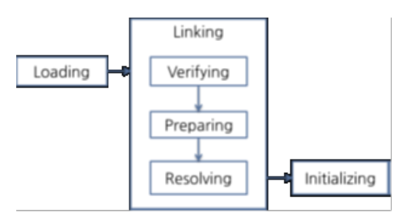

#### 1\. 로딩(Loading)

클래스 로더가 \*.class 파일을 읽고 그 내용에 따라 적절한 바이너리 데이터를 만들고 "메서드"영역(Runtime Data Area의 Method Area)에 저장

이때 메서드 영역에 저장되는 데이터

-   FQCN(Fully Qualified Class Name)
-   클래스 | 인터페이스 | ENUM
-   메서드와 변수
-   로딩이 끝나면 해당 클래스 타입의 Class 객체를 생성하여 "힙" 영역에 저장

_\*FQCN은 클래스가 속한 패키지명을 모두 포함한 이름_

#### 2\. 링킹(Linking)

-   검증(Verifying)
    -   .class 바이트 코드가 자바의 규칙을 잘 따르고 있는지
-   준비(Preparing)
    -   클래스가 필요로한 메모리를 미리 할당 (필드, 메서드, 인터페이스 등등)
-   분석(Resolving)
    -   클래스가 참조하는 객체에 대해서 실제 메모리 주소값을 대입
    -   (options)클래스의 상수 풀 내 모든 심볼릭 레퍼런스를 실제 레퍼런스로 변경
    -   _상수풀 (Constant Pool): 우리가 Integer, String 같은 레퍼런스 타입 의 데이터 값 또는, 메서드 호출 Class 호출 등을 저장하는 JVM의 메모리 공간 중 하나이다. 벤더마다 상수 풀의 위치기 heap에 있거나, method 영역에 있을 수 있다._
    -   _심볼릭 레퍼런스: 기본 자료형(primitive data type)을 제외한 모든 타입(클래스와 인터페이스)을 명시적인 메모리 주소 기반의 레퍼런스가 아니라 심볼릭 레퍼런스를 통해 참조한다._
    
    -   
    -   출처 : [https://javarevisited.blogspot.com/](https://javarevisited.blogspot.com/)

#### 3\. 초기화(Initializing)

-   클래스 변수들을 적절한 값으로 초기화 (static 필드)


## Runtime Data Area

.class 파일은 클래스 로더에 의해서 JVM내로 로드되고, 실행엔진에 의해 기계어로 해석되어 메모리 상(Runtime Data Area)에 배치되게 된다.

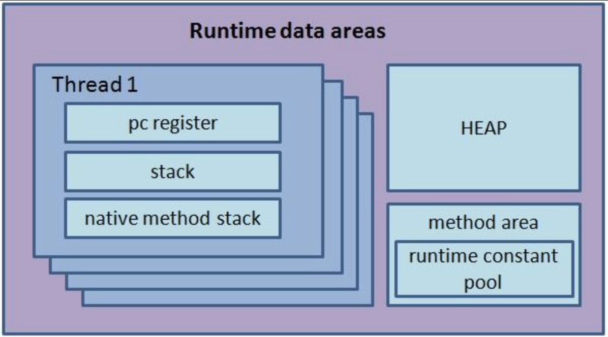

_[https://velog.io/@pond1029/JVM](https://velog.io/@pond1029/JVM)_

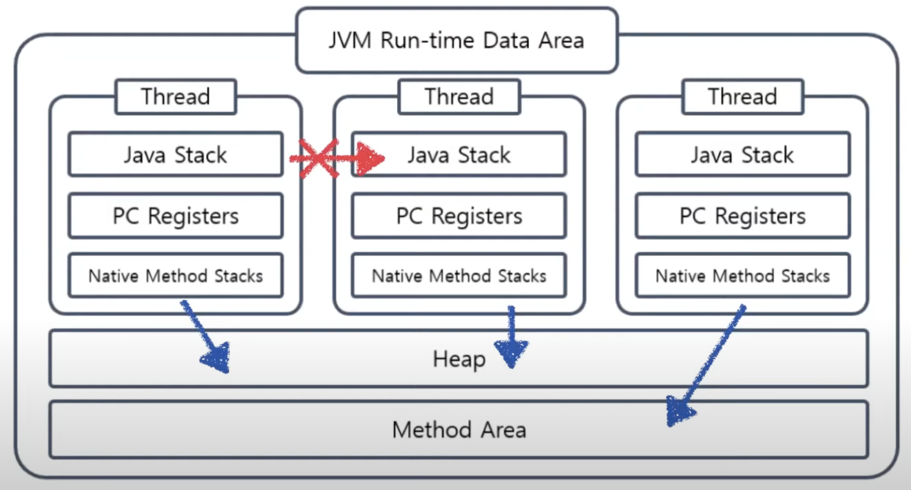

PC 레지스터, 스택, 네이티브 메서드 스택은 스레드마다 하나씩 생성되고 힙, 메서드 영역은 모든 스레드가 공유해서 사용된다.

위 그림과 같이 각 스레드는 힙과 메서드 영역에 동시 접근할 수 있다. 그러나 하나의 스레드는 다른 스레드에 접근할 수 없다. 그래서 우리는 하나의 메서드 안에서 지역변수의 동시성 문제를 신경 쓰지 않아도 된다.

### 스레드마다 하나씩 생성되는 영역들

#### PC 레지스터(Program Counter Register)

레지스터는 현재 수행 중인 명령의 주소를 가지며 스레드가 시작될 때 생성되며 각 스레드마다 하나씩 존재한다. 멀티 스레드 환경에서 한 스레드가 작업을 하다가 다른 스레드로 잠시 CPU 점유를 넘겨주고, 다시 돌아왔을 때 이전에 어떤 명령어를 수행하고 있었는지 기억하고 있어야 이어서 작업을 수행할 수 있다.

#### JVM 스택(JVM Stack)

각 스레드마다 하나씩 존재하며 스레드가 시작될 때 생성된다. 스택 프레임(Stack Frame)이라는 구조체를 저장하는 스택으로, JVM은 오직 JVM 스택에 스택 프레임을 추가하고(push) 제거하는(pop) 동작만 수행한다. 예외 발생 시 printStackTrace() 등의 메서드로 보여주는 Stack Trace의 각 라인은 하나의 스택 프레임을 표현한다.

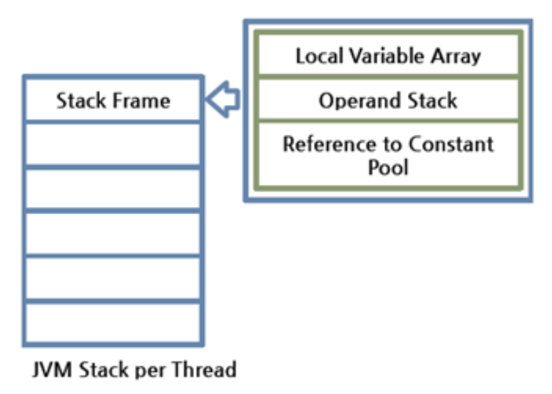

#### 스택 프레임

JVM 내에서 메서드가 수행될 때마다 하나의 스택 프레임이 생성되어 해당 스레드의 JVM 스택에 추가되고 메서드가 종료되면 스택 프레임이 제거된다. 각 스택 프레임은 지역 변수 배열(Local Variable Array), 피연산자 스택(Operand Stack), 현재 실행 중인 메서드가 속한 클래스의 런타임 상수 풀에 대한 레퍼런스를 갖는다. 지역 변수 배열, 피연산자 스택의 크기는 컴파일 시에 결정되기 때문에 스택 프레임의 크기도 메서드에 따라 크기가 고정된다.

#### 지역 변수 배열(Local Variable Array)

0부터 시작하는 인덱스를 가진 배열. 0은 메서드가 속한 클래스 인스턴스의 this 레퍼런스이고, 1부터는 메서드에 전달된 파라미터들이 저장되며, 메서드 파라미터 이후에는 메서드의 지역 변수들이 저장된다.

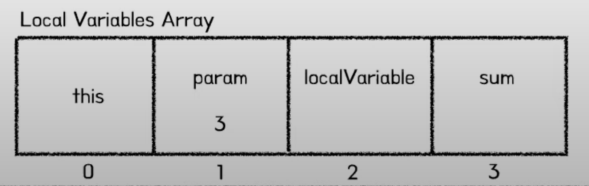

#### 피연산자 스택(Operand Stack)

메서드의 실제 작업 공간이다. 각 메서드는 피연산자 스택과 지역 변수 배열 사이에서 데이터를 교환하고, 다른 메서드 호출 결과를 추가하거나(push) 꺼낸다(pop). 피연산자 스택 공간이 얼마나 필요한지는 컴파일할 때 결정할 수 있으므로, 피연산자 스택의 크기도 컴파일 시에 결정된다.

#### 예시

```
public class Crew {
    public static void main(String[] args) {
        Crew crewObj = new Crew();
        crewObj.methodA(3);
    }

    private int methodA(int param) {
        int localVariable = 1;
        int sum = localVariable + param;
        methodB();
        return sum;
    }

    private void methodB() {

    }
}
```

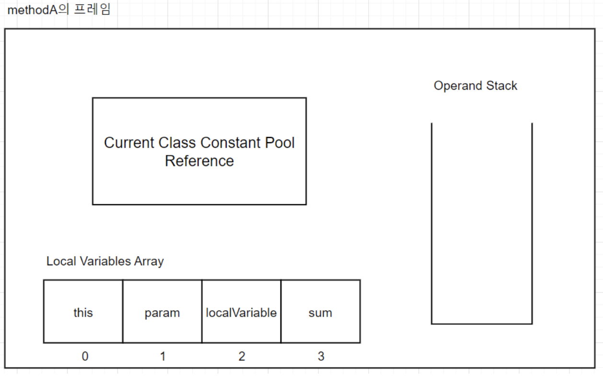

만약 정수가 아니라 객체라면 힙에 저장된 객체의 참조값을 아래와 같이 지역변수 배열에서 사용한다.

```
위 methodA의 바이트코드
Local VAiables Array : 배열
Operand Stack : 스텍 

0 iconst_1 // 스택에 정수 값 1을 올려라
1 istore_2 // 스택에서 값을 꺼내 배열 2번 인덱스에 정수 값을 저장하라
2 iload_2  // 배열 2번 인덱스의 정수 값을 스택에 올려라
3 iload_1 //  배열 1번 인덱스의 정수 값을 스택에 올려라
4 iadd // 스택 상단의 두 정수 값을 더한 후 스택에 넣어라
5 istore_3 // 스택에 값을 꺼내 배열 3번 인덱스에 정수 값을 저장하라
6 iload_0
7 invokevirtual #14 <Crew.methodB : ()V>
10 iload_3
11 ireturn
```

#### 네이티브 메서드 스택(Native Method Stack)

자바 외의 언어로 작성된 네이티브 코드를 위한 스택이다. 즉, JNI(Java Native Interface)를 통해 호출하는 C/C++ 등의 코드를 수행하기 위한 스택으로, 언어에 맞게 C 스택이나 C++ 스택이 생성된다.

### 모든 스레드가 공유하는 영역들

#### 힙(Heap Area)

**인스턴스 또는 객체(Object)**(클래스 타입이 선언된 것), **배열**을 저장하는 공간으로 **가비지 컬렉션의 대상**이다. **JVM 성능** 등의 이슈에서 가장 많이 언급되는 공간이다.  
메모리를 여러 스레드에서 공유하기 때문에 데이터가 **스레드로부터 안전하지 않다**.  
힙 구성 방식이나 가비지 컬렉션 방법 등은 JVM 벤더의 재량이다.

#### 메서드 영역(Method Area)

JVM이 시작될 때 생성된다. JVM이 읽어 들인 각각의 클래스와 인터페이스에 대한 런타임 상수 풀, 필드와 메서드 정보, Static 변수, 메서드의 바이트코드 등을 보관한다. 클래스 멤버 변수의 이름, 데이터 타입, 접근 제어자 정보 같은 필드 정보와 메서드의 이름, 리턴 타입, 파라 미터 등이 메서드 영역에 저장된다.  
메서드 영역은 JVM벤더마다 다양한 형태로 구현할 수 있다. 오라클 핫스팟 JVM(HotSpot JVM)에서는 흔히 Permanent Area, 혹은 Permanent Generation(PermGen)이라고 불린다. 메서드 영역에 대한 가비지 컬렉션은 JVM 벤더의 선택 사항이다.

#### 런타임 상수 풀(Runtime Constant Pool)

클래스 파일 포맷에서 constant\_pool 테이블에 해당하는 영역이다. 메서드 영역에 포함되는 영역이긴 하지만, JVM 동작에서 가장 핵심적인 역할을 수행하는 곳이기 때문에 JVM 명세에서도 따로 중요하게 기술한다. 각 클래스와 인터페이스의 상수뿐만 아니라, 메서드와 필드에 대한 모든 레퍼런스까지 담고 있는 테이블이다. 즉, 어떤 메서드나 필드를 참조할 때 JVM은 런타임 상수 풀을 통해 해당 메서드나 필드의 실제 메모리상 주소를 찾아서 참조한다.(클래스로더.링킹.분석)

즉, Constatnt pool(Run-time Constant Pool)이란 클래스 내에서 사용하는 상수를 담은 테이블이다. 리터럴에 해당되는 값은 특정 메모리 공간인 Constatnt pool(Run-time Constant Pool)에 있고 필요한 경우 Constatnt pool(Run-time Constant Pool)에서 가져와서 사용한다.

Constant Pool에서 제공하는 타입의 종류는 아래와 같다.

-   Integer, Float: 32비트 상수 (Boolean, Short, Byte 상수는 Integer 취급)
-   Double, Long: 64비트 상수
-   String: 실제 바이트를 포함하는 풀의 다른 항목을 가리키는 16비트 문자열 상수
-   Class: 정규화된 클래스 이름**(fully qualified class name)**
-   Utf8: 바이트 문자열(a stream of bytes)
-   NameAndType: (이름 **.** 타입)으로 표시. 보통 다른 상수(#13.#15)를 이용하여 이름과 타입을 지정
-   Fieldref, Methodref, InterfaceMethodref: (Class:NameAndType)으로 표시. Class와 NameAndType은 위에서 설명한 상수 풀에서 사용되는 타입을 의미함.

#### 예시 : Example 클래스가 실행되기까지 과정

| **Example 클래스 정보** |   |
| --- | --- |
| **Constant Pool** |   |
| #3 = Utf8 | Init<> |
| #7 = Class | #8 |
| #8 = Utf8 | com.example.Crew |
| #9 = Methodref | #7.#3 |

| **Bytecode** |
| --- |
| public static void main(java.lang.String\[\]) |
| 0: new #7 |
| 3: dup |
| 4: invokespecial #9 |
| 7: astore\_1 |
| 8: aload\_1 |
| 9: invokevirtual #10 |
| 12: return |

1.  Example.java 파일을 java 명령어로 실행한다.
2.  jvm은 classpath를 찾아보면서 Example.class 파일을 읽어온다.
3.  해당 클래스 정보를 Method 영역에 올린다.
4.  JVM은 Method 영역에 저장된 바이트 코드를 해석한다. (main 메서드를 실행)
5.  JVM은 Main 메서드를 실행하면서 Constant pool에 대한 포인터를 하나 유지한다. (Constant pool을 언제든지 직접 참조할 수 있도록 계속 쳐다본다.)
6.  이때까지 아직, 크루 클래스가 Method 영역에 올라오지 않는다. (대부분의 구현체는 해당 클래스가 필요할 때 클래스 정보를 동적 로딩한다.)
7.  0번 명령어는 JVM에게 Constant Pool에 있는 클래스를 위한 메모리 공간을 할당할 것을 명령한다.
8.  Constant Pool #7에 있는 값은 #8을 가리키고 있고, #8은 com.example.Crew라는 문자열이 저장되어 있다.
9.  com.example.Crew 는 **Symbolic Reference**이다. 아직은 Crew 클래스가 Method 영역에 올라오지 않았다면 클래스 로더에게 요청을 보내 , 메모리에 로드하도록 한다.
10.  이후에는 Example/Constant Pool/#8의 값인 Symbolic Reference를 크루 클래스 데이터를 직접 가리키는 참조로 바꾼다. 이를 **Constsant Pool Resolution**이라고 한다. (run-time constant pool에 있는 symbolic references들로부터 변수의 값을 결정하는 과정)
11.  JVM은 크루라는 객체를 할당하는데 얼마만큼의 힙 공간이 필요한지 알아내기 위해서 다시 한번 우테코 클래스의 Constant Pool을 바라본다.
12.  JVM은 항상 메서드 영역의 저장된 클래스 정보를 보고, 객체를 표현하는데 필요한 메모리 크기를 결정할 수 있다. 이에 필요한 모든 정보가 Method 영역에 있기 때문이다.
13.  JVM이 객체를 위해 필요한 힙 영역의 크기를 결정하고 나면, 힙 공간을 할당하고 인스턴스 변수 값을 초기값으로 초기화한다. main메서드의 첫 번째 명령어는 새로운 크루의 객체의 참조를 스택에 푸시하면서 끝이 나게 된다.
14.  다음 명령에서 study 메서드를 호출할 때, 이 참조값을 사용하게 된다.


## 실행 엔진(Execution Engine)

실행 엔진은 클래스 로더를 통해 런타임 데이터 영역에 배치된 바이트 코드를 명령어 단위로 읽어서 실행한다.

바이트 코드의 각 명령어는 1바이트 크기의 OpCode(Operation Code)와 추가 피연산자로 이루어져 있다. 실행 엔진은 하나의 OpCode를 가져와서 피연산자와 작업을 수행한 다음, 그다음 OpCode를 수행하는 식으로 동작한다.

이 수행 과정에서 실행 엔진은 바이트 코드를 기계가 실행할 수 있는 형태로 변경하는데 다음 두 가지 방식으로 변경한다.

-   인터프리터(interpreter) : JVM안에서 바이트코드는 기본적으로 인터프리터 방식으로 동작한다. 바이트 코드 명령어를 하나씩 읽어서 해석하고 실행한다. 하나하나의 해석은 빠르지만 전체적인 실행 속도는 느리다는 단점을 가진다. 또한, 같은 메소드라도 여러번 호출될 때 매번 새로 수행해야 한다.
-   JIT 컴파일러(Just-In-Time Compiler) : 인터프리터의 단점을 보완하기 위해 도입된 방식으로 바이트 코드 전체를 컴파일하여 네이티브 코드로 변경하고 이후에는 해당 메서드를 더 이상 인터프리팅 하지 않고 네이티브 코드로 직접 실행하는 방식이다. 하나씩 인터프리팅하여 실행하는 것이 아니라 바이트 코드 전체가 컴파일된 네이티브 코드를 실행하는 것이기 때문에 전체적인 실행 속도는 인터프리팅 방식보다 빠르다.

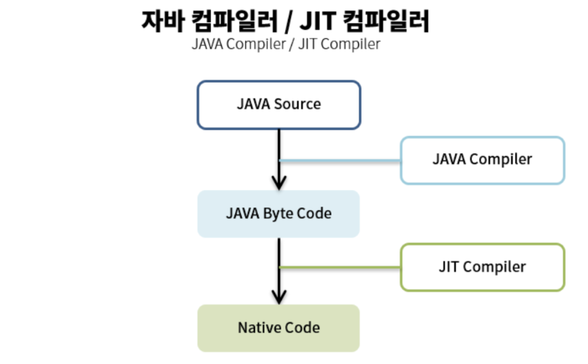

JIT 컴파일러를 통한 컴파일 과정은 바이트 코드를 바로 네이티브 코드로 만드는 것이 아니라 안에서 IR(Intermediate Representation)로 변환하여 최적화를 수행하고 그다음에 네이티브 코드로 변환은 과정을 거친다.

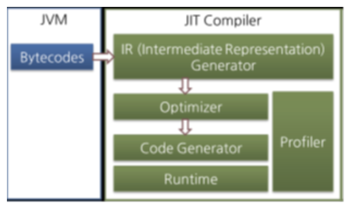

네이티브 코드는 캐시에 보관하기 때문에 한 번 컴파일된 코드는 캐시에서 바로 꺼내어 실행하기 때문에 빠르게 수행된다. 하지만 JIT 컴파일러가 컴파일하는 과정은 바이트 코드를 하나씩 인터프리팅 하는 것보다 훨씬 오래 걸리기 때문에 JIT 컴파일러를 사용하는 JVM은 내부적으로 해당 메서드가 얼마나 자주 호출되고 실행되는지 체크하고, 일정 기준을 넘었을 때에만 JIT 컴파일러를 통해 컴파일하여 네이티브 코드를 생성한다.

오라클 핫스팟 VM은 핫스팟 컴파일러라고 불리는 JIT 컴파일러를 사용하는데 내부적으로 프로파일링(Profiling)을 통해 가장 컴파일이 필요한 부분, 즉 '핫스팟'을 찾아낸 다음, 이 핫스팟을 컴파일하기 때문에 핫스팟이라 부른다고한다. 핫스팟 VM은 한 번 컴파일된 바이트코드라도 해당 메서드가 더 이상 자주 불리지 않는다면, 캐시에서 네이티브 코드를 덜어내고 다시 인터프리터 모드로 동작한다.f

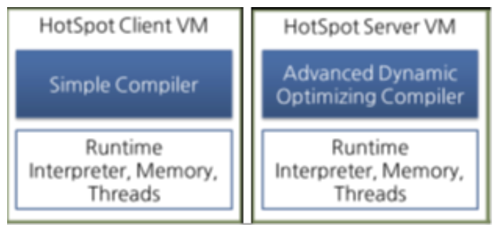

핫스팟 VM은 서버 VM과 클라이언트 VM으로 나뉘어 있고, 각각 다른 JIT 컴파일러를 사용해요 각각은 동일한 런타임을 사용하지만, 다른 JIT 컴파일러를 사용한다. 서버 VM에서 사용되는 컴파일러가 더 복잡하고 다양한 성능 최적화 기법을 사용하고 있다.


### Reference

-   [Naver D2 - JVM Internal](https://d2.naver.com/helloworld/1230)
-   [\[10분 테코톡\] 어썸오의 JVM Memory Layout](https://www.youtube.com/watch?v=GU254H0N93Y)
-   inside the java virtual machine
-   [링크](https://le2ksy.tistory.com/30)