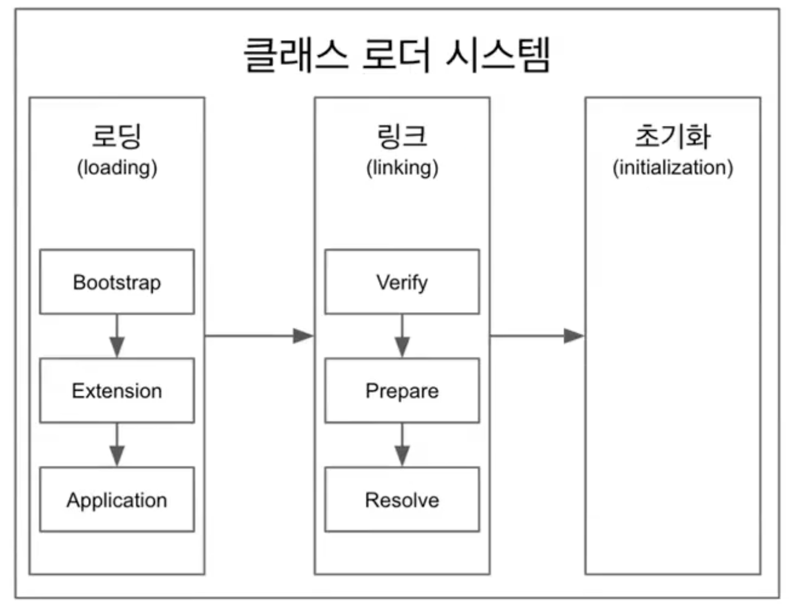

## JVM

JVM은 컴파일의 결과물인 바이트 코드를 실행하기 위한 가상 머신이다.
컴파일된 *.class 파일들을 클래스 로더가 읽고 **Runtime Data Area** 에 올라가면 **Execution Engine** 이 바이트 코드를 읽게 된다.

#### JVM은 크게 4가지로 구분된다.

- Class Loader
- Runtime Data Area
- Execution Engine
- Garbage Collector

### Class Loader

자바는 동적 로드, 즉 컴파일타임이 아니라 런타임에 클래스를 처음으로 참조할 때 해당 클래스를 로드하고 링크하는 특징이 있다. 이 동적 로드를 담당하는 부분이 JVM의 클래스 로더이다. 자바 클래스 로더의 특징은 다음과 같다.

- 계층 구조: 클래스 로더끼리 부모-자식 관계를 이루어 계층 구조로 생성된다. 최상위 클래스 로더는 부트스트랩 클래스 로더(Bootstrap Class Loader)이다.
- 위임 모델: 계층 구조를 바탕으로 클래스 로더끼리 로드를 위임하는 구조로 동작한다. 클래스를 로드할 때 먼저 상위 클래스 로더를 확인하여 상위 클래스 로더에 있다면 해당 클래스를 사용하고, 없다면 로드를 요청받은 클래스 로더가 클래스를 로드한다.
- 가시성(visibility) 제한: 하위 클래스 로더는 상위 클래스 로더의 클래스를 찾을 수 있지만, 상위 클래스 로더는 하위 클래스 로더의 클래스를 찾을 수 없다.
- 언로드 불가: 클래스 로더는 클래스를 로드할 수는 있지만 언로드할 수는 없다. 언로드 대신, 현재 클래스 로더를 삭제하고 아예 새로운 클래스 로더를 생성하는 방법을 사용할 수 있다.

각 클래스 로더는 로드된 클래스들을 보관하는 네임스페이스(namespace)를 갖는다. 클래스를 로드할 때 이미 로드된 클래스인지 확인하기 위해서 네임스페이스에 보관된 FQCN(Fully Qualified Class Name)을 기준으로 클래스를 찾는다. 비록 FQCN이 같더라도 네임스페이스가 다르면, 즉 다른 클래스 로더가 로드한 클래스이면 다른 클래스로 간주된다.

#### 클러스 로더의 위임 모델

클래스 로더가 클래스 로드를 요청받으면, 클래스 로더 캐시, 상위 클래스 로더, 자기 자신의 순서로 해당 클래스가 있는지 확인한다. 즉, 이전에 로드된 클래스인지 클래스 로더 캐시를 확인하고, 없으면 상위 클래스 로더를 거슬러 올라가며 확인한다. 부트스트랩 클래스 로더까지 확인해도 없으면 요청받은 클래스 로더가 파일 시스템에서 해당 클래스를 찾는다.

- 부트스트랩 클래스 로더
	- JVM을 기동할 때 생성되며, Object 클래스들을 비롯하여 자바 API들을 로드한다. 다른 클래스 로더와 달리 자바가 아니라 네이티브 코드로 구현되어 있다.
	- JAVA_HOME\lib에 있는 코어 자바 API를 제공한다. 최상위 우선순위를 가진 클래스 로더
- 익스텐션 클래스 로더(Extension Class Loader)
	- 기본 자바 API를 제외한 확장 클래스들을 로드한다. 다양한 보안 확장 기능 등을 여기에서 로드하게 된다.
	- JAVA_HOME\lib\ext 폴더 또는 java.ext.dirs 시스템 변수에 해당하는 위치에 있는 클래스를 읽는다.
- 시스템 클래스 로더(System Class Loader): 부트스트랩 클래스 로더와 익스텐션 클래스 로더가 JVM 자체의 구성 요소들을 로드하는 것이라 한다면, 시스템 클래스 로더는 애플리케이션의 클래스들을 로드한다고 할 수 있다. 사용자가 지정한 $CLASSPATH 내의 클래스들을 로드한다.
- 사용자 정의 클래스 로더(User-Defined Class Loader): 애플리케이션 사용자가 직접 코드 상에서 생성해서 사용하는 클래스 로더이다.

웹 애플리케이션 서버(WAS)와 같은 프레임워크는 웹 애플리케이션들, 엔터프라이즈 애플리케이션들이 서로 독립적으로 동작하게 하기 위해 사용자 정의 클래스 로더를 사용한다. 즉, 클래스 로더의 위임 모델을 통해 애플리케이션의 독립성을 보장하는 것이다. 이와 같은 WAS의 클래스 로더 구조는 WAS 벤더마다 조금씩 다른 형태의 계층 구조를 사용하고 있다.

#### 클래스 로더 과정

#### 1. 로딩(Loading)

클래스 로더가 *.class 파일을 읽고 그 내용에 따라l 적절한 바이너리 데이터를 만들고 "메소드"영역(Runtime Data Area의 Method Area)에 저장

이때 메소드 영역에 저장되는 데이터

- FQCN(Fully Qualified Class Name)
- 클래스 | 인터페이스 | ENUM
- 메소드와 변수
- 로딩이 끝나면 해당 클래스 타입의 Class 객체를 생성하여 "힙" 영역에 저장

**FQCN은 클래스가 속한 패키지명을 모두 포함한 이름*

#### 2. 링킹(Linking)

- 검증(Verifying)

	- .class 바이트 코드가 자바의 규칙을 잘 따르고 있는지

- 준비(Preparing)

	- 클래스가 필요로한 메모리를 미리 할당 (필드, 메서드, 인터페이스 등등)

- 분석(Resolving)

	- 클래스가 참조하는 객체에 대해서 실제 메모리 주소값을 대입

	- (options)클래스의 상수 풀 내 모든 심볼릭 레퍼런스를 실제 레퍼런스로 변경

	- *상수풀 (Constant Pool): 우리가 Integer, String 같은 레퍼런스 타입 의 데이터 값 또는, 메소드 호출 Class 호출 등을 저장하는 JVM의 메모리 공간 중 하나이다. 벤더마다 상수 풀의 위치기 heap에 있거나, method 영역에 있을 수 있다.*

	- *심볼릭 레퍼런스: 기본 자료형(primitive data type)을 제외한 모든 타입(클래스와 인터페이스)을 명시적인 메모리 주소 기반의 레퍼런스가 아니라 심볼릭 레퍼런스를 통해 참조한다.*

		

	- 출처 : https://javarevisited.blogspot.com/

#### 3. 초기화(Initializing)

- 클래스 변수들을 적절한 값으로 초기화 (static 필드)

