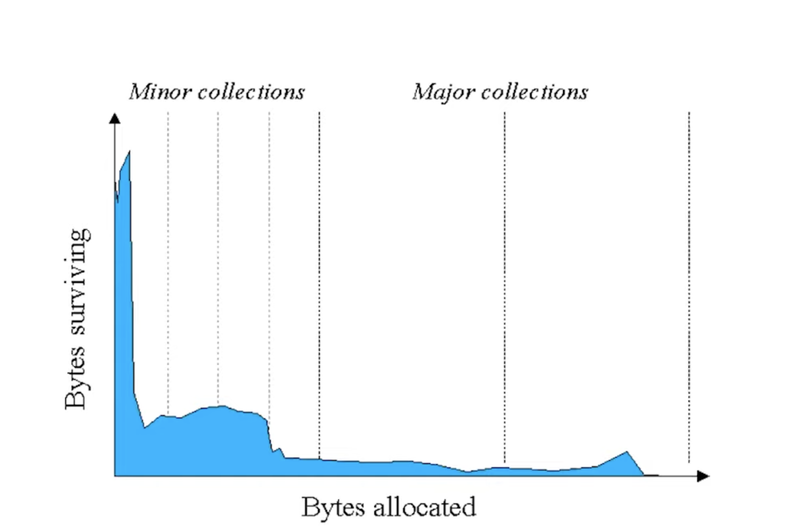

## Java Heap

Instance(Object)와 Array 객체 두 가지 종류만 저장되는 공간이며, 모든 Thread에 의해 공유 되는 영역이다. 이곳에 생성된 객체들은 다른 객체의 필드 또는 스택에 존재하는 다른 메소드에 의해 참조될 수 있다. 참조하는 변수가 사라진다면 이 객체는 필요없는 것으로 간주하고 Garbage Collector에 의해서 할당이 해제된다.


JVM은 Java Heap에 Memory를 할당하는 Instruction(Bytecode로 new, newarray, anewarray, multianewarray)만 존재하고 메모리 해제를 위한 어떤 Java Code나 Bytecode도 존재하지 않는다. Java Heap의 메모리 해제는 오로지 Garbage Collection을 통해서만 수행된다. JVM 스펙(Specification)은 이러한 원칙을 강하게 제시하고 있고 그 구현을 담당한 JVM 벤더들은 최대한 이를 따르고 있다. 그러나 이것은 원칙일 뿐 어떻게 구현하는지에 대해서는 전적으로 벤더들에게 일임하고 있다.


Garbage Collection 뿐만 아니라 Heap의 전반적인 구성도 특별히 정의된 바 없이 JVM을 구현하는 벤더에게 전권을 위임하고 있다. 게다가 Heap은 단순히 Array와 Object를 저장하는 공간에 지나지 않는다. Sun, Oracle, HP, Windows, Linux, MacOS에서 제공하는 JVM은 Hotspot JVM으로 명명하고 IBM에서 제공하는 JVM은 IBM JVM이라 부르기도 한다.


---

## GC(Garbage Collection)

GC는 JVM에서 자동으로 Heap 메모리를 관리하는 기능이다.

Java 이전의 C,c++ 같은 언어에서는 개발자가 직접 메모리 할당과 해제를 컨트롤 해야했다.(calloc, free, etc...) 잦은 메모리 이슈를 개선하기 위해 GC가 나오게 되었다.

#### 장점

- 메모리 누수 걱정이 없다.
- 해제된 메모리에 접근할 수 없다.
- 해제한 메모리를 다시 해제하는 행위를 예방한다.

#### 단점 

- GC 작업은 순수 오버헤드 작업이다.
- 개발자는 언제 GC가 메모리를 언제 해제하는지 정확하게 알기 어렵다.


---

### GC의 과정 - Generational Garbage Collection

GC에 대해서 알아보기 전에 알아야 할 용어가 있다. 바로 'stop-the-world'이다. stop-the-world란, GC을 실행하기 위해 JVM이 애플리케이션 실행을 멈추는 것이다. stop-the-world가 발생하면 GC를 실행하는 쓰레드를 제외한 나머지 쓰레드는 모두 작업을 멈춘다. GC 작업을 완료한 이후에야 중단했던 작업을 다시 시작한다. 어떤 GC 알고리즘을 사용하더라도 stop-the-world는 발생한다. 대개의 경우 GC 튜닝이란 이 stop-the-world 시간을 줄이는 것이다.


Java에서 명시적으로 해제하려면 해당 객체를 null로 지정하면 된다. System.gc() 메서드를 호출하는 것은 시스템의 성능에 매우 큰 영향을 끼치므로 System.gc() 메서드는 절대로 사용하면 안 된다.


Java에서는 개발자가 프로그램 코드로 메모리를 명시적으로 해제하지 않기 때문에 가비지 컬렉터(Garbage Collector)가 더 이상 필요 없는 (쓰레기) 객체를 찾아 지우는 작업을 한다. 이 가비지 컬렉터는 두 가지 가설 하에 만들어졌다.**("weak generational hypothesis")**

- 대부분의 객체는 금방 접근 불가능 상태(unreachable)가 된다.
- 오래된 객체에서 젊은 객체로의 참조는 아주 적게 존재한다.

즉, 객체는 대부분 일회성이며, 메모리에 오랫동안 남아있는 경우는 드물다.
이 가설의 장점을 최대한 살리기 위해서 HotSpot JVM에서는 크게 2개로 물리적 공간을 나누었다. Young Generation, Old Generation 총 2가지 영역이다.


아래 그림과 같이 대부분 객체의 수명을 나타낸 그래프로 대부분의 객체는 금방 사용되었다가 사라지게 된다. 그래서 특정 부분만 탐색하며 해제하면 더 효율적으로 Young Generation 안에서 최대한 처리하도록 하는 것이다.




##### Hotspot JVM의 Heap 구조


*8 버전부터 Pemanent는 Native Method Stack으로 이동


#### Yong Generation

새롭게 생성한 객체의 대부분이 여기에 위치한다. 대부분의 객체가 금방 접근 불가능 상태가 되기 때문에 매우 많은 객체가 Young 영역에 생성되었다가 사라진다. 이 영역에서 객체가 사라질때 **Minor GC**가 발생한다.

Young 영역은 1개의 Eden 영역과 2개의 Survivor 영역, 총 3가지로 나뉘어진다.

- Eden 영역: 새로 생성된 객체가 할당(Allocation)되는 영역
- Survivor 영역: 최소 1번의 GC 이상 살아남은 객체가 존재하는 영역

#### Old Generation

접근 불가능 상태로 되지 않아 Young 영역에서 살아남은 객체가 여기로 복사된다. 대부분 Young 영역보다 크게 할당하며, 크기가 큰 만큼 Young 영역보다 GC는 적게 발생한다. 이 영역에서 객체가 사라질 때 **Major GC**(혹은 Full GC)가 발생한다.


#### Minor GC의 동작 방식


1. 새로 생성된 객체가 Eden 영역에 할당된다.
2. 객체가 계속 생성되어 Eden 영역이 꽉차게 되고 Minor GC가 실행된다.
	1. Eden 영역에서 사용되지 않는 객체의 메모리가 해제된다.
	2. Eden 영역에서 살아남은 객체는 **비어있는 Survivor** 영역으로 이동된다.
3. 1~2번의 과정이 반복되다가 Survivor 영역이 가득 차게 되면 Survivor 영역의 살아남은 객체를 다른 Survivor 영역으로 이동시킨다.(1개의 Survivor 영역은 반드시 빈 상태가 된다.)
4. 이러한 과정을 반복하여 계속해서 살아남은 객체는 Old 영역으로 이동(Promotion)된다.

객체의 생존 횟수를 카운트하기 위해 Minor GC에서 객체가 살아남은 횟수를 의미하는 age를 Object Header에 기록한다. 그리고 Minor GC 때 Object Header에 기록된 age를 보고 일정 수준의 age-bit를 넘어가면 Old 영역으로 이동(Promotion)된다.

*Java 8에서는 Parallel GC 기준 age-bit가 15되면 Promotion진행

또한 Survivor 영역 중 1개는 반드시 사용이 되어야 한다. 만약 두 Survivor 영역에 모두 데이터가 존재하거나, 모두 사용량이 0이라면 현재 시스템이 정상적인 상황이 아님을 파악할 수 있다.

>참고로, HotSpot VM에서는 보다 빠른 메모리 할당을 위해서 두 가지 기술을 사용한다. 하나는 bump-the-pointer라는 기술이며, 다른 하나는 TLABs(Thread-Local Allocation Buffers)라는 기술이다.
>
>bump-the-pointer는 Eden 영역에 할당된 마지막 객체를 추적한다. 마지막 객체는 Eden 영역의 맨 위(top)에 있다. 그리고 그 다음에 생성되는 객체가 있으면, 해당 객체의 크기가 Eden 영역에 넣기 적당한지만 확인한다. 만약 해당 객체의 크기가 적당하다고 판정되면 Eden 영역에 넣게 되고, 새로 생성된 객체가 맨 위에 있게 된다. 따라서, 새로운 객체를 생성할 때 마지막에 추가된 객체만 점검하면 되므로 매우 빠르게 메모리 할당이 이루어진다.
>
>그러나 멀티 스레드 환경을 고려하면 이야기가 달라진다. Thread-Safe하기 위해서 만약 여러 스레드에서 사용하는 객체를 Eden 영역에 저장하려면 락(lock)이 발생할 수 밖에 없고, lock-contention 때문에 성능은 매우 떨어지게 될 것이다. HotSpot VM에서 이를 해결한 것이 TLABs이다.
>
>각각의 스레드가 각각의 몫에 해당하는 Eden 영역의 작은 덩어리를 가질 수 있도록 하는 것이다. 각 쓰레드에는 자기가 갖고 있는 TLAB에만 접근할 수 있기 때문에, bump-the-pointer라는 기술을 사용하더라도 아무런 락이 없이 메모리 할당이 가능하다.
>
>https://d2.naver.com/helloworld/1329


#### Major GC의 동작 방식

Old 영역은 기본적으로 데이터가 가득 차면 Major GC를 실행한다. Magor GC는 Minor GC 보다 더 오래 걸리게 된다.


GC 종류에 따라서 처리 절차가 달라지므로 stop-the-world의 시간이 달라진다. 어떤 GC 방식이 있는지 살펴보면 이해가 쉬울 것이다.


---

### GC의 수거대상 - Reachability

가비지 컬렉션(Garbage Collection)은 특정 객체가 가비지인지 아닌지 판단하기 위해서 도달성, 도달능력(Reachability)

- 레퍼런스가 있다면 Reachable
- 유효한 레퍼런스가 없다면 Unreachable

[자바 레퍼런스와 가비지 컬렉션(Java Reference & Garbage Collection)](https://madplay.github.io/post/java-garbage-collection-and-java-reference)

### Reference Type

Reachable / Unreachalbe 을 판단하는데 아래와 같이 Reference Type을 선택해 사용할 수 있다.

##### [Strong Reference](https://luckydavekim.github.io/development/back-end/java/strong-reference-in-java)

```null
Object obj = new Object();
```

위 처럼 Thread Stack이 직접적으로 Object에 접근 가능한 상태
null을 대입하지 않는 이상 gc대상으로 취급 되지않음

##### [Soft Reference](https://luckydavekim.github.io/development/back-end/java/soft-reference-in-java)

```null
SoftReference<Object> softReference = new SoftReference<>(new Object());
```

GC 구현에 따라 대상 될 수도 안 될 수도 있다.

##### [Weak Reference](https://luckydavekim.github.io/development/back-end/java/weak-reference-in-java)

```null
WeakReference<Object> weakReference = new WeakReference<>(new Object());
```

항상 GC의 대상이 된다.

##### [Phantom Reference](https://luckydavekim.github.io/development/back-end/java/phantom-reference-in-java)

**올바르게 삭제**하고 **삭제 이후 작업을 조작**하기 위한 타입으로 Object의 finalize 메소드가 말을 안들어 강한참조가 역으로 일어날수 있는 경우의 위 참조방식을 사용하면 유용하다.
[Have you ever used PhantomReference in any project? - Stack OverFlow](https://stackoverflow.com/questions/1599069/have-you-ever-used-phantomreference-in-any-project)


---

### 대표적인 JVM 가비지 수집 알고리즘 2가지

- #### Reference Counting


##### Reference Counting 가 0이 되면 GC대상이 된다(Unreachable).

Reference Counting : Root Space가 객체를 참조한 횟수(객체로 접근 할 수 있는 방법의 수)로 개체에 대한 새 참조가 생성될 때 증가하고 개체에 대한 참조가 삭제될 때 감소한다.

##### 단점 : 순환 참조 문제


Root Space로 부터 끊어져도 객체들이 서로가 서소를 참조하고 있어 Reference Counting가 1로 유지 된다(Reachable). 결국 사용하지 않는 메모리 영역이 해제되지 못하고 Memory Leak이 방생한다.

- #### Mark And Sweep

Reference Countingd의 순환 참조 문제를 해결할 수 있다.


알고리즘에 따라 Compact 과정이 추가되기도 합니다. 메모리의 단편화를 막아주는 과정


그림 출처 : https://www.youtube.com/watch?v=FMUpVA0Vvjw


##### Mark And Sweep 특징

- 의도적으로 GC를 실행시켜야한다.
- 어플리케이션 실행과 GC 실행이 병행된다. (stop-the-world)


##### Root Space


그림 출처 : https://www.youtube.com/watch?v=FMUpVA0Vvjw


---

### GC의 종류

종류를 알기 전 GC중 가장 좋은 건 없다. 상황에 맞는 GC를 사용 하면 된다.

#### Serial GC
싱글스레드 애플리케이션을 위한 GC 다.
실행 간에는 무조건 STW가 발생하기 때문에 멀티 스레드 환경에서는 사용하지 않는 것이 좋다. low-latency(pause) 를 추구하는 애플리케이션 또한 적당하지 않다.

#### Parallel GC

가비지 수집을 위해 여러 스레드를 사용하므로 직렬 GC에 비해 일시 중지 시간을 줄일 수 있다. Parallel Scavenge라고도 하며 멀티 코어 시스템에서 높은 처리량을 위해 설계되었다.

배치 프로젝트와 같은 긴 pause가 허용되는 애플리케이션에 사용할 수 있다.


멀티스레드로 Young genereation 처리하고 싱글스레드로 Old genereation 을 처리한다.
(이후 Parallel Old GC 등장하여 Old generation 도 병렬로 처리하게 된다.)

#### Parallel Old GC (Parallel Compacting GC)

힙이 크고 할당률이 높은 시스템을 위해 설계되었다.

멀티스레드로 Young genereatione돠 Old genereation 을 처리한다.

#### Concurrent Mark & Sweep GC (CMS)
대부분의 가비지 수집 작업을 애플리케이션 스레드와 동시에 수행하여 일시 중지 시간을 최소화하도록 설계되었다. low pause 의 시초가 되는 GC다. Parellel GC 과 다른 점은 애플리케이션 백그라운드에서 진행 가능하다는 점이다.

다음 그림은 Serial GC와 CMS GC의 절차를 비교한 그림이다. 그림에서 보듯이 CMS GC는 지금까지 설명한 GC 방식보다 더 복잡하다.


#### Garbage First (G1) GC

장기적으로 많은 문제를 일으킬 수 있는 CMS GC를 대체하기 위해 개발되었고, Java7부터 지원되기 시작하였다.

G1(Garbage First) GC는 짧은 대기 시간과 균형 잡힌 처리량을 제공하도록 설계된 JVM(Java Virtual Machine)에서 사용되는 가비지 수집 알고리즘이다.

힙이 크고 객체 할당률이 높은 애플리케이션의 성능 향상에 효과적이며 힙 오버헤드가 적고 응답성이 높은 환경에서 일반적으로 사용된다.

##### Space divided into regions

전체 힙을 고정된 크기의 영역으로 분할하고 각 영역을 별도로 관리합니다. 이를 통해 전체 힙을 스캔하지 않고 부분적인 가비지 수집을 수행할 수 있다.

##### Dynamic resizing of regions

G1 GC는 힙의 사용 패턴을 기반으로 가비지 수집을 위한 영역 크기를 동적으로 조정할 수 있습니다. 이는 실제 힙 사용 패턴을 기반으로 가비지 수집의 효율성을 향상시킵니다.

##### Copying and marking

G1 GC는 가비지 수집을 위해 복사 및 표시 알고리즘의 기능을 결합합니다. 첫째, 영역에서 덜 사용되는 객체는 다른 영역으로 복사됩니다. 그런 다음 마킹 알고리즘을 사용하여 아직 사용 중인 개체를 식별하고 표시된 개체만 가비지 수집의 대상이 됩니다.

##### Low pause time

 G1 GC는 가비지 수집 중에 짧은 일시 중지 시간을 달성하는 것을 목표로 합니다. 가비지 콜렉션 시 애플리케이션의 일시정지 시간을 최소화하여 높은 응답성을 제공합니다.

##### Multi-threaded processing

G1 GC는 다중 스레드를 사용하여 가비지 수집을 처리하고 병렬 처리를 활용하여 가비지 수집 처리 속도를 향상시킵니다.


**Humongous** : Region 크기의 50%를 초과하는 큰 객체를 저장하기 위한 공간이며, 이 Region 에서는 GC 동작이 최적으로 동작하지 않는다.

**Available/Unused** : 아직 사용되지 않은 Region을 의미한다.


G1 GC에서 **Young GC** 를 수행할 때는 STW(Stop-The-World) 현상이 발생하며, STW 시간을 최대한 줄이기 위해 멀티스레드로 GC를 수행한다. **Young GC는 각 Region 중 GC대상 객체가 가장 많은 Region(Eden 또는 Survivor 역할) 에서 수행** 되며, 이 Region 에서 **살아남은 객체를 다른 Region(Survivor 역할) 으로 옮긴 후, 비워진 Region을 사용가능한 Region으로 돌리는 형태** 로 동작한다.


G1 GC에서 **Full GC** 가 수행될 때는 **Initial Mark -> Root Region Scan -> Concurrent Mark -> Remark -> Cleanup -> Copy** 단계를 거치게된다.

- Initial Mark
	- Old Region 에 존재하는 객체들이 참조하는 Survivor Region 을 찾는다. 이 과정에서는 STW 현상이 발생하게 된다.
- Root Region Scan
	- Initial Mark 에서 찾은 Survivor Region에 대한 GC 대상 객체 스캔 작업을 진행한다.
- Concurrent Mark
	- 전체 힙의 Region에 대해 스캔 작업을 진행하며, GC 대상 객체가 발견되지 않은 Region 은 이후 단계를 처리하는데 제외되도록 한다.
- Remark
	- 애플리케이션을 멈추고(STW) 최종적으로 GC 대상에서 제외될 객체(살아남을 객체)를 식별해낸다.
- Cleanup
	- 애플리케이션을 멈추고(STW) 살아있는 객체가 가장 적은 Region 에 대한 미사용 객체 제거 수행한다. 이후 STW를 끝내고, 앞선 GC 과정에서 완전히 비워진 Region 을 Freelist에 추가하여 재사용될 수 있게 한다.
- Copy
	- GC 대상 Region이었지만 Cleanup 과정에서 완전히 비워지지 않은 Region의 살아남은 객체들을 새로운(Available/Unused) Region 에 복사하여 Compaction 작업을 수행한다.


*stop-the-world : GC를 실행하는 쓰레드 외의 모든 쓰레드가 작업을 중단하는 것


---

### JVM 가비지 수집 알고리즘

[참고](https://medium.com/@joongwon/jvm-garbage-collection-algorithms-3869b7b0aa6f)


### Reference

https://d2.naver.com/helloworld/1329

https://rebelsky.cs.grinnell.edu/Courses/CS302/99S/Presentations/GC/

https://medium.com/@joongwon/jvm-garbage-collection-algorithms-3869b7b0aa6f

[G1 GC](https://thinkground.studio/%EC%9D%BC%EB%B0%98%EC%A0%81%EC%9D%B8-gc-%EB%82%B4%EC%9A%A9%EA%B3%BC-g1gc-garbage-first-garbage-collector-%EB%82%B4%EC%9A%A9/)

https://www.dynatrace.com/news/blog/understanding-g1-garbage-collector-java-9/

https://mirinae312.github.io/develop/2018/06/04/jvm_gc.html