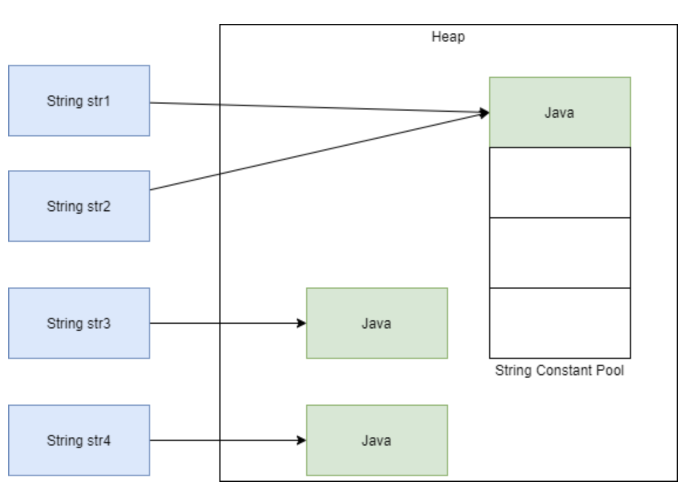
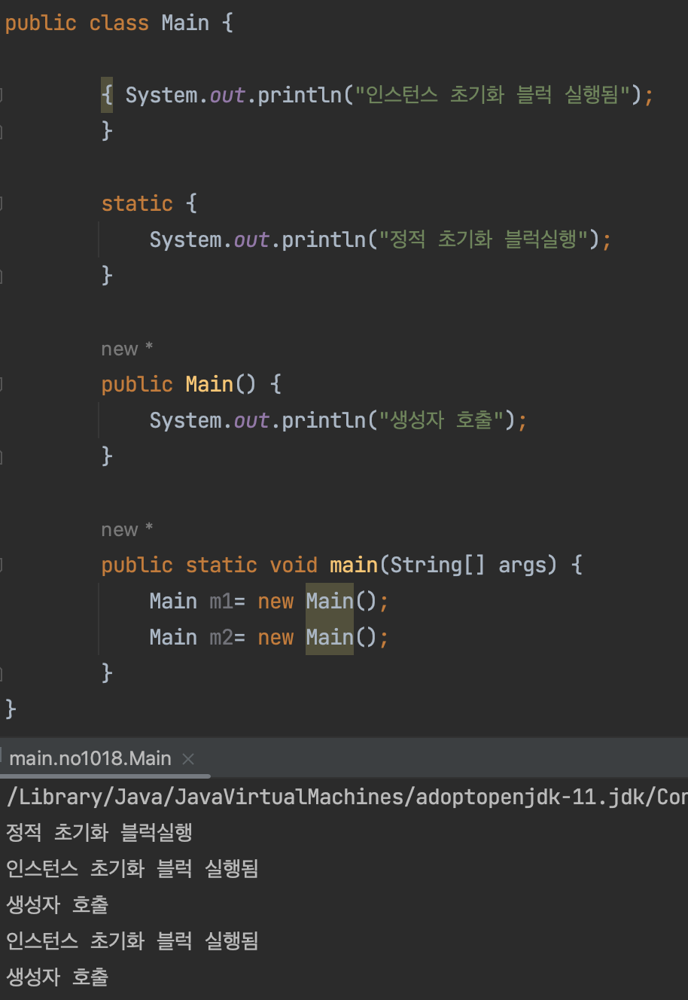
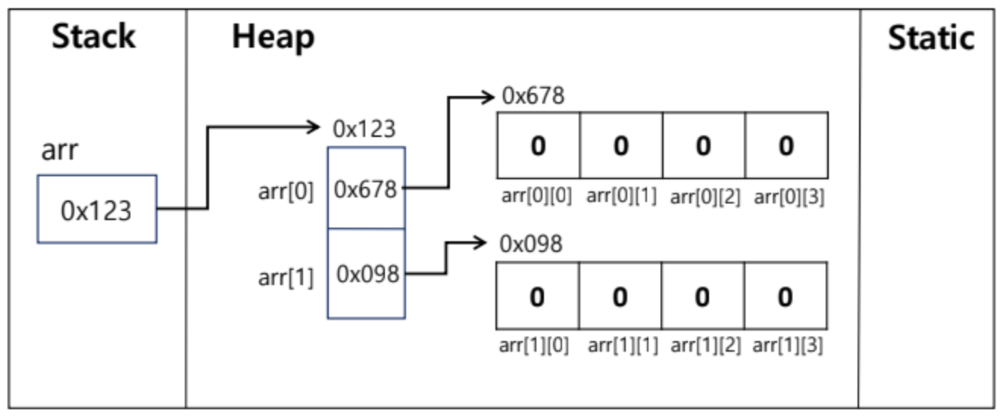

## 목표

자바의 프리미티브 타입, 변수 그리고 배열을 사용하는 방법을 익힙니다.

## 학습할 것

-   프리미티브 타입 종류와 값의 범위 그리고 기본 값
-   프리미티브 타입과 레퍼런스 타입
-   리터럴
-   변수 선언 및 초기화하는 방법
-   변수의 스코프와 라이프타임
-   타입 변환, 캐스팅 그리고 타입 프로모션
-   1차 및 2차 배열 선언하기
-   타입 추론, var

## 학습 내용 정리

### 프리미티브 타입 종류와 값의 범위 그리고 기본 값

| 이름          | 크기    | 값 범위                 | 기본 값   | 비고                 |
| ------------- | ------- | ----------------------- | --------- | -------------------- |
| byte          | 1 byte  | \-128 ~ 127             | 0         |                      |
| short         | 2 bytes | \-32,768 ~ 32,767       | 0         |                      |
| signed int    | 4 bytes | $-2^{31}$ ~ $2^{31}-1$  | 0         |                      |
| unsigned int  | 4 bytes | 0 ~ $2^{32}-1$          | 0         | java 8 이상부터 가능 |
| signed long   | 8 bytes | $-2^{63}$ ~ $2^{63}-1$  | 0L        |                      |
| unsigned long | 8 bytes | $0$ ~ $2^{64}-1$        | 0L        | java 8 이상부터 가능 |
| float         | 4 bytes | single-precision 32-bit | 0.0f      |                      |
| double        | 8 bytes | double-precision 64-bit | 0.0d      |                      |
| boolean       | 1 bit   | true / false            | false     |                      |
| char          | 2 bytes | '\\u0000' ~ '\\uffff'   | '\\u0000' |                      |

### 프리미티브 타입과 레퍼런스 타입


"primitive type은 실제 값을 저장하는 반면 reference type은 참조하는 객체의 주소를 저장한다는 것입니다."

> "The basic difference is that primitive variables store the actual values, whereas reference variables store the addresses of the objects they refer to."
>
> 출처 : [https://stackoverflow.com/a/32049775](https://stackoverflow.com/a/32049775)

### 리터럴

"리터럴은 고정 값의 소스 코드 표현입니다. 리터럴은 계산할 필요 없이 코드에 직접 표시됩니다. 변수 혹은 상수에 저장되는 값입니다."

```
int i = 100000; // i는 변수, 100000는 리터럴
final int F = 1234; //f는 상수, 1234는 리터럴
boolean result = true;
char capitalC = 'C';
byte b = 100;
short s = 10000;
long l = 1000L;
```

변수나 상수는 메모리에 할당된 공간을 뜻하고, 리터럴은 해당 공간에 저장된 값이다.

리터럴 선언 시 "String constant poll"에 저장된다.

##### String constant pool 위치 변경

Java6까지 String constant pool의 위치는 Perm 영역이었다. Perm 영역에 위치하였던 게 Java7에서 Heap 영역으로 변경되었다. 그 이유는 `OutOfMemoryException` 문제 때문이다.

```
String str1 = "java";
String str2 = "java"; 
String str3 = new String("java"); 
String str4 = new String("java");
```



\*출처 : [https://hyunbbo.tistory.com/24](https://hyunbbo.tistory.com/24)

"java"를 문자열 리터럴로 저장하면 **Heap 영역** 내의 상수 풀(String constant pool) 내에 저장되고 해당 상수 풀 내에서는 같은 문자열의 경우 하나만 존재하므로, str1과 str2에 해당 **상수 풀 내의 "java"의 위치**를 가리키게 된다.

#### 문자열 immutable

**문자열 리터럴은 변하지 않는다.** 따라서 예시처럼 문자열을 하나의 String constant pool내의 값을 참조할 수 있다. JVM에 Class 파일(.class)가 로드될 때, **JVM은 String Constant Pool에 동일한 문자열("java")를 확인하고 존재하면 재사용하고, 없으면 새로 만든다.** 또한 문자열 리터럴의 불변(immutable)하기 때문에 **여러 레퍼런스에 같은 문자열 리터럴을 참조해도, 영향이 없고 thread-safe** 하다.따라서 **멀티 스레드 환경에서 공유하여 사용할 수 있다.**

또한 immutable 하기 때문에 `+` 연산 등을 통해 문자열을 변경할 경우 해당 **객체의 수정이 아니라 새로운 객체를 만들고 해당 객체를 참조**하도록 한다. 그리고 **기존 객체는 참조가 사라지고, 가비지 컬렉터의 수집 대상**이 된다.

### 변수 선언 및 초기화하는 방법

#### 선언

```
int a;
```

#### 초기화 3가지 방법

##### 명시적 초기화 (explicit initialization)

```
// 변수 선언과 동시에 초기화
int age = 10; // 기본형 변수 초기화 
Book book = new Book(); //참조 변수 초기화
```

##### 생성자 (Constructor)

```
// 생성자는 인스턴스가 생성될 때 호출되는 '인스턴스 초기화 메서드'이다

ExamClass ex = new ExamClass();
// 연산자 new에 의해 Heap 영역에 클래스의 인스턴스가 생성
```

##### 초기화 블럭 (initialization block)

-   인스턴스 초기화 블럭
    -   인스턴스가 생성될 때마다 호출
    -   힙영역에 생성
-   정적초기화 블럭
    -   클래스 영역에 생성
    -   한 번만 수행되어 생성
-   초기화 순서
    -   클래스 변수 초기화 순서  
        \- 기본값 --> 명시적 초기화 --> 클래스 초기화 블럭
    -   인스턴스 변수 초기화 순서  
        \- 기본값 --> 명시적 초기화 --> 인스턴스 초기화 블럭 --> 생성자



### 변수의 스코프

**변수에 접근 가능한 유효 범위 혹은 영역**이다. 일반적으로 {} 사이에서 동작합니다. 즉, {} 범위를 넘어서는 순간 그 변수는 사용이 불가합니다.  
멤버 변수는 클래스 변수라고 불리며 클래스 바로밑에 선언됩니다.

```
class Main {
  int a;
  int b;
  int c;
}
```

```
//맴버 변수랑 지역 변수가 동시에 있다면? -> 지역 변수
class Main {
int a = 3;

  public static void main(String[] args) {
   int a = 5;
   System.out.print(a); //5
  }
}
```

### 변수의 라이프타임

**변수가 메모리에서 살아있는 기간을** 뜻합니다.  
변수의 종류는 크게는 인스턴스 변수, 클래스 변수(멤버 변수), 로컬 변수가 있습니다.

##### 인스턴스 변수 : GC가 객체를 메모리상에서 지울 때까지

```
Hello a = new Hello();
```

##### 클래스 변수(멤버 변수) : 프로그램이 종료될 때까지

##### 로컬 변수 : {} 블록 종료 될 때까지

참고 : [https://www.learningjournal.guru/article/programming-in-java/scope-and-lifetime-of-a-variable/](https://www.learningjournal.guru/article/programming-in-java/scope-and-lifetime-of-a-variable/)

### 타입 변환, 캐스팅 그리고 타입 프로모션

형 변환에는 크게 자동 형 변환(**Promotion**\- 묵시적 타입 변환)과 강제 형 변환(**Casting**\-명시적 타입 변환)이 있다.

#### 프로모션(자동 형 변환, 묵시적 형 변환) - **작은 데이터 타입에서 큰 데이터 타입으로** 형 변환 되는 것. (컴파일러가 자동 수행)

```
// 자동 타입 변환
// 큰 크기 타입 = 작은 크기 타입
byte byteValue = 10;
int intValue = byteValue // 자동 타입 변환이 일어난다.
```

#### 캐스팅(강제 형 변환, 명시적 형 변환) - **큰 데이터 타입에서 작은 데이터 타입으로** 형 변환 되는 것.

```
// 작은 크기 타입 = (작은 크기 타입) 큰 크기 타입
int intValue = 123456789;
byte byteValue = (byte) intValue;    // 강제 타입 변환 (캐스팅)

double doubleValue = 3.14;
int intValue = (int) doubleValue;    // intValue는 정수 부분인 3만 저장한다.
```

### 배열 선언하기

Java에서 배열은 실제로 생성되는 객체이기 때문에 **Heap 영역에 고정된 크기를 가지고 생성**된다. 한마디로 고정 힙 배열(Fixed Heap Array)이다.

#### 1차 배열

```
int arr[] = new int[2];
// int형을 저장할 수 있는 2개의 메모리 공간을 할당한다.
arr[0] = 2; 
arr[1] = 3;
// arr는 stack 영역에 저장되고 실제 값을 저장할 수 있는 공간은 Heap 영역에 할당된다.
// 실제 값(2, 3)은 Heap 영역에 저장되고, arr는 해당 값이 저장된 주소를 할당받는다.
```

#### 2차 배열

```
int arr[][] = {{0,0,0,0},{0,0,0,0}}; 
int arr[][] = new int[2][4];
```



### 타입 추론

**타입추론**

타입이 정해지지 않은 변수에 대해서 컴파일러가 변수의 타입을 스스로 찾아낼 수 있도록 하는 기능.

### var

Java 10부터 지원. 지역변수를 선언할 때 초기값을 통하여 컴파일러가 변수의 타입을 스스로 찾아내 데이터 타입을 추론한다.

코드 양을 줄일 수 있고, 가독성을 높인다.

```
var a; // 에러 변수 a에 대한 타입 추론 못함 (초기화 필요) 
var b = null; // 에러 null은 타입 추론을 하지 못한다.
var i = 1; // int 추론
var str = "Hello World" // String으로 추론
var list = new ArrayList<String>(); // ArrayList<String>으로 추론
var list = new ArrayList<>(); // 에러
```
