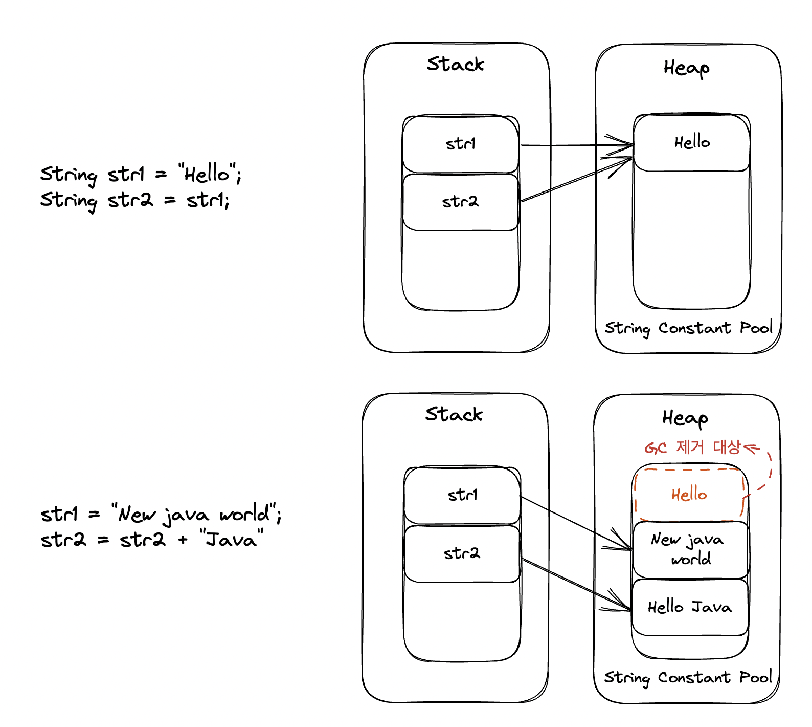
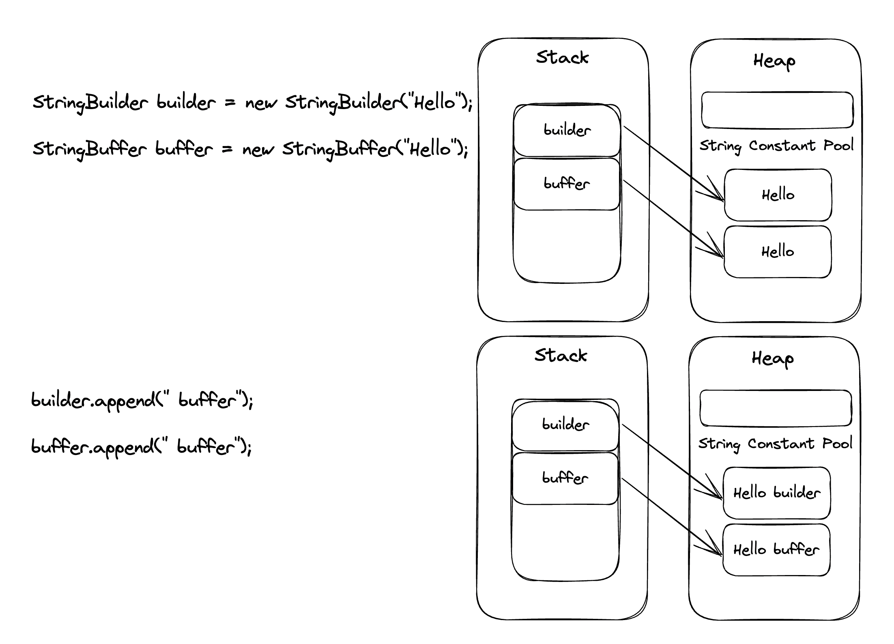

### String

String은 immutable(불변) 하다.

String Constant Pool에 있는 값은 변하는 것이 아니라 새로운 값의 주소를 가리키게 된다.



String 객체의 내부 구성 요소를 보면 다음과 같이 되어 있다.

```java
public final class String implements java.io.Serializable, Comparable {
	private final byte[] value;
}
```

인스턴스 생성 시 생성자의 매개변수로 입력받는 문자열은 이 value라는 인스턴스 변수에 문자형 배열로 저장되게 된다. 이 value라는 변수는 상수(final)형이니 값을 바꾸지 못하는 것이다.

replace(), toUpperCase(), subString(), concat() 등 String 메소드는 문자열이 변경되는 것처럼 보이지만, 새로운 String 객체를 생성하여 리턴한다. 즉, 기존 값이 바뀌는 것이 아니다.


> jdk 8까지는 String 객체의 값은 char[] 배열로 구성돼 있지만, jdk 9부터 기존 char[]에서 byte[]를 사용하여 String Compacting을 통한 성능 및 heap 공간 효율(2byte -> 1byte)을 높이도록 수정되었습니다. 


**[ 자바 언어에서 String을 불변으로 설정한 이유 ]**
String 객체를 불변하게 설계한 이유는 캐싱, 보안, 동기화, 성능측면 이점을 얻기 위해서이다.

- 캐싱 : String을 불변하게 함으로써 String pool에 각 리터럴 문자열의 하나만 저장하며 다시 사용하거나 캐싱에 이용가능하며 이로 인해 힙 공간을 절약할 수 있다는 장점이 있다. 

- 보안 : 예를 들어 데이터베이스 사용자 이름, 암호는 데이터베이스 연결을 수신하기 위해 문자열로 전달되는데, 만일 번지수의 문자열 값이 변경이 가능하다면 해커가 참조 값을 변경하여 애플리케이션에 보안 문제를 일으킬 수 있다.

- 동기화 : 불변함으로써 동시에 실행되는 여러 스레드에서 안정적이게 공유가 가능하다.


### StringBuffer, StringBuilder

StringBuffer, StringBuilder는 mutable(가변) 하다.

두 클래스는 내부 Buffer(데이터를 임시로 저장하는 메모리)에 문자열을 저장해두고 그 안에서 추가, 수정, 삭제 작업을 할 수 있도록 설계되어 있다.



따라서 값이 변경될 때마다 새로운 객체를 만드는 String보다 훨씬 빠르고, 메모리 낭비도 적다.

문자열의 추가, 수정 삭제 작업이 빈번하게 발생한다면 StringBuffer, StringBuilder를 사용하는 것이 좋다.


StringBuffer 객체의 내부 구성 요소를 보면 다음과 같이 되어 있다.

StringBuffer, StringBuilder 둘다 AbstractStringBuilder을 상속하며, String 과 다르게 상수(final) 키워드가 없는것을 볼 수 있다.

```java
public final class StringBuffer implements java.io.Serializable {
	private byte[] value;
}
```


### StringBuffer, StringBuilder 차이

| StringBuffer   | StringBuilder    |
| -------------- | ---------------- |
| Thread-Safe    | Not Thread-Safe  |
| Synchronized   | Not Synchronized |
| Since Java 1.0 | Since Java 1.5   |
| Slower         | Faster           |

단일 스레드 환경에 있거나 Thread-Safe에 관심이 없는 경우 StringBuilder를 Thread-Safe 한 작업에는 StringBuffer를 사용한다.

두 클래스는 문법이나 배열구성도 모두 같지만, **동기화**(**Synchronization**)에서의 지원의 여부가 다르다. 

StringBuffer는 메서드에서 synchronized 키워드를 사용하기 때문에 StringBuffer는 동기화를 지원하여 멀티 스레드 환경에서도 안전하게 동작할 수 있다. 반면, StringBuilder는 동기화를 지원하지 않는다.

*synchronized 키워드 : java에서 여러 개의 스레드가 한 개의 자원에 접근하려고 할 때, 현재 데이터를 사용하고 있는 스레드를 제외하고 나머지 스레드들이 데이터에 접근할 수 없도록 막아준다.


#### Thread-Safe Test

```java
public class Main extends Thread{
    public static void main(String[] args) {
        StringBuffer stringBuffer = new StringBuffer();
        StringBuilder stringBuilder = new StringBuilder();

        new Thread(() -> {
            for(int i=0; i<10000; i++) {
                stringBuffer.append("O");
                stringBuilder.append("O");
            }
        }).start();

        new Thread(() -> {
            for(int i=0; i<10000; i++) {
                stringBuffer.append("O");
                stringBuilder.append("O");
            }
        }).start();

        new Thread(() -> {
            for(int i=0; i<10000; i++) {
                stringBuffer.append("O");
                stringBuilder.append("O");
            }
        }).start();

        new Thread(() -> {
            try {
                Thread.sleep(3000);

                // thread-safe
                System.out.println("StringBuffer.length: "+ stringBuffer.length());
                // Not thread-safe
                System.out.println("StringBuilder.length: "+ stringBuilder.length());
            } catch (InterruptedException e) {
                e.printStackTrace();
            }
        }).start();
    }
}
```

```shell
StringBuffer.length: 30000
StringBuilder.length: 29626
```


StringBuilder는 3개의 Thread가 동시에 append()를 수행하다 값이 덮어 씌워지는 오류가 발생하게 된다. 이를 Not Thread-Safe 하다고 한다.

Thread-Safe 하다면 하나의 Thread가 작업 중이면 다른 Thread를 대기 시켜주고 차례대로 실행하게 한다.

web이나 소켓환경과같이 **비동기로 동작하는 경우가 많을 때는 StringBuffer를 사용**하는 것이 안전하다는 것을 알 수가 있다.


### StringBuffer, StringBuilder 성능 비교

```java
package main.no1152;

import java.util.GregorianCalendar;

public class Main {

    public static void main(String[] args) throws Exception {
        System.gc();
        long start=new GregorianCalendar().getTimeInMillis();
        long startMemory=Runtime.getRuntime().freeMemory();
        StringBuffer sb = new StringBuffer();
//        StringBuilder sb = new StringBuilder();
        for(int i = 0; i<100000000; i++){
            sb.append(":").append(i);
        }
        long end=new GregorianCalendar().getTimeInMillis();
        long endMemory=Runtime.getRuntime().freeMemory();
        System.out.println("Time Taken:"+(end-start));
        System.out.println("Memory used:"+(startMemory-endMemory));
    }
}
```

| n           | StringBuffer                            | StringBuilder                           |
| ----------- | --------------------------------------- | --------------------------------------- |
| 100,000,000 | Time Taken:2830<br/>Memory used:2445744 | Time Taken:2477<br/>Memory used:2444800 |


### 정리

String : 문자열 변경 작업이 거의 없는 경우

StringBuffer :문자열 추가나 변경 등의 작업이 많을 경우 (대부분 멀티 스레드 이상의 환경이기 때문)

