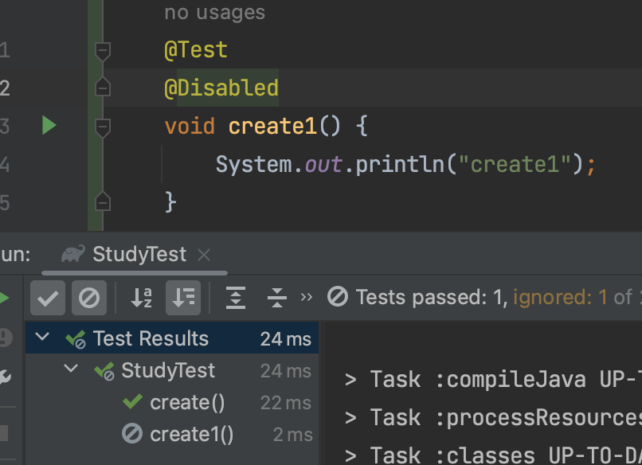
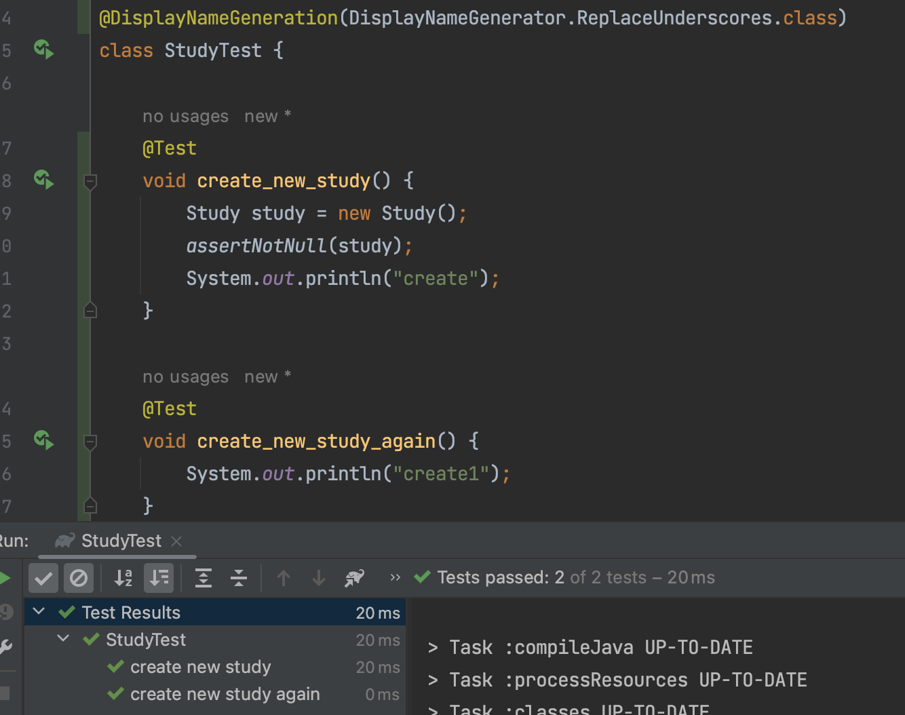
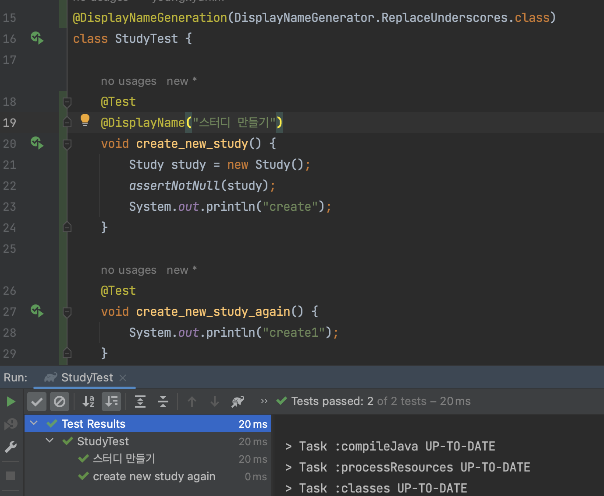

## 기본 애노테이션

@Test, @BeforeAll / @AfterAll, @BeforeEach / @AfterEach

```java
class StudyTest {

    @Test
    void create() {
        Study study = new Study();
        assertNotNull(study);
        System.out.println("create");
    }

    @Test
    void create1() {
        System.out.println("create1");
    }

    // BeforeAll, AfterAll 은 static으로 선언해야한다.
    @BeforeAll
    static void beforeAll() {
        System.out.println("beforeAll");
    }
    @AfterAll
    static void afterAll() {
        System.out.println("afterAll");
    }

    // 테스트
    @BeforeEach
    void beforeEach() {
        System.out.println("beforeEach");
    }
    @AfterEach
    void afterEach() {
        System.out.println("afterEach");
    }
}
```

```she
beforeAll
beforeEach
create
afterEach
beforeEach
create1
afterEach
afterAll
```


@Disabled

좋은 방법은 아니지만, 테스트를 생략하는 기능이다.



---


## 테스트 이름 표시하기 

@DisplayNameGeneration(전략 구현체)

- Method와 Class 레퍼런스를 사용해서 테스트 이름을 표기하는 방법 설정.
- 기본 구현체로 ReplaceUnderscores 제공
- ReplaceUnderscores : 언더바를 빈 공간으로



@DisplayName

- 어떤 테스트인지 테스트 이름을 보다 쉽게 표현할 수 있는 방법을 제공하는 애노테이션.
- @DisplayNameGeneration 보다 우선 순위가 높다.



@ParameterizedTest

- 표현 식을 지정할 수 있습니다. {0}, {1}은 파라미터값을 테스트 이름에 넣을 수 있습니다.
- {displayName}: 메서드 이름을 표시합니다.
- {index}: 테스트 실행 횟수를 표시합니다. (1-based)
- {arguments}: 파라미터를 콤마로 구분해서 보여줍니다.
- {argumentsWithNames}: 콤마로 구분된 파라미터 이름과 파리머터 값을 보여줍니다.
- {0}, {1} ...: 메서드에 인자로 넘어오는 각 파라미터를 표시합니다.

```java
@DisplayName("로또 정상 값 테스트")
@ParameterizedTest(name = "[{index}] input {0} ")
@ValueSource(strings = {"1,2,3,4,5,6", "1,10,20,30,40,45", "40,41,42,43,44,45"})
void lottoNumberTest(String inputString) {
  Lotto lotto = new Lotto(inputHandler.stringToList(inputString));
  assertThat(lotto.getLottoNumbers()).isEqualTo(inputHandler.stringToList(inputString));
}
```


>you can customize invocation display names via the `name` attribute of the`@ParameterizedTest` annotation like in the following example.
>
>```
>@DisplayName("Display name of container")
>@ParameterizedTest(name = "{index} ==> the rank of ''{0}'' is {1}")
>@CsvSource({ "apple, 1", "banana, 2", "'lemon, lime', 3" })
>void testWithCustomDisplayNames(String fruit, int rank) {
>}
>```
>
>When executing the above method using the `ConsoleLauncher` you will see output similar to the following.
>
>```
>Display name of container ✔
>├─ 1 ==> the rank of 'apple' is 1 ✔
>├─ 2 ==> the rank of 'banana' is 2 ✔
>└─ 3 ==> the rank of 'lemon, lime' is 3 ✔
>```
>
>https://junit.org/junit5/docs/current/user-guide/#writing-tests-parameterized-tests-display-names


IntelliJ 에서 표시가 않되는 문제가 발생한다.

- Preferences  > Gradle 검색
- Build, Execution, Deployment 아래 있는 Gradle 선택
- Run tests using을 IntelliJ IDEA로 변경하면 해결된다.


> https://junit.org/junit5/docs/current/user-guide/#writing-tests-parameterized-tests

---


## Assertion

### assertEqulas(expected, actual)

실제 값이 기대한 값과 같은지 확인

만약 메세지를 같이 사용한다면

assertEqulas(expected, actual, "이 테스트는 어떤 상태값이여야 한다") 보다는 assertEqulas(expected, actual, () -> "이 테스트는 어떤 상태값이여야 한다")

마지막 매개변수로 Supplier<String> 타입의 인스턴스를 람다 형태로 제공할 수 있다.복잡한 메시지 생성해야 하는 경우 사용하면 실패한 경우에만 해당 메시지를 만들게 할 수 있다.

### assertAll(executables...)

- 모든 Assertion이 실행
- MultipleFailureError에 대한 메시지 문자열에 포함될 제목과 실행 가능한 스트림을 허용
- 실행 파일 중 하나에서 OutOfMemoryError가 발생한 경우에만 중단됨
- 메소드 내에서 인자로 람다식을 사용
	- 여러 개의 람다식이 동시에 실행됨

```java
@Test
void test() {
  assertAll(
    "heading",
    () -> assertEquals(4, 2 * 2, "4 is 2 times 2"),
    () -> assertEquals("java", "C/C++", () -> "java를 입력 해야 합니다.")
  );
}
```


### assertSame and assertNotSame

- JUnit4 버전과 동일
- 예상되는 값과 실제 값이 동일한 객체를 참조하는지 확인

```java
@Test
public void test() {
    String language = "Java";
    Optional<String> optional = Optional.of(language);

    assertSame(language, optional.get());
}
```

### fail

- 제공된 실패 메시지와 기본 원인으로 테스트에 실패
- 개발이 완료되지 않은 테스트를 표시하는 데 유용

```java
@Test
public void test() {
    // Test not completed
    fail("FAIL - test not completed");
}
```

### assertThrows

- 특정 예외가 발생하였는지 확인
- 첫 번째 인자는 확인할 예외 클래스
- 두 번째 인자는 테스트하려는 코드

```java
@Test
void test() {
    Throwable exception = assertThrows(
      IllegalArgumentException.class, 
      () -> {
          throw new IllegalArgumentException("Exception message");
      }
    );
    assertEquals("Exception message", exception.getMessage());
}
@Test
    void test() {
        Exception exception = assertThrows(ArithmeticException.class, () ->
            calculator.divide(1, 0));
        assertEquals("/ by zero", exception.getMessage());
    }
```

### assertTimeout & assertTimeoutPreemptively

- 특정 시간 안에 실행이 끝나는지 확인
- 시간 내 실행이 끝나는지 여부 확인 시 : assertTimeout
- 지정한 시간 내 끝나지 않으면 바로 종료 : assertTimeoutPreemptively
	- 트랜잭션 설정에 따라 예상치 못한 에러가 발생할 수 있음

```java
@Test
public void test() {
    assertTimeout(
      ofSeconds(2), 
      () -> {
        // code that requires less then 2 minutes to execute
        Thread.sleep(1000);
      }
    );
}
```

### assertArrayEquals

- 예상 배열과 실제 배열이 동일한지 확인
- 배열이 같지 않으면 마지막 인자로 들어간 메세지가 출력됨

```java
@Test
public void test() {
    char[] expected = { 'J', 'u', 'p', 'i', 't', 'e', 'r' };
    char[] actual = "Jupiter".toCharArray();

    assertArrayEquals(expected, actual, "Arrays should be equal");
}
```

### assertIterableEquals

- 예상 반복 가능 항목과 실제 반복 가능 항목이 동일한지 확인
- 두 Iterable은 동일한 순서로 동일한 요소를 반환해야 함
- 두 Iterable이 동일한 유형일 필요는 없음
- 아래에서 서로 다른 유형의 두 목록(LinkedList 및 ArrayList)이 동일한지 확인

```java
@Test
public void test() {
    Iterable<String> al = new ArrayList<>(asList("Java", "Junit", "Test"));
    Iterable<String> ll = new LinkedList<>(asList("Java", "Junit", "Test"));

    assertIterableEquals(al, ll);
}
```

### assertLinesMatch

- 예상 목록이 실제 목록과 일치하는지 확인
- assertEquals, assertIterableEquals와 다름
	- 예상 줄이 실제 줄과 같은지 확인
	- 같으면 다음 쌍으로 이동
	- String.matches() 메서드로 검사
	- fast-forward marker 확인
- 아래에서 두 목록에 일치하는 행이 있는지 검사

```java
@Test
public void test() {
    List<String> expected = asList("Java", "\\d+", "JUnit");
    List<String> actual = asList("Java", "11", "JUnit");

    assertLinesMatch(expected, actual);
}
```

[JUnit5](https://junit.org/junit5/docs/current/user-guide/#writing-tests-parameterized-tests), [AssertJ](https://joel-costigliola.github.io/assertj/), [Hemcrest](https://hamcrest.org/JavaHamcrest/), [Truth](https://truth.dev/) 등의 라이브러리를 사용할 수도 있다.


### 조건에 따라 테스트 실행하기

### 태깅, 필터링

### 커스텀 태그

### 테스트 반복

### 테스트 순서

등 다양한 기능이 있다.
