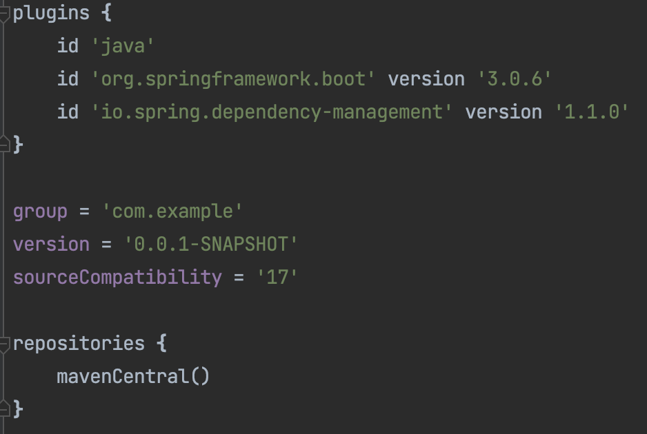
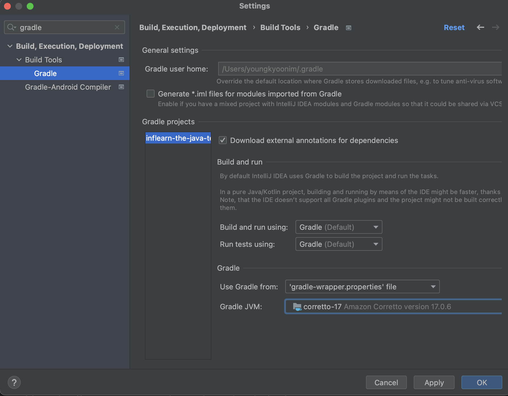
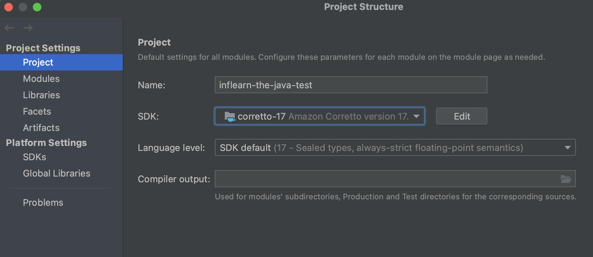
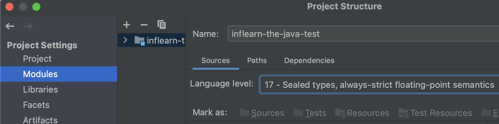
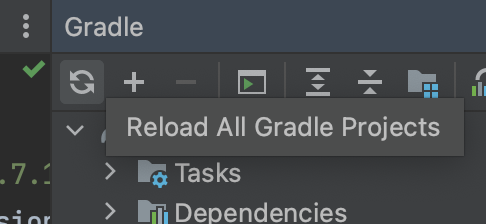

3.X부터는 **Java 17부터 지원**된다.
기존에 Java8, 11등을 사용하시던 분들은 3.x 스프링 부트 프로젝트를 실행할때 에러들을 만나게 된다.

```
//error
No matching variant of org.springframework.boot:spring-boot-gradle-plugin:3.0.1 was found. The consumer was configured to find a runtime of a library compatible with Java 16, packaged as a jar, and its dependencies declared externally, as well as attribute 'org.gradle.plugin.api-version' with value '7.6' but:
          - Variant 'apiElements' capability org.springframework.boot:spring-boot-gradle-plugin:3.0.1 declares a library, packaged as a jar, and its dependencies declared externally:
              - Incompatible because this component declares an API of a component compatible with Java 17 and the consumer needed a runtime of a component compatible with Java 16
              - Other compatible attribute:
                  - Doesn't say anything about org.gradle.plugin.api-version (required '7.6')
          - Variant 'javadocElements' capability org.springframework.boot:spring-boot-gradle-plugin:3.0.1 declares a runtime of a component, and its dependencies declared externally:
              - Incompatible because this component declares documentation and the consumer needed a library
              - Other compatible attributes:
                  - Doesn't say anything about its target Java version (required compatibility with Java 16)
                  - Doesn't say anything about its elements (required them packaged as a jar)
                  - Doesn't say anything about org.gradle.plugin.api-version (required '7.6')
          - Variant 'mavenOptionalApiElements' capability org.springframework.boot:spring-boot-gradle-plugin-maven-optional:3.0.1 declares a library, packaged as a jar, and its dependencies declared externally:
              - Incompatible because this component declares an API of a component compatible with Java 17 and the consumer needed a runtime of a component compatible with Java 16
              - Other compatible attribute:
                  - Doesn't say anything about org.gradle.plugin.api-version (required '7.6')
          - Variant 'mavenOptionalRuntimeElements' capability org.springframework.boot:spring-boot-gradle-plugin-maven-optional:3.0.1 declares a runtime of a library, packaged as a jar, and its dependencies declared externally:
              - Incompatible because this component declares a component compatible with Java 17 and the consumer needed a component compatible with Java 16
              - Other compatible attribute:
                  - Doesn't say anything about org.gradle.plugin.api-version (required '7.6')
          - Variant 'runtimeElements' capability org.springframework.boot:spring-boot-gradle-plugin:3.0.1 declares a runtime of a library, packaged as a jar, and its dependencies declared externally:
              - Incompatible because this component declares a component compatible with Java 17 and the consumer needed a component compatible with Java 16
              - Other compatible attribute:
                  - Doesn't say anything about org.gradle.plugin.api-version (required '7.6')
          - Variant 'sourcesElements' capability org.springframework.boot:spring-boot-gradle-plugin:3.0.1 declares a runtime of a component, and its dependencies declared externally:
              - Incompatible because this component declares documentation and the consumer needed a library
              - Other compatible attributes:
                  - Doesn't say anything about its target Java version (required compatibility with Java 16)
                  - Doesn't say anything about its elements (required them packaged as a jar)
```


### 해결 방법

2.7.X 버전으로 다운그레이드

Java 17버전 이상으로 변경


만약 Java 버전이 17 이상인데, 오류가 그대로 발생한다면 다음과 같은 설정을 하자.


### **build.gradle**

```
sourceCompatibility = '17'
```




### IntelliJ

IntelliJ의 `Preferences/Settings` -> `Build, Execution, Deployment` -> `Build Tools` -> `Gradle` 로 이동

Gradle 설정에서 **Gradle의 JVM이 Java 17이상인지** 확인




### Project SDK

`File` -> `Project Structure..` 로 이동하여 프로젝트 SDK의 버전을 확인후 Java 17이상으로 설정

**Project**



**Modules**




### Gradle Refresh

모든 설정 후 Gradle Refresh 실행





이제 정상적으로 빌드 되는 것을 확인할 수 있다.