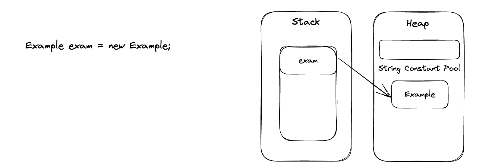
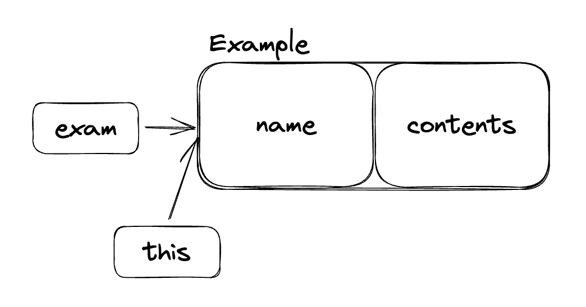

# 클래스(Class)


## 목차

- 클래스란 무엇인가?
- 클래스 정의하는 방법
- 객체 만드는 방법 (new 키워드 이해하기)
- 메소드 정의하는 방법
- 생성자 정의하는 방법
- this 키워드 이해하기

<br/>

## 클래스란 무엇인가?

클래스는 객체의 상태를 나타내는 필드(field)와 객체의 행동을 나타내는 메소드(method)로 구성됩니다.

즉, 객체의 설계도입니다.

<br/>

## 클래스 정의하는 방법

```java
public class Example{
  private String name;
  private String contents;
  
  public Example(){} //기본 생성자
  
  public Void setName(String name){
    this.name = name;
  }
  
  public String getName(){
    return this.name;
  }
}
```


<br/>

## 객체 만드는 방법 (new 키워드 이해하기)

```java
Example exam = new Example;
```



new 연산자는 객체를 Heap이라는 메모리 영역에 메모리 공간을 할당해 주고 메모리주소를 반환한 후 생성자를 실행시켜 준다.

리터럴과는 달리 new 연산자로 생성된 객체는 서로 다른 메모리를 할당합니다.


<br/>

## 메소드 정의하는 방법

`{public, private} {static, strictfp, sysnchronized} {Types, void} 메서드명 (인자들) {}  public String getFirstName() {        return this.firstName; }`

```java
public void methodName(){
  
}

//오버 로딩
//메소드의 이름이 같고, 매개변수의 개수나 타입이 달라야 한다
public void methodName(int a){
  System.out.println(a);
}

// '리턴 값만' 다른 것은 오버로딩을 할 수 없다
public int methodName(int a){
  System.out.println(a);
  return a;
}
```


<br/>

## 생성자 정의하는 방법

**전달하는 인자에 의해서 호출되는 생성자가 달라진다.**

```java
public class Example{
  private String name;
  private String contents;
  
  public Example(){} //기본 생성자
  public Example(String name){
    this.name = name;
  }
	public Example(String name, String contents){
    this.name = name;
    this.contents = contents;
  }
}
```


<br/>

## this 키워드 이해하기

객체, 자기 자신을 나타내는 명령어




### 그럼 this() 는 무엇인가?

this() 메소드에 인수를 전달하면, 생성자 중에서 메소드 시그니처가 일치하는 다른 생성자를 찾아 호출해 줍니다.

```java
public class Example{
  private String name;
  private String contents;
  
  public Example(){
    this("기본 이름", "기본 내용");
  }
	public Example(String name, String contents){
    this.name = name;
    this.contents = contents;
  }
}
```

this("초기 설정 이름", "기본 내용");를 통해서 	public Example(String name, String contents){ ... } 코드로 연결된다. 

new public Example()로 생성된 객체는 name = 기본 이름, contents = 기본 내용을 가지게 된다. 

### super() 키워드는 무엇인가?

this()와 마찬가지로 생성자를 호출 함수로, 자기 자신이 아닌 부모 클래스의 생성자를 호출합니다.