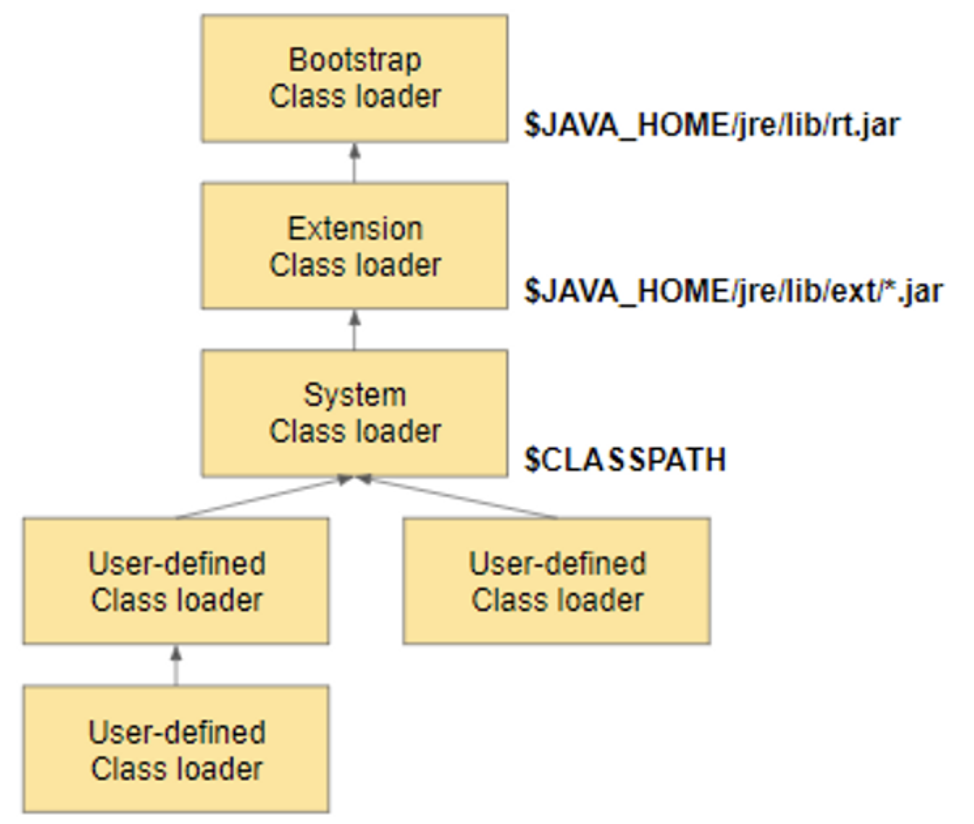

# 패키지(Package)

<br>

## 목차

- package 키워드
- import 키워드
- 접근제어자
- 클래스패스
- CLASSPATH 환경변수
- -classpath 옵션

<br>
## package

패키지란 많은 클래스들을 체계적으로 관리하기 위해 존재한다.

패키지의 물리적인 형태는 "파일 시스템의 폴더" 이다.

폴더를 만들어서 파일을 저장하듯, 패키지를 만들어서 클래스를 저장/관리 한다.

또한, 파일 시스템의 폴더 기능만이 아니라 클래스의 일부분이다.

- 패키지는 클래스를 유일하게 만들어주는 "식별자" 역할을 한다.
- 클래스의 전체 이름은 "패키지 + 클래스명" 이다.
- 패키지가 상, 하위로 구분되어 있다면 도트(.)를 사용해서 표현한다.

```
상위패키지.하위패키지.클래스
```

- 패키지 이름과 위치한 폴더의 이름이 같아야한다.
- 모든 클래스에는 정의된 클래스 이름과 패키지 이름이 있다. 이 둘을 합쳐야 완전하게 한 클래스를 표현한다고 할 수 있으며 FQCN(Fully Qualified Class Name) 이라고 한다.
	- 예를 들어 String 클래스의 패키지는 java.lang이며 FQCN은 java.lang.String이 된다.

### 패키지 이름 명명 규칙

- 패키지 이름은 모두 소문자여야한다.
- 자바의 예약어를 사용하면 안된다. (예, `int`, `static`)
- 개발 패키지 표준은 정하는 것에 따라 지정하면 된다.

### 빌트-인 패키지(Built-in Package)

자바는 개발자들이 사용할 수 있도록 여러 많은 패키지 및 클래스를 제공한다.

가장 자주 쓰이는 패키지로는 **java.lang**과 **java.util**이 있다.

<br>

## import 키워드

다른패키지명에 있는 클래스를 찾지 못할때 사용한다.

**주의점**

**import문으로 지정된 패키지의 하위 패키지는 import 대상이 아니다.**

만약 하위 패키지의 클래스를 이용하고 싶다면 import 문을 하나 더 작성해야 한다.

### static import

**static import**는 일반적인 import와 다르게 메소드나 변수를 패키지, 클래스명 없이 접근가능하게 해준다.

```java
import static java.lang.System,*;

...
out.println("Hello Java");
...
```


<br>

## 클래스패스

JVM이나 Java 컴파일러가 실행할 때 사용자 지정 클래스와 패키지들이 어디 있는지 위치를 지정해주는 데 사용한다.

classpath 옵션은 java와 javac 명령어에 모두 사용할 수 있다.


JVM의 클래스로더는 런타임 시에 $**CLASSPATH** 환경변수를 호출해 해당 디렉토리에 정의된 클래스들을 로딩하게 된다.

3가지 Class Loader 가 존재한다.



**BootStrap Class Loader**

기본 클래스로더 중 최상위 클래스 로더로 **jre/lib/rt.jar** 에 담긴 JDK 클래스 파일을 로딩한다.

String 클래스나, Object 클래스를 사용할 수 있었던 이유가 바로 BootStrap Class Loader가 자동으로 메모리에 적재해주기 떄문이다.

**Extension Class Loader**

익스텐션 클래스로더는 **jre/lib/ext** 폴더나 **java.ext.dirs** 환경 변수로 지정된 폴더에 있는 클래스 파일을 로딩한다.

**System Class Loader**

System Class Loader 가 개발자가 만든 Class를 메모리에 올리는 역할을 하는데, 그 때 classpath 기준으로 클래스들을 로드해준다.


### **- rt.jar**

JRE는 JDK 중에서 java 프로그램을 실행하는 프로그램만 포함된 환경입니다.

JRE는 classes.zip 파일에서 클래스를 찾지 않습니다. 대신 **rt.jar** 파일을 사용합니다.

rt.jar 파일에는 classes.zip과 동일한 클래스가 모두 포함되어 있고, 아카이브 형식과 이름만 다른 것을 사용합니다.

Java 1.2가 발표되면서 classes.zip 파일은 없어졌습니다. 대신, JDK와 JRE가 모두 "rt.jar" 파일을 사용합니다.

"rt.jar" 파일을 classpath에 지정해야 하는가에 대해서는 classes.zip 파일과 동일한 규칙이 적용되며, 지정할 필요가 없습니다.


classpath 를 지정하기 위한 두 가지 방법이 있다.

- CLASSPATH 환경변수
- java runtime 에 -classpath 옵션

<br>

## CLASSPATH 환경변수

환경변수는 운영체제에 지정하는 변수로 자바 가상머신과 같은 애플리케이션들은 환경변수 값을 참고해서 동작하게 된다.

자바는 클래스 패스로 환경번수 CLASSPATH를 사용하는데 이 값을 지정하면 실행할때마다 -cp(classpath) 옵션을 사용하지 않아도 된다. 하지만, 운영체제를 변경하면 클래스패스가 사라진다.

**windows**

시스템 설정 > 환경 변수

**linux, unix 계열**

/etc/profile

**IDE의 자동 클래스패스 설정**

최근에는 운영체제 상의 환경변수로 클래스패스를 설정하는 것은 지양하고 IDE나 빌드도구를 통해 클래스패스를 설정한다. https://gintrie.tistory.com/67

<br>

## -classpath 옵션

컴파일러가 컴파일 하기 위해서 필요로 하는 참조할 클래스 파일들을 찾기 위해서 컴파일시 파일 경로를 지정해주는 옵션


참조할 클래스 파일들이 그 외의 다른 디렉터리, 그리고 현 디렉토리에도 존재한다면,
`javac -classpath .;C:\Java\Engclasses;C;\Java\Korclasses C:\Java\Hello.java`\

단축어 `javac -cp .;C:\Java\Engclasses;C;\Java\Korclasses C:\Java\Hello.java`


<br>

## 접근제어자

접근제어자는 클래스, 메소드, 인스턴스 및 클래스 변수를 선언할 때, 사용된다. 

- public

	- 누구나 접근 가능하다.

- protected

	- 같은 패키지에 있거나, 상속 받는 경우 사용할 수 있다.

-	package-private

	- 아무 접근제어자를 적어주지 않은 경우이며, `package-private`라 불린다. 같은 패키지 내에서 접근 가능하다.

-	private

	- 해당 클래스 내에서만 접근 가능하다.

|                  | 해당 클래스 내 | 같은 패키지 내 | 상속받은 클래스 | import 한 클래스 |
| ---------------- | -------------- | -------------- | --------------- | ---------------- |
| public           | O              | O              | O               | O                |
| protected        | O              | O              | O               | X                |
| package- private | O              | O              | X               | X                |
| private          | O              | X              | X               | X                |