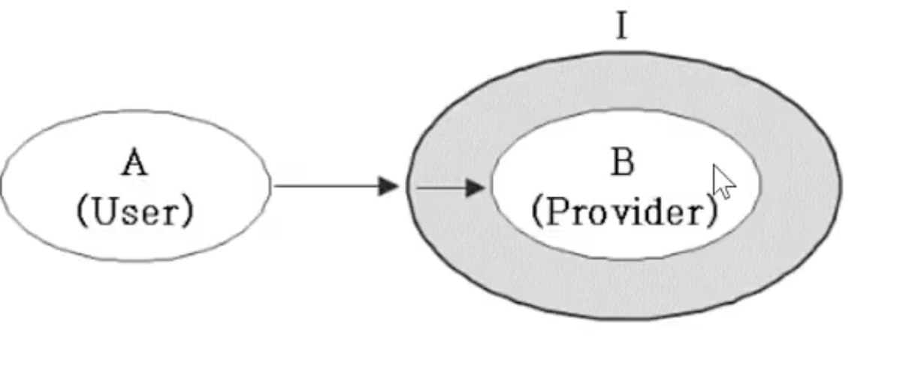
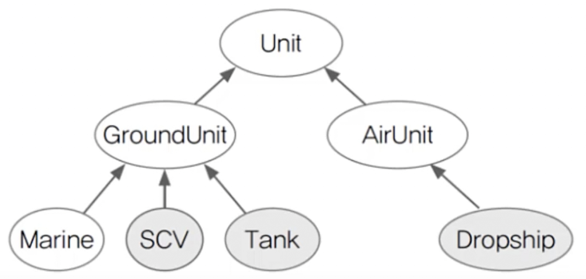

# 인터페이스(Interface)

<br>

## 목차

- 인터페이스 정의하는 방법
- 인터페이스 구현하는 방법
- 인터페이스 레퍼런스를 통해 구현체를 사용하는 방법
- 인터페이스 상속
- 인터페이스의 기본 메서드 (Default Method), 자바 8
- 인터페이스의 static 메서드, 자바 8
- 인터페이스의 private 메서드, 자바 9

<br>

## 인터페이스

추상 클래스보다 추상화가 높다. 일반 메서드 또는 멤버 변수를 가질 수 없고, 오직 추상 메서드와 상수만을 맴버로 가질 수 있다.

Java 8버전 부터 default 예약어를 통해 일반 메소드구현이 가능하다.


인터페이스와 추상 클래스는 자기 자신을 객체화할 수 없으며 다른 객체가 상속(extends) , 구현(implements)을 하여 객체를 생성할 수 있다.

하위 클래스에서는 상위에서 정의한 추상 메서드(abstract method)를 반드시 구현하여야 한다.

### 추상 클래스와의 차이점

| **추상 클래스(abstract class)** | **인터페이스(interface)**                                    |
| ------------------------------- | ------------------------------------------------------------ |
| 일반 메소드 포함가능            | 모든 메서드는 추상메서드 <br />자바 8 이후 부터 default ,static 메서드 추가가능 |
| 다중상속 불가능                 | 다중상속 가능                                                |
| 상수, 변수 필드 포함가능        | 상수필드만 포함가능                                          |

<br>

### 추상 클래스, 인터페이스 존재 이유

- 추상 클래스는 IS-A관계  ( ~은(는) ~이다. )
	- 상속관계
	- 강아지는 동물이다.

- 인터페이스는 HAS-A관계 ( ~은(는) ~ 을(를) 할 수 있다.  )
	- 수평 구조 : 특정 기능을 포함 시키고 싶을때
	- 강아지는 짖을 수 있다.

<br>

## 인터페이스 사용 이유

- 다형성

  - 형변환을 통한 교체 용이

  - ```java
    Crypto crypto = new SHA512Crypto(); // 기존 SHA512 방식
    String enc = crypto.encrypt("1234");
    ```

  - 위 SHA512 방식을 새로운 암호화 방식으로 쉽게 변경가능

  - ```java
    Crypto crypto = new NewSHACrypto(); // 새로운 암호화 방식
    String enc = crypto.encrypt("1234");
    ```

  - 선언(설계)와 구현을 분리시킬 수 있게 한다.

    - ```java
      class B {
        public void method() {
          System.out.println("methodInB");
        }
      }
      ```

    - 분리

    - ```java
      interface I {
      	public void method()
      }
      
      class B implements I{
        public void method() {
          System.out.println("methodInB");
        }
      }
      ```

    - 인터페이스 덕분에 B가 변경되어도 A는 안바꿀 수 있게 된다.(느슨한 결합)

  - 

  - A는 I사용, B는 구현

  	위 그림과 같이 interface로 중간 역할을 해주면 B가 C로 변경되어도 A는 변경할 필요가 없다. (느슨한 결합)

  	```java
  	//직접적인 관계의 두 클래스 A-B
  	class A {
  	  public void methodA(B b) { //B를 사용
  	    b.methodB();
  	  }
  	}
  	
  	class B {
  	  public void methodB() {
  	    System.out.println("methodInB()");
  	  }
  	}
  	
  	class C implements I {
  	  public void methodB() {
  	    System.out.println("methodInB() in C class");
  	  }
  	}
  	
  	//클래스 B -> C 로 변경시 A 코드 변경 필요
  	
  	class InterfaceTst {
  	  public static void main(String args[]) {
  	    A a = new A();
  	    a.methodA(new B()); //"methodInB()"출력
  	  }
  	}
  	```

  	```java
  	//간접적인 관계의 두 클래스 A-I-B
  	class A {
  	  public void methodA(I i) { //I를 사용
  	    i.methodB();
  	  }
  	}
  	
  	Interface I { void methodB(); }
  	
  	class B implements I {
  	  public void methodB() {
  	    System.out.println("methodInB()");
  	  }
  	}
  	
  	class C implements I {
  	  public void methodB() {
  	    System.out.println("methodInB() in C class");
  	  }
  	}
  	
  	//클래스 B -> C 로 변경시 A는 변경 없음
  	
  	class InterfaceTst {
  	  public static void main(String args[]) {
  	    A a = new A();
  	    a.methodA(new B()); //"methodInB()"출력
  	    a.methodA(new C()); //"methodInB() in C class"출력
  	  }
  	}
  	```

- 프로젝트 개발 시 일관되고 정형화된 개발을 위한 표준화가 가능하다.

  - 미리 메소드를 정할 수 있다.

- 다중 상속을 통한 이점을 누릴 수 있다.

- 클래스와 클래스 간의 관계를 인터페이스로 연결하면, 클래스마다 독립적인 프로그래밍이 가능하다.
  - 개방 폐쇄법칙인 확장에는 열려있고 변경에는 닫혀있게 된다.

- 서로 관계없는 클래스들을 관계를 맺어줄 수 있다.

	

	SCV, Tank, Dropship 를 수리하는 기능을 만든다고 가정하면

	```java
	interface Repairable {}
	
	class SCV extends GroundUnit implements Repairable {
	  // ...
	}
	class Tank extends GroundUnit implements Repairable {
	  // ...
	}
	class Dropship extends AirUnit implements Repairable {
	  // ...
	}
	
	void repair(Repairable r) { // -> Repairable을 구현한 객체만 가는
	  if (r instanceof Unit) {
	    Unit u = (Unit)r;
	    While(u.hitPoint != u.MAX_HP) {
	      u.hitPoint++; //Unit의 HP를 증가시킨다.
	    }
	  }
	}
	```


<br>

## 인터페이스 정의하는 방법

```java
interface 인터페이스 {
    public static final 타입 상수 = 값;
    public abstract 메서드(매개변수);
}
```

- class 대신 interface를 사용한다.

- 모든 변수는(상수) public static final 이 붙어야 하며, 생략 시 컴파일러가 자동으로 추가해준다.

- 모든 메서드는 public abstract 이 붙어야 하며, 생략 가능하다.
	- 단, JDK 1.8부터 static 메서드와 default 메서드는 예외이다.


<br>

## 인터페이스 구현하는 방법

```java
class 클래스이름 implements 인터페이스 이름 {
    // 인터페이스에 정의된 추상 메서드를 구현
}

abstract class 클래스 이름 implements 인터페이스이름 {
    // 인터페이스에 정의된 추상 메서드의 일부만 구현
}

class 클래스이름 extends 조상클래스이름 implements 인터페이스이름 {
		// 다중 상속
}
```


<br>

## 인터페이스 레퍼런스를 통해 구현체를 사용하는 방법

인터페이스는 다형성을 이용해 구현할 수 있다.

```java
public interface TV {
    void name();
}
```

```java
public class SmartTV implements TV {
   @Override
   public void name() {
      System.out.println("스마트 티비");
   }

   public void smart() {
      System.out.println("똑똑한 기능을 제공한다.");
   }
}
   
public class BigTV implements TV {
   @Override
   public void name() {
      System.out.println("큰 티비");
   }

   public void bigScreen() {
      System.out.println("큰 화면을 보여준다.");    
   }
}
```

```java
public class Main {
    public static void main(String[] args) {
        TV smartTV = new SmartTV(); // 업 캐스팅
        TV bigTV = new Big();				// 업 캐스팅

        smartTV.name();
        bigTV.name();

        // smartTV.smart();           사용불가
        // BigTV.bigScrean();         사용불가
        ((SmartTV) smartTV).smart();      // 다운 캐스팅
        ((BigTV) bigTV).bigScrean();  		// 다운 캐스팅
    }
}

// 스마트 티비
// 큰 티비
// 똑똑한 기능을 제공한다.
// 큰 화면을 보여준다.
```


<br>

## 인터페이스 상속

인터페이스는 다중 상속이 가능하다. 클래스끼리는 다중상속 불가능.

```java
interface Interface1 {
  ...
}

interface Interface2 extends Interface1 {
  ...
}

interface Interface3 extends Interface1, Interface1 {
  ...
}
class Class1 {
  ...
}
class Class2 extends Class1 implements Interface1, Interface2 {
  ...
}
```


<br>

## 인터페이스의 기본 메서드 (Default Method), 자바 8

기존 인터페이스에 새로운 메서드를 추가한다면 해당 인터페이스를 구현한 모든 클래스에 새로운 메서드를 구현해줘야 했다. 이를 보완하기 위해 Default Method가 추가된 것이다.

default 키워드를 앞에 붙여 사용하며, 일반 메서드처럼 구현부가 있어야 한다. 접근 제어자는 public이며 생략 가능하다.

```java
public interface TV {
    void name();     // 추상메서드
    
    default void typing() {
       System.out.println("타이핑을 할 수 있다.");
   }
}
```


### 기본 메서드 충돌

```java
public interface TV{
  String getName();
  default int getId() {return 0;}
}
```

```java
public interface Identified{
  default int getId() {return 12345;} 
}
```

```java
public class SmartTV implements TV, Identified }
	...
}
```

`TV`와 `Identified`는 `getId()` 기본 메서드를 정의하고 있다. `SmartTV`클래스에서 `getId()`를 오버라이드 하지 않으면 **Employee inherits unrelated defaults for getId() from types Person and Identified** 컴파일 에러가 발생한다.

마찬가지로 `TV`와 `Identified`는 `getId()`를 한쪽에서 추상 메서드로 정의해도 **Employee is not abstract and does not override abstract method getId() in Identified** 컴파일 에러가 발생한다.

컴퓨터 입장에서 어떤 메서드를 사용해야 하는지 판단할 수 없기 때문이다. 하지만, 두 인터페이스 모두 기본 메서드를 구현하지 않는 경우에는 충돌이 일어나지 않는다...

### 충돌 메서드 구현

```java
// 충돌 직접 구현
public class SmartTV implements TV, Identified }
	@Override
	public int getId(){
    // TV의 기본 메서드를 사용
    return TV.super.getId();
  }
}
```

```java
// 상속구조의 인터페이스에서 자식 인터페이스가 부모 인터페이스의 default 메서드를 재정의
public interface TV extends Identified {
  String getName();
  default int getId() {return 0;}
}
public class SmartTV implements TV{
  ...
  // TV의 기본 메서드를 사용
  // getId() -> 0
}
```


<br>

## 인터페이스의 static 메서드, 자바 8

Static Method는 바로 위에서 공부한 Default 메서드와 같이 JDK 1.8 부터 추가되었다.

오버라이딩이 가능한 디펄트 메서드와는 다르게 오버라이딩이 불가하다.

또한 객체를 만들지 않고, 반드시 클래스명을 통해 호출해야 한다.

```java
public interface Cals{
  ...
  static void sum(int a, int b){
    System.out.println(a + b);
  }
}
```

```java
public class CalsTest{
    public static void main(String[] args){
			Cals.sum(1,5);
    }
}
```


<br>

## 인터페이스의 private 메서드, 자바 9

자바 8에서 나온 default ,static method 는 기본적으로 접근 지정자가 public만 가능했기 때문에 캡슐화를 하지 못하였다.

```java
public interface TV extends Identified {
  String getName();
  
  default int getId() {
    lavel();
    return 0;
  }
  
  private void lavel(){
    System.out.println("아이디를 표시합니다.");
  }
}
```


<br>