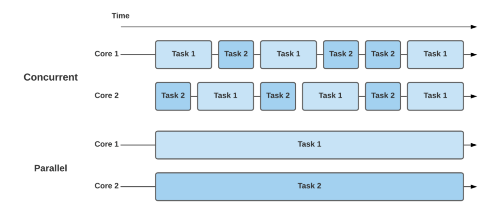
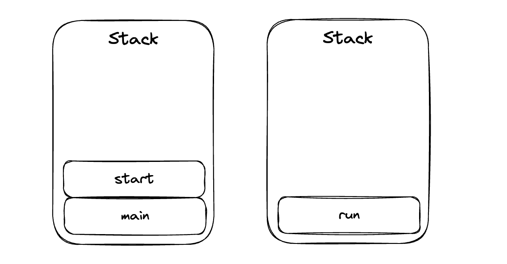
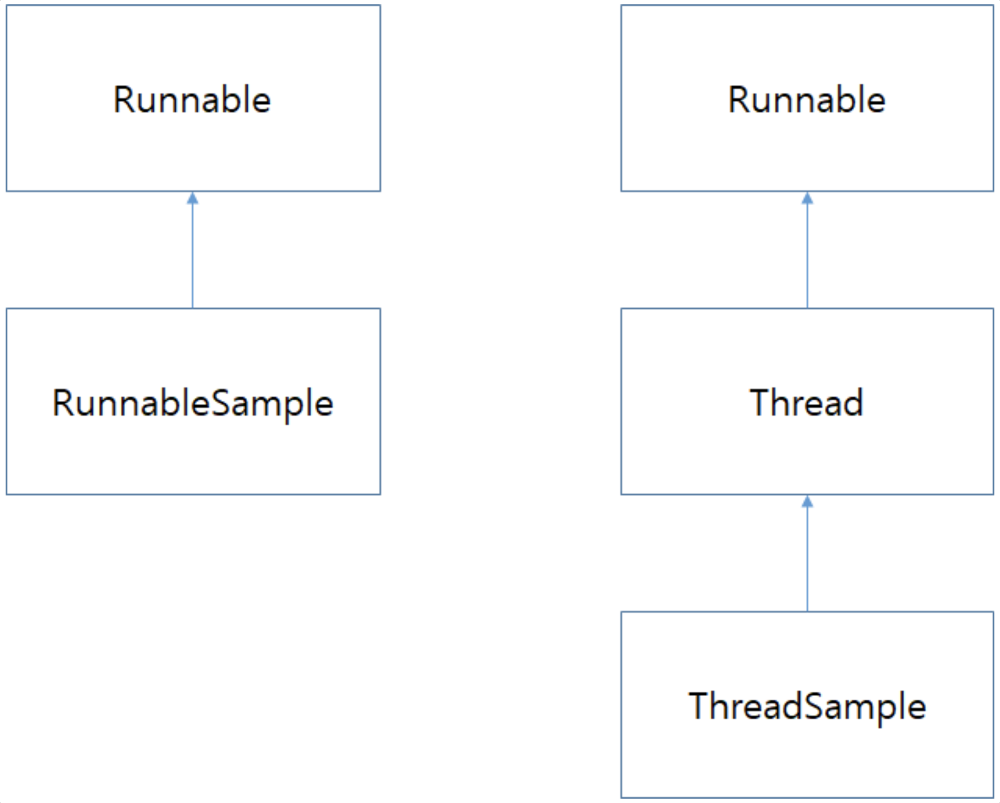
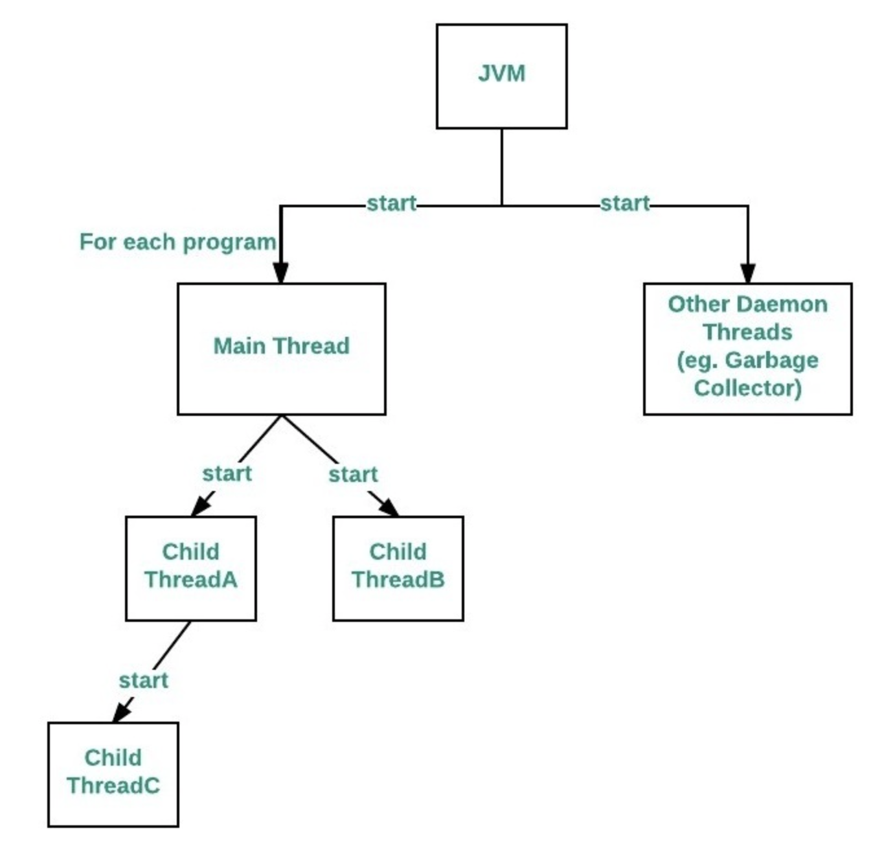
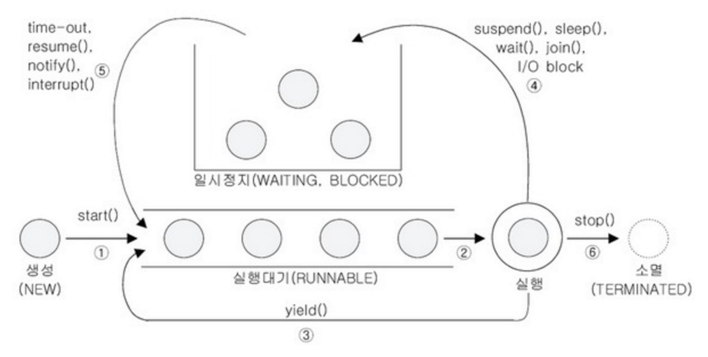
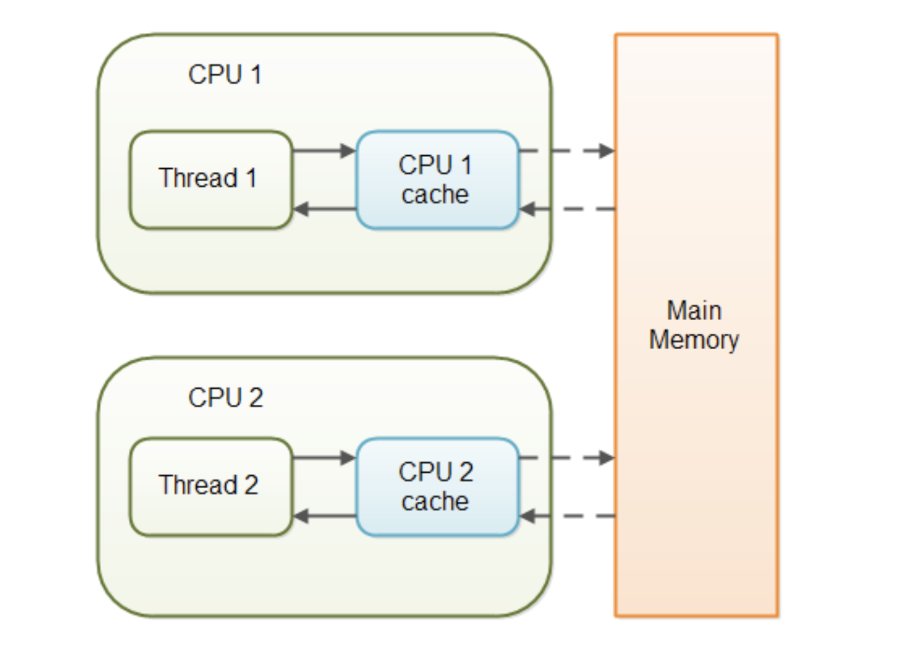
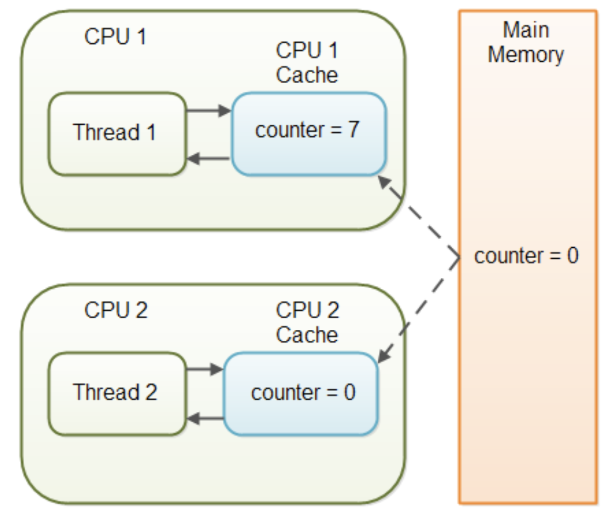

# 멀티쓰레드 프로그래밍

<br>

## 목차

- Thread?
- Thread 클래스와 Runnable 인터페이스
- Main 쓰레드
- 쓰레드의 상태
- 쓰레드의 우선순위
- 동기화
- 데드락

<br>

## Thread?

- 쓰레드는 하나의 프로그램에서의 실행 흐름이다.
- JVM은 병렬적으로 작동하는 여러개의 쓰레드 실행을 허용한다.
- 모든 쓰레드는 우선순위가 있다. 우선순위가 높은 쓰레드는 우선순위가 낮은 쓰레드보다 먼저 실행된다.
- 어떤 쓰레드는 데몬쓰레드가 되거나 되지 않을수 있다.
- 일부 쓰레드에서 실행중인 코드가 새 쓰레드 객체를 생성할 때, 새 쓰레드는 처음에 생선된 쓰레드의 우선순위와 동일하게 설정된 우선순위를 가지며, 생성쓰레드가 데몬인 경우에만 데몬쓰레드가 된다.
- JVM이 시작될 때 일반적으로 메인메서드의 호출로 발생한 단일 비데몬 쓰레드가 있다.
- JVM은 다음과 같은 상황이 발생할 때 까지 지속된다.
	- Runtime 클래스의 exit() 메서드가 호출되고 security manager가 종료 조작을 허가한 경우.
	- 데몬 쓰레드가 아닌 모든 쓰레드가 run()메서드의 호출로 return되었거나, run()메서드를 넘어서 전파되는 예외를 throw하여 죽은경우.
- 쓰레드는 두 가지의 실행방식이 있다. 첫 번째는 Thread 클래스의 서브클래스로 선언되는것이다. 이 서브클래스는 반드시 Thread클래스의 run()메서드를 오버라이딩 해야한다. 그런 다음에야 서브클래스의 인스턴스를 할당하고 시작할 수 있다.
- 그 후 인스턴스의 start()메서드를 호출하면 쓰레드를 실행할 수 있다.
- 또 다른 방법은 Runnable 인터페이스를 구현하는 클래스를 작성하는 것이다. 그 클래스는 run()메서드를 구현해야한다.
- 새로운 쓰레드의 인수로 Runnable인스턴스를 인자로 넘긴 후, 해당 쓰레드를 실행하면 쓰레드를 실행할 수 있다.
- 모든 쓰레드는 식별을 위한 이름이 있다.
- 둘 이상의 쓰레드가 동일한 이름을 가질 수 있다.
- 쓰레드가 생성될 때 이름이 지정되지 않으면 새 이름이 생성된다.
- 달리 명시되지 않는 한, 이 클래스의 생성자, 또는 메서드에 null 인수를 전달하면 NullPointerException이 throw된다.


### Daemon Thread

- Main 쓰레드의 작업을 돕는 보조적인 역할 수행
- Main 쓰레드가 모두 종료되면 자동 종료
- 가비지 컬렉터, 자동저장, 화면 자동 갱신등에 사용됨
- 무한루프와 조건물을 이용해서 실행 후 대기하다 특정조건이 반복되면 작업을 수행하고 다시 대기하도록 작성

### Deamon Thread 사용

- Main 쓰레드가 Daemon 이 될 쓰레드의 `setDaemon(true)`를 호출해주면 Daemon 쓰레드가 된다

### 그래서 데몬쓰레드는 왜 만들었을까?

- 예를 들어 모니터링하는 쓰레드를 별도로 띄워 모니터링을 하다가, Main 쓰레드가 종료되면 관련된 모니터링 쓰레드가 종료되어야 프로세스가 종료될 수 있다. 모니터링 스레드를 데몬 쓰레드로 만들지 않으면 프로세스가 종료할 수 없게 된다. 이렇게 부가적인 작업을 수행하는 쓰레드를 선언할 때 데몬 쓰레드를 만든다.


### 프로세스와 쓰레드 비교

프로세스는 운영체제로부터 자원을 할당받는 작업의 단위이고 쓰레드는 프로세스가 할당받은 자원을 이용하는 실행의 단위이다.

멀티프로세스에서 각 프로세스는 독립적으로 실행되며 각각 별개의 메모리를 차지하고 이쓴 것과 달리 멀티쓰레드는 프로세스 내의 메모리를 공유해 사용할 수 있다.

그래서, 멀티 쓰레드는 멀티 프로세스보다 적은 메모리 공간을 차지하고 `Context Switching`이 빠른 장점이 있지만, 동기화 문제와 하나의 쓰레드 장애로 전체 쓰레드가 종료 될 위험을 갖고 있다.

멀티 프로세스는 하나의 프로세스가 죽더라도 다른 프로세스에 영향을 주지 않아 안정성이 높지만, 멀티 쓰레드보다 많은 메모리공간과 CPU 시간을 차지하는 단점이 있다.

각각의 장단점이 있어 적용하는 시스템에 따라 적합한 동작 방식을 선택하고 적용해야 한다.


### 동시성(concurrency)과 병렬성(parallelism)

멀티 쓰레드가 실행될 때 이 두가지 중 하나로 실행된다.

하나의 프로세스가 가질 수 있는 쓰레드의 개수는 제한되어 있지 않으나, 쓰레드가 작업을 수행하는데 개별적인 메모리 공간(호출스택)을 필요로 하기 때문에 프로세스의 메모리 한계에 따라 생성할 수 있는 쓰레드의 수가 결정된다.

이것은 CPU의 코어의 수와도 연관이 있는데, 하나의 코에서 여러 쓰레드가 실행되는 것을 `"동시성"` , 멀티 코어를 사용할 때 코어별로 개별 쓰레드가 실행되는 것을 `"병렬성"`

즉, 코어의 수보다 쓰레드의 수가 더 많을 경우 "동시성"을 고려하지 않을 수 없다. 하나의 코어에서 여러 쓰레드를 실행할 때 하나의 쓰레드만 처리할 수 있어서 번갈아 가며 처리하게 된며 이는 병렬로 실행하는 것 '처럼' 보인다.



https://www.baeldung.com/cs/concurrency-vs-parallelism


<br>

## Thread 클래스와 Runnable 인터페이스

자바에서는 쓰레드를 관리하기 위한 메서드와 변수들을 java.lang.Thread 클래스에서 제공하고 있다.


쓰레드를 구현하는 방법은 Thread 클래스를 상속받는 방법과 Runnable 인터페이스를 구현하는 방법 두 가지가 있다. Thread를 상속받으면, 다른 클래스를 상속받을 수 없기 떄문에 인터페이스를 수현하는 방법이 일반적이다.


Thread 클래스를 상속받으면 run() 메서드를 오버라이딩 해줘야 한다.

Runnable은 오로지 run() 메서드만 구현되어 있는 함수형 인터페이스이다.


```java
public class ThreadDemo {

  public static void main(String[] args) {
    // 상속으로 구현
    ByThread thread1 = new ByThread();

    //인터페이스로 구현
    Runnable r = new ByRunnable();
    Thread thread2 = new Thread(r);    //생성자: Thread(Runnable target)

    thread1.start();
    thread2.start();
    // 혹은
    // new Thread(new ByRunnable()).start();
  }
}

class ByThread extends Thread {

  @Override
  public void run() {
    for (int i = 0; i < 100; i++) {
      System.out.print("T");
    }
  }
}

class ByRunnable implements Runnable {

  @Override
  public void run() {
    for (int i = 0; i < 100; i++) {
      System.out.print("R");
    }
  }
}
```

```
// 결과
RRRRRRRRRRRRRRRRTTTTRRTTTTTTRRRRRRRRRRRRRRRRRRRRRRRRRRRRRRRRRRRRRRRRRRRRRRRRRRRRRRRRRRRRRRRRRRRRRRRRRRRRRRRRRRTTTTTTTTTTTTTTTTTTTTTTTTTTTTTTTTTTTTTTTTTTTTTTTTTTTTTTTTTTTTTTTTTTTTTTTTTTTTTTTTTTTTTTTTTT
```

위에 그림에서 Concurrent와 같이 아주 빠른 속도로 작업을 번갈아가면서 수행하게된다.


### start()와 run()

쓰레드를 실행하기 위해서는 start 메서드를 통해 해당 쓰레드를 호출해야 한다. start 메서드는 쓰레드가 작업을 실행할 호출 스택을 만들고 그 안에 run 메서드를 올려주는 역할을 한다.


main메소드에서 run() 메소드를 호출했을 때의 호출스택



main메소드에서 start() 메소드를 호출하여 쓰레드를 위한 독립된 호출 스택이 생성되어 run() 메소드가 실행된 상태

```java
public class Main {
    public static void main(String[] args) {
        Runnable r = new ByRunnable();
        Runnable r2 = new ByRunnable2();
        r.run();
        r2.run();
    }
}

class ByRunnable implements Runnable {

    @Override
    public void run() {
        for (int i = 0; i < 50; i++) {
            System.out.print("R");
        }
    }
}

class ByRunnable2 implements Runnable {

    @Override
    public void run() {
        for (int i = 0; i < 50; i++) {
            System.out.print("R2");
        }
    }
}
```

```
// 결과
1111111111111111111111111111111111111111111111111122222222222222222222222222222222222222222222222222
```


한 번 실행이 종료된 쓰레드는 다시 실행 할 수 없습니다. 즉, 하나의 쓰레드에 대해 start()가 한 번만 호출될 수 있다는 뜻입니다. 하나의 쓰레드 객체에 대해 start() 메소드를 두 번 이상 호출하면 실행시에 IllegalThreadStateException이 발생합니다.

```java
public static void main(String[] args) {
  ByThread thread1 = new ByThread();

  thread1.start();
  thread1.start(); // IllegalThreadStateException 발생
}
```


### 어느걸 사용 해야하는거지?

`Thread` 클래스가 다른 클래스를 확장할 필요가 있을 경우에는 `Runnable` 인터페이스를 구현하면 되며, 그렇지 않은 경우는 `Thread` 클래스를 사용하는 것이 편합니다.




<br>

## Main 쓰레드

main() 메서드를 실행하는 쓰레드이다. 모든 자바 어플리케이션은 메인쓰레드가 메인메소드를 호출하면서 시작한다.



출처: https://www.geeksforgeeks.org/main-thread-java/?ref=lbp


<br>

## 쓰레드의 상태

효율적인 멀티쓰레드 프로그램을 만들기 위해서는 보다 정교한 스케줄링을 통해 프로세스에게 주어진 자원과 시간을 여러 쓰레드가 낭비없이 잘 사용하도록 프로그랭 해야합니다.

 

때문에 쓰레드의 스케줄링을 잘하기 위해서는 쓰레드의 상태와 관련된 메소드를 잘 알아야 합니다.


#### 쓰레드의 상태

NEW : 쓰레드가 생성되고 아직 start()가 호출되지 않은 상태

RUNNABLE : 실행 중 또는 실행 가능한 상태

BLOCKED : 동기화 블럭에 의해서 일시정지된 상태(lock이 풀릴 때까지 기다리는 상태)

WAITING, TIMED_WAITING : 쓰레드의 작업이 종료되지는 않았지만 실행가능하지 않은(unrunnable) 일시정지 상태, TIMED_WAITING은 일시정지시간이 지정된 경우를 의미한다.

TERMINATED : 쓰레드의 작업이 종료된 상태

 



1. 쓰레드를 생성하고 start()를 호출하면 바로 실행되는 것이 아니라 실행 대기열에 저장되어 자신의 차례가 될 때까지 기다려야 합니다. (실행 대기열은 큐(queue)와 같은 구조로 먼저 실행대기열에 들어온 쓰레드가 먼저 실행됩니다.
2. 자기 차례가 되면 실행상태가 됩니다.
3. 할당된 실행시간이 다되거나 yield() 메소드를 만나면 다시 실행 대기상태가 되고 다음 쓰레드가 실행상태가 됩니다.
4. 실행 중에 suspend(), sleep(), wait(), join(), I/O block에 위해 일시정지상태가 될 수 있습니다. 
	(I/O block은 입출력 작업에서 발생하는 지연상태를 말합니다. 사용자의 입력을 받는 경우를 예로 들수 있습니다.)
5. 지정된 일시정지시간이 다되거나, notify(), resume(), interrupt()가 호출되면 일시정지상태를 벗어나 다시 실행 대기열에 저장되어 자신의 차례를 기다리게 됩니다.
6. 실행을 모두 마치거나 stop()이 호출되면 쓰레드는 소멸됩니다.

> 자바의 정석 3판 쓰레드의 상태와 메소드들의 관계


### 쓰레드의 상태와 스케줄링에 관련된 메소드들

- sleep()
	- 시스템 타이머 및 스케줄러의 정밀도에 따라 현재 실행중인 쓰레드를 지정된 밀리초동안 휴면한다. 쓰레드는 모니터의 소유권을 잃지 않는다.
- yield()
	- 현재 쓰레드가 프로세서의 현재 사용을 양보할 의사가 있다는 스케줄러에 대한 힌트이다. 보통 디버깅 또는 테스트 목적에 유용하다.
- clone() 불가능
	- 클론이 불가능하다. 호출시 예외를 던진다.
- start()
	- 쓰레드를 실행한다. 쓰레드를 두번 시작할 수 없고, 쓰레드가 실행 완료된 후에도 다시 시작할 수 없다.
- run()
	- 쓰레드에 할당된 runnable을 실행한다.
- exit()
	- 쓰레드가 실제로 종료되기 전에 정리할 기회를 주기 위해 시스템에 의해 호출된다.
- interrupt()
	- 이 쓰레드를 중단한다.
- join()
	- 해당 메서드가 죽을때까지 최대 파라미터ms만큼 기다린다.
	- join 메소드도 sleep 메소드처럼 interrupt()에 의해 대기상태에서 벗어날 수 있으며, join()이 호출되는 부분을 try-catch문으로 감싸서 InterruptedException을 catch 해야합니다.
- set/getPriority()
	- 쓰레드의 우선순위 get/set한다.
- getState()
	- 쓰레드의 상태를 get/set 한다.

yield()와 interrupt()를 적절히 사용하면, 프로그램의 응답성을 높이고 보다 효율적인 실행이 가능하게 할 수 있습니다.


<br>

## 쓰레드의 우선순위

자바에서 각 스레드는 우선순위(priority)에 관한 자신만의 필드를 가지고 있습니다.이러한 우선순위에 따라 특정 스레드가 더 많은 시간 동안 작업을 할 수 있도록 설정할 수 있습니다.

|           필드           |                       설명                        |
| :----------------------: | :-----------------------------------------------: |
| static int MAX_PRIORITY  |   스레드가 가질 수 있는 최대 우선순위를 명시함.   |
| static int MIN_PRIORITY  |   스레드가 가질 수 있는 최소 우선순위를 명시함.   |
| static int NORM_PRIORITY | 스레드가 생성될 때 가지는 기본 우선순위를 명시함. |

getPriority()와 setPriority() 메소드를 통해 스레드의 우선순위를 반환하거나 변경할 수 있습니다.

스레드의 우선순위가 가질 수 있는 범위는 1부터 10까지이며, 숫자가 높을수록 우선순위 또한 높아집니다.

단지 우선순위가 10인 스레드는 우선순위가 1인 스레드보다 좀 더 많이 실행 큐에 포함되어, 좀 더 많은 작업 시간을 할당받을 뿐입니다.


<br>

## 동기화(Synchronize)

멀티쓰레드로 동작하는 프로세스의 경우 여러 쓰레드가 같은 프로세스 내의 자원을 공유해서 작업하기 때문에 서로의 작업에 영향을 주게 된다.

### 서로의 작업에 영향을 받은 예시

```java
package main.no17478;

public class Main {

    public static void main(String[] args) {
        runCommonCalculate();
        runCommonCalculate();
    }

    public static void runCommonCalculate() {
        CommonCalculate calc = new CommonCalculate(); //1
        MyThread thread1 = new MyThread(calc);
        MyThread thread2 = new MyThread(calc);

        thread1.start();
        thread2.start();
        try {
            // 각각의 쓰레드가 종료될 때 까지 기다린다
            thread1.join();
            thread2.join();
            System.out.println("Final value is " + calc.getAmount());
        } catch (InterruptedException e) {
            e.printStackTrace();
        }

    }
}

class MyThread extends Thread {

    private final CommonCalculate calc;

    public MyThread(CommonCalculate calc) {
        this.calc = calc;
    }

    public void run() {
        for (int l = 0; l < 10000; l++) {
            calc.plus(1);
        }
    }
}

class CommonCalculate {

    private int amount;

    public CommonCalculate() {
        amount = 0;
    }

    public void plus(int value) {
        amount += value;
    }

    public int getAmount() {
        return amount;
    }

}
```

```
Final value is 18383
Final value is 15632
```

### 

### Synchronized 적용 예제 1 (method)

```java
class CommonCalculate {

    private int amount;

    public CommonCalculate() {
        amount = 0;
    }

    public synchronized void plus(int value) {
        amount += value;
    }

    public int getAmount() {
        return amount;
    }
}
```

```
Final value is 20000
Final value is 20000
```


### Synchronized 적용 예제 2 (block)

```java
class CommonCalculate {

    private int amount;

    public CommonCalculate() {
        amount = 0;
    }

    public void plus(int value) {
        synchronized (this) {
            amount += value;
        }
    }

    public synchronized int getAmount() {
        synchronized (this) {
            return amount;
        }
    }
}
```

```
Final value is 20000
Final value is 20000
```


### wait()와 notify()

synchronized로 동기화하면 공유 데이터를 보호할 수 있지만 특정 쓰레드가 객체의 락을 가진 상태로 오랜시간을 보내지 않게 하는것도 중요합니다.

동기화된 임계구역의 코드를 수행하다가 작업을 더 이상 진행할 상황이 아니라면, wait()를 호출하여 쓰레드가 락을 반납하고 기다리게 합니다. 이때 다른 쓰레드가 락을 얻어 해당 객체에 대한 작업을 수행할 수 있게 됩니다. 이후 작업을 다시 진행할 수 있는 상황이 되면 notify()를 호출해서, 작업을 중단했던 쓰레드가 다시 락을 얻어 작업을 진행할 수 있습니다

wait(), notify(), notifyAll()
\- Object에 정의 되어 있는 메소드 입니다.
\- 동기화 블록(synchronized블록)내에서만 사용할 수 있습니다. 
\- 보다 효율적인 동기화를 가능하게 합니다.

wait() : 쓰레드가 락을 반납하고 기다리게 합니다.
notify() : 객체의 대기실에서 대기중인 모든 쓰레드중 임의의 쓰레드에게 lock을 얻을 수 있는 상태로 바꿔줍니다.
notifyAll() : 기다리고 있는 모든 객체에게 통지하여 lock을 얻을 수 있는 상태로 바꿔줍니다. notifyAll()이 호출된 객체의 waiting pool에 대기중인 쓰레드만 해당됩니다.

```java
public class ThreadExample {
    public static void main(String[] args) throws Exception{
        Table table = new Table();

        new Thread(new Cook(table), "COOK1").start();
        new Thread(new Customer(table, "donut"), "CUSTOMER1").start();
        new Thread(new Customer(table, "burger"), "CUSTOMER2").start();

        Thread.sleep(2000);
        System.exit(0);
    }
}

class Customer implements Runnable {
    private Table table;
    private String food;

    Customer(Table table, String food) {
        this.table = table;
        this.food = food;
    }

    @Override
    public void run() {
        while (true) {
            try {
                Thread.sleep(100);
            }catch (InterruptedException e) {

            }
            String name = Thread.currentThread().getName();

            table.remove(food);
            System.out.println(name + " ate a " + food);
        }
    }
}

class Cook implements Runnable {
    private Table table;

    Cook(Table table) {this.table = table; }

    @Override
    public void run() {
        while (true) {
            int idx = (int) (Math.random()*table.dishNum());
            table.add(table.dishNames[idx]);
            try {
                Thread.sleep(10);
            }catch (InterruptedException e) { }
        }
    }
}

class Table {
    String[] dishNames = { "donut", "donut", "burger" };
    final int MAX_FOOD = 6;
    private ArrayList<String> dishes = new ArrayList<>();

    public synchronized void add(String dish) {
        while (dishes.size() >= MAX_FOOD) {
            String name = Thread.currentThread().getName();
            System.out.println(name+" is waiting.");
            try {
                wait(); // COOK쓰레드를 기다리게 합니다.
                Thread.sleep(500);
            }catch (InterruptedException e) { }
        }
        dishes.add(dish);
        notify();  // 기다리고 있는 CUSTOMER를 깨우기 위함.
        System.out.println("Dishes:" + dishes.toString());
    }

    public void remove(String dishName) {
        synchronized (this) {
            String name = Thread.currentThread().getName();

            while (dishes.size() == 0) {
                System.out.println(name+" is waiting.");
                try {
                    wait(); // CUSTOMER 쓰레드를 기다리게 합니다.
                    Thread.sleep(500);
                }catch (InterruptedException e) { }
            }

            while (true) {
                for (int i = 0; i < dishes.size(); i++) {
                    if (dishName.equals(dishes.get(i))) {
                        dishes.remove(i);
                        notify();  // 잠자고 있는 COOK 쓰레드를 깨우기 위함
                        return;
                    }
                } // for문의 끝

                try {
                    System.out.println(name+ " is waiting.");
                    wait();
                    Thread.sleep(500);
                }catch (InterruptedException e) {

                }
            }
        }
    }

    public int dishNum() { return dishNames.length; }
}
```

```
// 결과
Dishes:[donut]
Dishes:[donut, burger]
Dishes:[donut, burger, donut]
Dishes:[donut, burger, donut, donut]
Dishes:[donut, burger, donut, donut, burger]
Dishes:[donut, donut, burger, burger]
Dishes:[donut, donut, burger, burger, burger]
Dishes:[donut, donut, burger, burger, burger, donut]
CUSTOMER1 ate a donut
CUSTOMER2 ate a burger
COOK1 is waiting.
CUSTOMER2 ate a burger
Dishes:[donut, donut, burger, burger, donut, burger]
CUSTOMER2 ate a burger
CUSTOMER1 ate a donut
Dishes:[donut, burger, donut, burger, donut]
Dishes:[donut, burger, donut, burger, donut, donut]
COOK1 is waiting.
CUSTOMER2 ate a burger
Dishes:[donut, donut, burger, donut, donut, burger]
CUSTOMER2 ate a burger

// 출처 : https://parkadd.tistory.com/48
```


## Volatile

`volatile` keyword 는 Java 변수를 Main Memory에 저장하겠다라는 것을 명시하는것이다

매번 변수의 값을 Read할 때마다 CPU cache에 저장된 값이 아닌 Main Memory에서 읽는 것입니다.

또한 변수의 값을 Write할 때마다 Main Memory 에 까지 작성하는 것입니다.

### 왜 사용하지?




`volatile` 변수를 사용하고 있지 않는 MultiThread 애플리케이션은 작업을 수행하는 동안 성능 향상을 위해서 Main Memory에서 읽은 변수를 CPU Cache에 저장하게 된다

만약 Multi Thread환경에서 Thread가 변수 값을 읽어올 때 각각의 CPU Cache에 저장된 값이 다르기 때문에 변수 값 불일치 문제가 발생하게 된다.

### 예제

SharedObject를 공유하는 두 개의 Thread가 있다

- Thread-1 는 counter 값을 더하고 읽는 연산을 한다 (Read & Write)
- Thread-2 는 counter 값을 읽기만 한다(Only Read)

```java
public class SharedObject {
    public int counter = 0;
}
```

Thread- 1 만 counter 변수를 증가 시키지만 CPU Cache에만 반영되어 있고 실제로 Main Memory에는 반영이 되지 않았다. 그렇기 때문에 Thread-2는 count 값을 계속 읽어오지만 0을 가져오는 문제가 발생한다



다른 쓰레드에 의해 아직 Main Memory에 다시 기록되지 않았기 때문에 Thread가 변수의 최신 값을 보지 못하는 문제를 "가시성" 문제라고 합니다. 한 쓰레드의 업데이트는 다른 Thread에 표시 되지 않는다


### 해결

`volatile` 키워드를 추가하게 되면 Main Memory에 저장하고 읽어오기 때문에 변수 값 불일치 문제를 해결 할 수 있다


Multi Thread 환경에서 하나의 Thread만 read & write하고 나머지 Thread 가 read하는 상황에서 가장 최신의 값을 보장한다

### volatile 성능에 영향?

`volatile`는 변수의 read와 write 를 Main Memory 에서 진행하게 된다

CPU Cache 보다 Main Memory가 비용이 더 크기 때문에 변수 값 일치를 보장해야 하는 경우에 `volatile` 을 사용하는 것이 좋다

> https://jenkov.com/tutorials/java-concurrency/volatile.html


<br>

## 데드락(교착상태)


http://denninginstitute.com/itcore/processes/Dead.html

두개 이상의 작업이 서로 상대방의 작업이 끝나기만을 기다리고있기 때문에 프로세스가 자원을 얻지 못해 다음 처리를 진행할 수 없는 상태


데드락이 발생하기 위해서는 다음 네가지의 조건을 모두 만족시켜야한다.

1. 상호배제(Mutual exclusion)Permalink
	자원을 한 번에 한 프로세스만이 사용하는 경우.
2. 점유대기(Hold and wait)Permalink
	최소한 하나의 자원을 점유하고 있으면서 다른 프로세스에 할당되어 사용하고 있는 자원을 추가로 점유하기 위해 대기하는 프로세스가 있는 경우.
3. 비선점(No preemption)Permalink
	다른 프로세스에 할당된 자원은 사용이 끝날 때까지 강제로 빼앗을 수 없는 경우.
4. 순환대기(Circular wait)Permalink
	각 프로세스는 순환적으로 다음 프로세스가 요구하는 자원을 가지고 있는 경우.


```java
public class DeadLock { 
    static Object object1 = new Object();
    static Object object2 = new Object();

    public static void main(String[] args) {
        User1 user1 = new User1();
        User2 user2 = new User2();
        user1.start();
        user2.start();
    }

    public static class User1 extends Thread {

        public void run() {
            synchronized (object1){
                System.out.println("User1 is holding object1");
                try {
                    Thread.sleep(10);
                } catch (Exception e) {}
                System.out.println("User1 is waiting object2");
                synchronized (object2){
                    System.out.println("User1 is holding object1 and object2");
                }
            }
        }
    }

    public static class User2 extends Thread {

        public void run() {
            synchronized (object2){
                System.out.println("User2 is holding object2");
                try {
                    Thread.sleep(10);
                } catch (Exception e) {}
                System.out.println("User2 is waiting object1");
                synchronized (object1) {
                    System.out.println("User2 is holding object1 and object2");
                }
            }
        }
    }
}
```

```
User1 is holding object1
User2 is holding object2
User2 is waiting object1
User1 is waiting object2
```

서비스 운영중에 데드락이 발생했을 경우 회사의 큰 손해로 이어질 수도 있기 때문에 항상 서비스가 데드락에서 빠져나올 수 있는 해결방안을 미리 고민해두어야 한다.


<br>