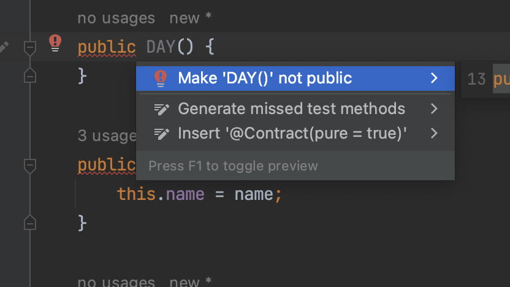
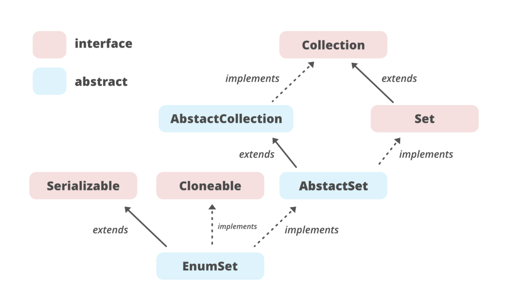

## Enum


### 목차

- enum 이란?
- enum이 제공하는 메소드 (values()와 valueOf())
- java.lang.Enum
- EnumSet


<br>

## Enum이란?

enum(열거형)은 Enum을 '열거형' 또는 Enumeration 또는 상수집합 이라고도 부릅니다.

서로 관련된 상수를 편리하게 선언하기 위한 것으로 상수를 여러 개 정의할 때 사용합니다. 


### enum 장점

- IDE의 적극적인 지원을 받을 수 있습니다.
- 허용 가능한 값들을 제한할 수 있습니다.
- 리팩토링 시 변경 범위가 최소화됩니다.
- 상태와 행위를 한곳에서 관리할 수 있습니다.
- 데이터 그룹 관리 및 데이터 간의 연관관계 표현할 수 있습니다.


### Enum은 왜 생겼나.

상수를 정의하는 방법을 개선하다 보니 열거형이 적합하기 때문입니다. 추가로, 열거형을 사용하면 코드의 가독성을 높이고 논리적인 오류를 줄일 수 있습니다.

자바 1.5버전 이전에 어떻게 상수를 정의했는지 알아보면서 왜 생겼는지 알아보겠습니다.

```java
public class EnumExample {
    public static void main(String[] args) {
        /*
         * 월요일 == 1
         * 화요일 == 2
         * 수요일 == 3
         * ...
         * 일요일 == 7
         */
        int day = 1;

        switch (day) {
            case 1:
                System.out.println("월요일 입니다.");
                break;
            case 2:
                System.out.println("화요일 입니다.");
                break;
            
            // ...
        }
    }
}
```

위 소스에서는 항상 월요일은 1, 화요일은 2, ... 일요일은 7로 정의되어야 한다. 변하지 않는 상수 값에 따라 그 값에 해당하는 요일을 고정하고 있습니다. 현재 상수의 의미를 주석으로 전달하고 있습니다. 만일 주석이 사라지거나 주석 부분과 상수를 사용하는 부분이 분리된다면 각각의 숫자들이 어떤 것을 의미하는지 이해하기 어렵습니다. 그래서 이름 만으로 어떤 의미가 있는지 알 수 있으면 더 좋을 것입니다.


```java
public class EnumExample {
    
    private final static int Mon = 1;
    private final static int Tue = 2;
    private final static int Wed = 3;
    // ...
    private final static int Sun = 7;
    
    public static void main(String[] args) {
        
        int day = Mon;

        switch (day) {
            case Mon:
                System.out.println("월요일 입니다.");
                break;
            case Tue:
                System.out.println("화요일 입니다.");
                break;
            
            // ...
        }
    }
}
```

하지만 여기에도 안 좋은 점이 있습니다. 예들 들어 위 소스에 달에 대한 상수를 더 추가해야 한다면 상수가 너무 많아 지고 한눈에 어떤 것에 관련된 것인지 보기 힘듭니다. 또한, 각각의 상수의 집합에서 같은 이름으로 정의된 상수가 있다면 중복된 이름이기 때문에 컴파일 단계에서 오류가 발생합니다. 그래서 class 또는 인터페이스를 사용합니다.

```java
interface DAY{
    int Mon = 1;
    int Tue = 2;
    int Wen = 3;
    // ...
    int Sun = 7;
}

interface MONTH{
    int JANUARY = 1;
    int FEBRUARY = 2;
    int MARCH = 3;
    // ...
    int OCTOBER = 10;
    int NOVEMBER = 11;
    int DECEMBER = 12;
}

public class EnumExample {

    public static void main(String[] args) {

        if(DAY.Mon == MONTH.JANUARY){
            System.out.println("두 상수는 같습니다.");
        }

        int day = DAY.Mon;

        switch (day) {
            case DAY.Mon:
                System.out.println("월요일 입니다.");
                break;
            case DAY.Tue:
                System.out.println("화요일 입니다.");
                break;
            case DAY.Wed:
                System.out.println("수요일 입니다.");
                break;

            // ...
        }
    }
}
```

class 또는 인터페이스를 사용하여 각각의 집합끼리 상수가 정의되고 중복된 이름이 있어도 오류가 발생하지 않습니다.

하지만 서로 다른 집합에 정의된 상수들은 서로 비교하면 안 됩니다. Day.Mon과 MONTH.JANUARY 를 비교하면 컴파일 단계에서 에러를 확인할 수 있어야 하지만, 위 코드는 확인 할 수 없습니다. 그래서 런타임 단계에서 예기치 못한 문제를 발생시킬 수 있습니다.


```java
class DAY{

    public final static DAY Mon = new DAY(); 
    public final static DAY Tue = new DAY(); 
    public final static DAY Wed = new DAY(); 
    // ...
}

class MONTH{

    public final static MONTH JANUARY = new MONTH();
    public final static MONTH FEBRUARY = new MONTH();
    public final static MONTH MARCH = new MONTH();
    // ...
}

public class EnumExample {

    public static void main(String[] args) {

        if(DAY.Mon == MONTH.JANUARY){
            System.out.println("두 상수는 같습니다.");
        }

        DAY day = DAY.Mon;

        switch (day) {
            case DAY.Mon:
                System.out.println("월요일 입니다.");
                break;
            case DAY.Tue:
                System.out.println("화요일 입니다.");
                break;
            case DAY.Wed:
                System.out.println("수요일 입니다.");
                break;

            // ...
        }
    }
}
```

interface로 작성된 상수들의 집합을 class로 바꾸었습니다. 그리고 각각 상수들의 타입을 자신의 상수 집합의 이름으로 지정하였습니다. 그리고 자기 자신을 인스턴스화 한 값을 할당합니다. 이 말은 각각의 상수들이 서로 다른 데이터를 의미합니다. 하지만 같은 집합의 상수들은 같은 데이터 타입을 갖습니다. 즉, 데이터 타입은 같지만 서로 다른 데이터 값을 가지고 있습니다. 이제 서로 다른 집합에 정의된 상수들은 서로 비교하는 곳에서 컴파일 에러가 날 것입니다. 하지만 여기서 작성한 상수들을 못 쓰는 경우도 있습니다. 즉, switch문에서는 사용하지 못합니다. 이유는 switch 문의 조건에 들어가는 데이터 타입이 제한적이기 때문입니다. 상수를 사용할 때 switch문을 사용해야 가독성이 좋습니다. 그래서 이러한 문제를 해결하는 방법 중 하나가 enum 입니다.


enum은 자바 1.5부터 지원하였으며 이것이 열거형입니다.

```java
enum Day{
	Mon,Tue, Wed, ... ;
}

enum Month{
	JANUARY, FEBRUARY, MARCH, APRIL, MAY, JUNE, JULY, 
	AUGUST, SEPTEMBER, OCTOBER, NOVEMBER, DECEMBER;
}

public class EnumExample {
	
	public static void main(String[] args) {		
		
        DAY day = DAY.Mon;

        switch (day) {
            case Mon:
                System.out.println("월요일 입니다.");
                break;
            case Tue:
                System.out.println("화요일 입니다.");
                break;
            case Wed:
                System.out.println("수요일 입니다.");
                break;

            // ...
        }
	}
}

```

위 예제처럼 각각의 상수들의 이름을 차례대로 나열하면 상수가 정의됩니다. 또한, switch 문의 레이블은 조건으로 넘어온 데이터 타입을 알고 있습니다. 그래서 각각의 레이블에서는 enum의 데이터 타입을 생략하고 상수만 입력할 수 있습니다.


<br>

```java
class DAY{

    public final static DAY Mon = new DAY(); 
    public final static DAY Tue = new DAY(); 
    public final static DAY Wed = new DAY(); 
    // ...
}

enum Day{
	Mon,Tue, Wed, ... ;
}
```

class Day과 enum Day는 똑같은 기능을 합니다.. 하지만 enum 방법이 훨씬 간결하고 가독성이 좋습니다.


추가로 enum의 각 열거형 상수에 추가 속성을 부여할 수 있습니다.

```java
enum DAY{
    Mon("월"),
    Tue("화"),
    Wed("수");

    private String name;
    private DAY() {
    }

    private DAY(String name) {
        this.name = name;
    }

    private String getName() {
        return name;
    }
}
```


### 여기서 왜 enum생성자는 private인가?



enum타입은 고정된 상수들의 집합으로써, 런타임이 아닌 컴파일타임에 모든 값을 알고 있어야 합니다. 즉 다른 패키지나 클래스에서 enum 타입에 접근해서 동적으로 어떤 값을 정해줄 수 없습니다. 따라서 컴파일 시에 타입안정성이 보장됩니다. 외부에서 접근 가능한 생성자가 없으므로 enum타입은 final과 다름이 없습니다. 결국 enum타입은 인스턴스 생성을 제어하며, 싱글톤을 일반화합니다.


### enum 활용

``` java
public enum PowerSwitch {
	//
	ON("켜짐"),
	OFF("꺼짐");
	
	private String krName;
	
	private PowerSwitch(){
		//
	}

	private PowerSwitch(String krName){
		this.krName = krName;
	}
	
	public String getKrName(){
		return krName;
	}
	
	public PowerSwitch opposite() {
		// 
		if (this == PowerSwitch.ON) {
			return PowerSwitch.OFF;  
		} else {
			return PowerSwitch.ON; 
		}
	}
}
```

```java
public class PowerSwitchMain {
        //
	public static void main(String[] args) {
		PowerSwitch powerSwitch = PowerSwitch.ON;
		displayByPowerSwitch(powerSwitch.opposite());		
	}
	
	public static void displayByPowerSwitch (PowerSwitch powerSwitch){
		if(powerSwitch == PowerSwitch.ON){
			System.out.println("전원을 on 합니다.");
		}else{
			System.out.println("전원을 off 합니다.");
		}
	}
}
```

코드 설명은 [코드 출처](https://www.nextree.co.kr/p11686/#:~:text=5.-,enum,-%ED%99%9C%EC%9A%A9)를 확인하면 좋을 것 같습니다. :)


<br>

## enum이 제공하는 메소드 (values()와 valueOf())

enum에서 값을 꺼내 오는 방법은 총 3가지가 존재한다.

```java
System.out.println(DAY.Mon);
System.out.println(DAY.Mon.name());
System.out.println(DAY.valueOf("Tue"));
System.out.println(Enum.valueOf(DAY.class,"Wed"));
```

```
// 출력
Mon
Mon
Tue
Wed
```


ordinal() : enum의 순서

name() : 각 요소들의 이름 리턴

valueOf() : 문자열로 enum요소의 이름을 찾아서 요소의 이름을 리턴한다.

values() : 모든 enum의 요소들을 배열로 만들어준다.


enum은 == 비교는 가능하지만, 비교(<,>,<=,=>)는 불가능하다. 만약 비교를 하고 싶다면 compareTo를 이용하면 된다.


<br>

## java.lang.Enum

java.lang 에 포함된 Enum 클래스는 모든 자바 열거형의 조상이다. **모든 열거형은 Enum 클래스를 상속받기 때문에 enum type은 별도의 상속을 받을 수 없다.** toString을 제외한 대부분의 메서드는 final로 선언되어 있기 때문에 별도의 오버라이딩을 할 수 없다.


<br>

## EnumSet

EnumSet의 상속 구조는 다음과 같다.



[이미지 출처](https://www.geeksforgeeks.org/enumset-class-java/)


### EnumSet 활용

**EnumSet을 활용하기 전**

```java
enum EnumEX{
	One, Two, Three
}

public static void main(String[] args){
	Set<EnumEX> enumEXSet = new HashSet<>();
	enumEXSet.add(EnumEX.One);
	enumEXSet.add(EnumEX.Three);
}
```

- 위와 같이 직접 Set Collection을 만들어서 add 하면서 정의할 수 있다.

**EnumSet 활용**

```java
enum EnumEX{
	One, Two, Three
}

public static void main(String[] args){
	EnumSet<EnumEX> enumSet = EnumSet.allOf(EnumEX.class);	
}
```

- EnumSet을 이용하여 별도의 Set Collection을 만드는 과정 없이 생성할 수 있다.

- allOf : enum에 정의된 정보를 모두 추가할 수 있다.

- noneOf : 아무것도 추가하지 않는다.

- of : 요소를 직접넣을 수 있다.

	- ```
		EnumSet<EnumEX> enumSet = EnumSet.of(EnumEX.One, EnumEX.Three);
		```

- 등등의 메소드가 제공되고 있다.


[비트 필드 대신 EnumSet을 사용하라](https://jaehun2841.github.io/2019/02/04/effective-java-item36/#서론)


ordinal 인덱싱 대신 EnumMap을 사용


### EnumSet은 왜 생성자를 사용자가 호출할 수 없게 만들었을까요?

>- **사용자의 편의성 1 - 사용자는 어떤 구현객체가 적합한지 몰라도 상관없습니다.**
>
>	RegularEnumSet은 원소의 개수가 적을 때 적합하고, JumboEnumSet은 원소의 개수가 많을 때 적합하지만, 이는 EnumSet의 구현체들은 모두 알고 있는 사용자가 아니라면 복잡한 선택지가 될 수 있습니다.
>
>	하지만 EnumSet을 가장 잘 알고있는 EnumSet을 개발한 개발자가 구현 객체를 반환해 준다면 EnumSet을 사용하는 입장에서는 어떤 구현체가 적합한지 고려하지 않아도 됩니다.
>
>- **사용자 편의성 2**
>
>	사용자는 빈번하게 EnumSet 초기화 과정을 간당히 진행할 수 있습니다. EnumSet이 다루는 Enum의 모든 원소들을 Set에 담는 행위는 빈번하게 수행될 것으로 예상되는 일입니다.
>
>	이러한 경우를 대비하여서 EnumSet의 allOf 라는 메서드를 사용하면 모든 Enum 요소가 담겨있는 EnumSet을 쉽게 반환받고 사용할 수 있습니다.
>
>- **EnumSet의 확장성과 유지보수의 이점**
>
>	EnumSet을 유지보수하는 과정에서 RegularEnumSet과 JumboEnumSet 이외에 다른 경우를 대비하는 구현클래스가 추가 된다고 하여도 내부에 감추어져 있기 때문에, EnumSet을 사용하던 기존의 코드에는 전혀 영향이 없습니다. 심지어 RegularEnumSet이 삭제된다 하더라도 사용자에게 영향이 없습니다. 이는 EnumSet의 확장성의 큰 이점으로 작용할 수 있습니다.
>
>[참고](https://parkadd.tistory.com/50)


<br>

### Reference

[Java: enum의 뿌리를 찾아서...](https://www.nextree.co.kr/p11686/#:~:text=enum%EC%9D%84%20%EC%82%AC%EC%9A%A9%ED%95%98%EB%8A%94%20%EC%9D%B4%EC%9C%A0,%EB%B6%84%EB%AA%85%ED%95%98%EA%B2%8C%20%EB%82%98%ED%83%80%EB%82%BC%20%EC%88%98%20%EC%9E%88%EC%8A%B5%EB%8B%88%EB%8B%A4.)

자바의 정석 (남궁성 저)
