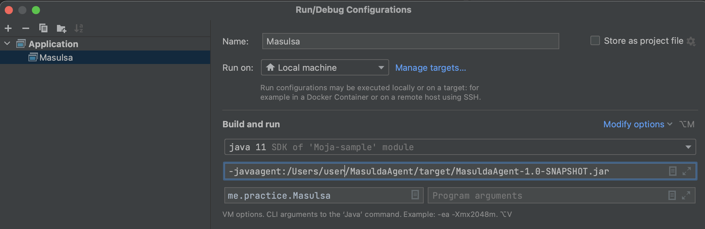

# 바이트코드 조작

바이트 코드 조작은 개발자의 소스코드(.java)를 직접 수정하지 않고

.class 파일을 수정하여 원하는 기능 구현하는 장점이 있습니다.


## 바이트코드 조작 활용 예시

- 프로그램 분석
	- 코드 복잡도 계산
- 성능 분석
- 최적화
- 로깅
- 클래스 파일 생성
	- 프록시
	- 특정 API 호출 접근 제한
- 스프링 컴포넌트 스캔(asm 라이브러리 사용)
	- 애노테이션들을 찾는 과정
- 강력한 기능으로 활용 범위가 굉장히 많다


## 바이트코드 조작 라이브러리

ASM : https://asm.ow2.io/

Javassist : https://www.javassist.org/

ByteBuddy : https://bytebuddy.net/  API 문서가 잘되어 있고 사용하기 편하다.


## ByteBuddy 실습

### 아무것도 없는 Moja에서 Rabbit을 꺼내는 마술


#### Moja.class

```java
public class Moja {

    public String pullOut() {
        return "";
    }
}
```


#### Masulsa.java

```java
public class Masulsa {

    public static void main(String[] args) {
        System.out.println(new Moja().pullOut());
    }
}
```

위 결과는 ""입니다. 이제 Rabbit이 나오게 바이트코드를 조작해야 합니다.


#### 바이트코드 조작 라이브러리 bytebuddy 의존성 주입

```null
<dependency>
    <groupId>net.bytebuddy</groupId>
    <artifactId>byte-buddy</artifactId>
    <version>1.11.22</version>
</dependency>
```


#### 예제

Moja라는 클래스를 ByteBuddy().redefine()을 통해 재정의해보겠습니다.

```java
public class Masulsa {

    public static void main(String[] args) {
        try {
            new ByteBuddy().redefine(Moja.class)
              .method(named("pullOut")).intercept(FixedValue.value("Rabbit!"))
              .make()
              .saveIn(new File("/Users/me/MasulcaTest/build/classes/java/main/"));   
        } catch (IOException e) {
            e.printStackTrace();
        }
        
      // System.out.println(new Moja().pullOut());
    }
}
```

Moja().pullOut()을 실행하기 전에 사전에 미리 ByteCode 조작 코드를 실행해야 합니다.

이후 주석되어 있는 System.out.println(new Moja().pullOut()); 코드의 주석을 풀고서 실행하면

실행결과가 "Rabbit!"으로 출력되는 것을 확인할 수 있습니다.


그 이유는 Masulsa 클래스가 실행되면 redefine 함수에서 Moja.class 파일을 직접 참조하여 

Moja 클래스 정보가 메모리(Runtime Data Area)의 메소드 영역에 저장되기 때문에

그 이후 바이트코드가 조작이 되어도 new Moja().pullOut의 코드는

바이트코드 조작 이전의 메모리에 있는 클래스 정보를 참조하기 때문입니다.


바이트 코드를 확인하면 아래처럼 바뀌어있습니다.

```java
public class Moja {
    public Moja() {
    }
    
    public String pullOut() { return "Rabbit!"; }

}
```


### 주석을 하지 않는 방법은 없을까?

```java
public class Masulsa {
    public static void main(String[] args) {
        ClassLoader classLoader = Masulsa.class.getClassLoader();
        TypePool typePool = TypePool.Default.of(classLoader);

        try {
            new ByteBuddy().redefine(
                    typePool.describe("org.example.Moja").resolve(),
                    ClassFileLocator.ForClassLoader.of(classLoader))
              .method(named("pullOut")).intercept(FixedValue.value("Rabbit!"))
              .make()
              .saveIn(new File("/Users/me/MasulcaTest/build/classes/java/main/"));   
        } catch (IOException e) {
            e.printStackTrace();
        }

        System.out.println(new Moja().pullOut());
    }
}
```

있다. Moja.class를 직접 참조하지 않고, 문자열(주소)을 참조했습니다.

바이트코드 조작 이후 new Moja().pollOut()에서 Moja 클래스를 메모리(Runtime Data Area)의 메소드 영역에 저장하기 때문에 "Rabbit!" 이 출력되게 됩니다.

하지만 다른 클래스에서 Moja 클래스를 로딩한다면, 바이트코드는 조작되지 않습니다. 클래스 로딩 순서에 의존적인 방법이라 문제가 있습니다.


이러한 문제를 해결하기 위해 Javaagent를 사용해보겠습니다.

>  Javaagent란 Instrumentation API 를 구현 한 특별한 jar파일로 jvm으로 로딩되는 java bytecode를 변형하기 위한 것입니다. 이를 구현하기 위해서 특별한 두가지 메소드가 필요합니다.
>
> 1. premain : jvm이 시작될 때 `-javaagent` 옵션을 사용하고 정적으로 로딩합니다.
> 2. agentMain: Java Attach API를 이용해서 JVM에서 agent를 동적으로 로딩합니다.
>
> https://blog.bespinglobal.com/post/java-instrumentation-api/


### 새로운 프로젝트 생성

```xml
<?xml version="1.0" encoding="UTF-8"?>

<project xmlns="http://maven.apache.org/POM/4.0.0" xmlns:xsi="http://www.w3.org/2001/XMLSchema-instance"
  xsi:schemaLocation="http://maven.apache.org/POM/4.0.0 http://maven.apache.org/xsd/maven-4.0.0.xsd">
  <modelVersion>4.0.0</modelVersion>

  <groupId>me.whiteship</groupId>
  <artifactId>masulsaJavaAgent</artifactId>
  <version>1.0-SNAPSHOT</version>

  <name>masulsaJavaAgent</name>

  <properties>
    <project.build.sourceEncoding>UTF-8</project.build.sourceEncoding>
    <maven.compiler.source>11</maven.compiler.source>
    <maven.compiler.target>11</maven.compiler.target>
  </properties>

  <dependencies>
    <dependency>
      <groupId>junit</groupId>
      <artifactId>junit</artifactId>
      <version>4.11</version>
      <scope>test</scope>
    </dependency>

    <!-- https://mvnrepository.com/artifact/net.bytebuddy/byte-buddy -->
    <dependency>
      <groupId>net.bytebuddy</groupId>
      <artifactId>byte-buddy</artifactId>
      <version>1.12.8</version>
    </dependency>

  </dependencies>

  <build>
    <plugins>
      <plugin>
        <groupId>org.apache.maven.plugins</groupId>
        <artifactId>maven-jar-plugin</artifactId>
        <version>3.1.2</version>
        <configuration>
          <archive>
            <index>true</index>
            <manifest>
              <addClasspath>true</addClasspath>
            </manifest>
            <manifestEntries>
              <mode>development</mode>
              <url>${project.url}</url>
              <key>value</key>
              <Premain-Class>me.whiteship.MasulsaAgent</Premain-Class>
              <Can-Redefine-Classes>true</Can-Redefine-Classes>
              <Can-Retransform-Classes>true</Can-Retransform-Classes>
            </manifestEntries>
          </archive>
        </configuration>
      </plugin>
    </plugins>
  </build>
</project>
```

pom.xml에 ByteBuddy Dependency를 추가합니다.


javaagent 방식 중 Premain 방식을 이용하려고 합니다. main 메소드를 시작하기 전에 Premain 메소드가 먼저 호출되는 방식입니다.


javaagent는 jar로 파일 안에 manifest 속성을 추가해야 하므로 커스텀할 수 있게 [plugin](https://maven.apache.org/plugins/maven-jar-plugin/examples/manifest-customization.html)을 추가하였습니다.

manifest에 추가할 내용은 다음과 같습니다

Premain-class : premain 메소드를 포함한 클래스 풀 패키지명을 기입합니다.

Can-Redefine-Classes : true

Can-Retransform-Classes : true

Can-Redefine-Classes, Can-Retransform-Classes는 클래스를 바이트 코드로 재정의 및 재변환하기 때문에 true로 지정


premain 메서드를 가지고 있는 MasulsaAgent 생성합니다.

```java
import net.bytebuddy.agent.builder.AgentBuilder;
import net.bytebuddy.implementation.FixedValue;
import net.bytebuddy.matcher.ElementMatchers;

import java.lang.instrument.Instrumentation;

import static net.bytebuddy.matcher.ElementMatchers.named;

public class MasulsaAgent {

    public static void premain(String agentAgrs, Instrumentation inst){
      // pullOut 메서드를 찾아 return 값을 "Rabbit!"으로 바꾸는 작업  
      new AgentBuilder.Default()
                .type(ElementMatchers.any())
                .transform((builder, typeDescription, classLoader, javaModule) ->
                                builder.method(named("pullOut")).intercept(FixedValue.value("Rabbit!")))
                .installOn(inst);
    }
}
```

콘솔에 `mvn clean package`입력후 jar 파일 생성

jar 파일 경로 복사


이전 ByteBuddy 실습 프로젝트로 이동

실습 프로젝트에서 Edit Configurations -> VM option에 -javaagent: "jar파일의 경로" 추가



maven clean 한 후에 애플리케이션을 실행하면 “Rabbit!”이 출력됩니다.


바이트 코드 Moja.class 파일을 보면 아무것도 변경되지 않았습니다.

javaagent를 거쳐서 조작된 바이트 코드를 메모리(Runtime Data Area)의 메소드 영역에 저장됩니다.

이렇게 기존 코드를 건드리지 않는 방식을 비 침투적(Transparent)이라고 합니다.


이러한 기술을 활용하는 대표적인 예시로, Srping 의 component scan기능이 있습니다.

내부 메서드 구현체 SimpleMetadataReader에서 ClassReader와 Visitor 사용해서 클래스에 있는 메타 정보를 읽어옵니다.

ClassReader가 바로 asm으로 구현된 바이트 코드 조작하는 기술입니다.
